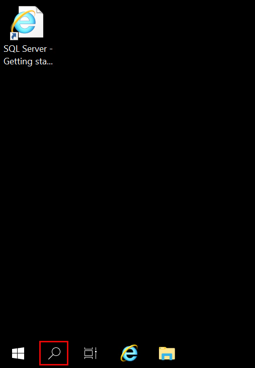
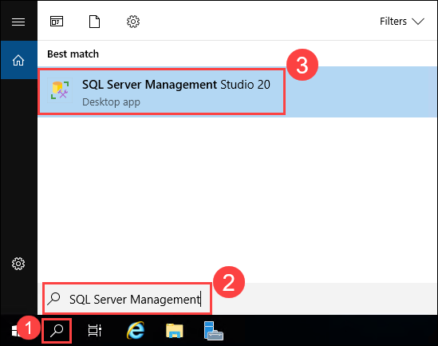
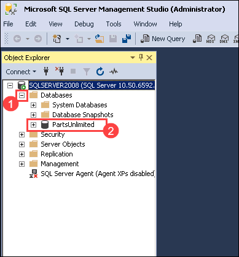
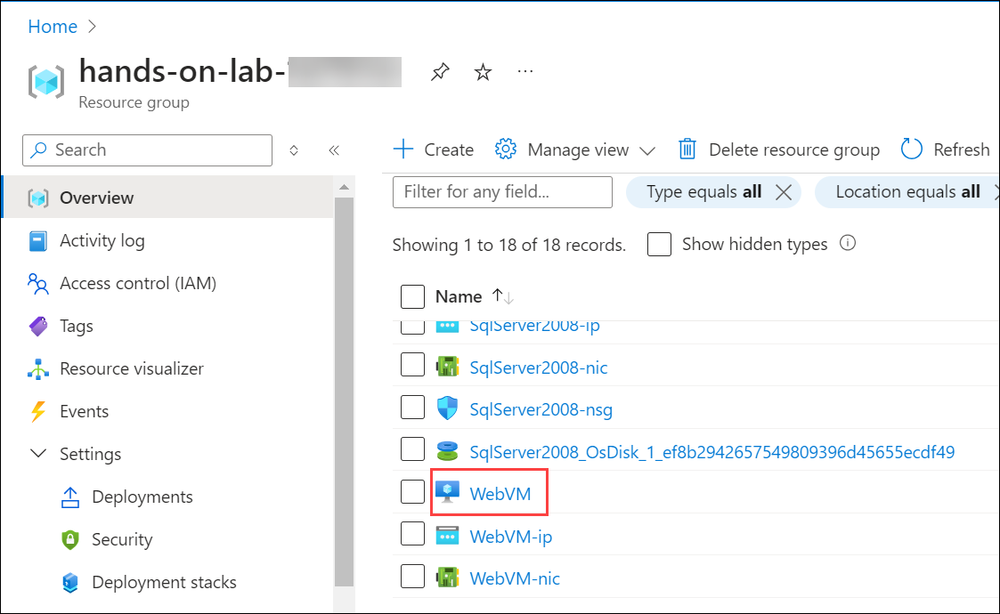
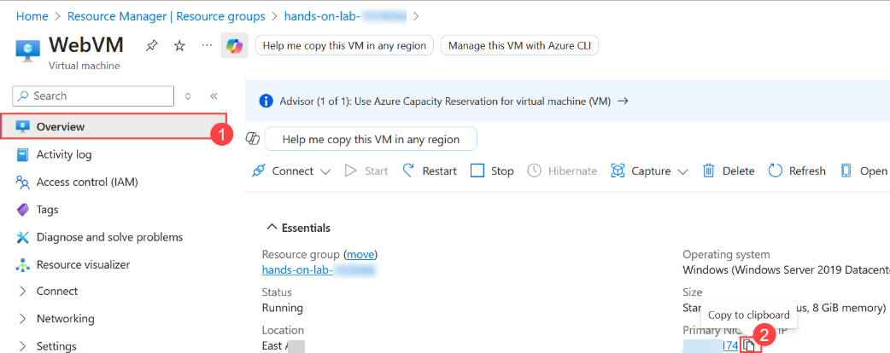
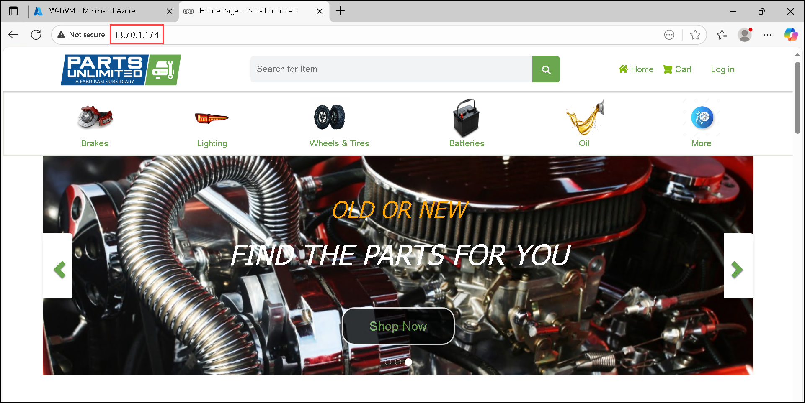
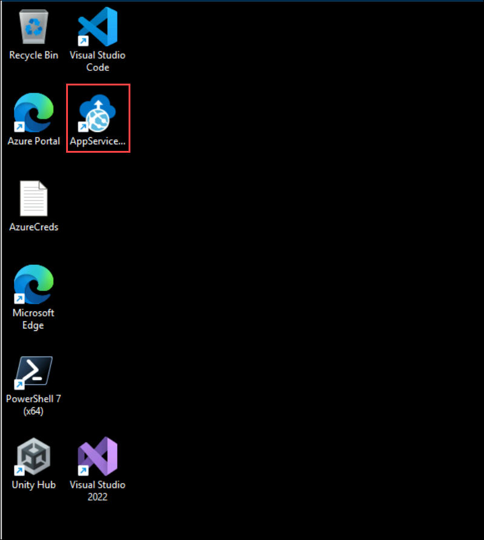
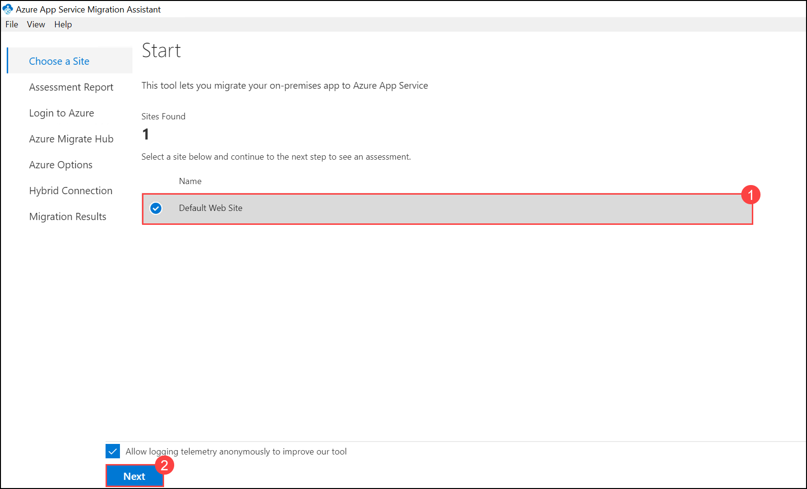
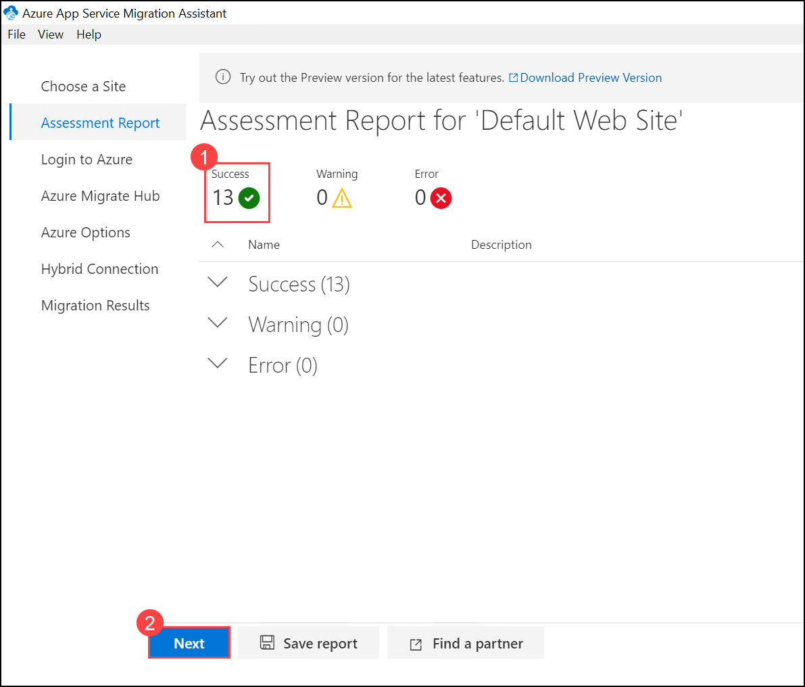
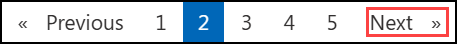

# Exercise 1: Review and Assess Legacy On-Prem Application

### Estimated Duration: 30 minutes

## Overview

Explore the structure and components of the Parts Unlimited .NET application, which is hosted on a web server and connected to a SQL Server database. Understanding the existing architecture is a crucial first step in preparing for the migration process.

## Lab objectives

You will be able to complete the following tasks:

- Task 1: Review the Legacy On-Prem Application
- Task 2: Perform assessment for migration to Azure App Service

## Task 1: Review the Legacy On-Prem Application

In this task, you will examine the on-premises .NET application hosted on IIS, along with its SQL Server database, to better understand its architecture and dependencies.

1. Open a Microsoft Edge browser window and enter **localhost** in the address bar. You will be directed to the Parts Unlimited web application hosted on the local web server.

   
   
1. Take a moment to explore the web application. We will migrate this application from the on-premises environment to Azure in upcoming exercises.

1. On the provided VM, click the **Start** or **Search (1)** button, search for **RDP (2)**, and select the **Remote Desktop Connection (3)** application.
   
   

1. Paste the **SQLVM DNS Name (1)** into the **Computer** field and click **Connect (2)**.

   * **SQLVM DNS Name**: **<inject key="SQLVM DNS Name" style="color:blue" />**

       
 
1. Next, enter the SQLVM **Username (1)** and **Password (2)** provided below, then click **OK (3)**. Please ensure you add a **dot** and a **backslash** `.\` before the username.

   * **Username**: **<inject key="SQLVM Username"/>** 
   * **Password**: **<inject key="SQLVM Password"/>**
   
      

1. Click **Yes** to accept the certificate and add it to your trusted certificates list.

   
   
1. Click the **Search** button on the SQLVM. 

    

1. In the search box, type **SQL Server Management (1)**, then select **Microsoft SQL Server (2)** from the search results.

    
   
1. In the connection window, click the **Encryption (1)** drop-down menu, select **Optional (2)**, and then click **Connect (3)**.
   
   .png)
   
1. Once connected, expand the **Databases (1)** node and observe the database hosting the **Parts Unlimited (2)** web application.
   
   
   
1. Close all open windows and disconnect from the SQL VM remote session.

## Task 2: Perform assessment for migration to Azure App Service

Parts Unlimited requires an assessment to identify potential issues before moving their application to Azure App Service. In this task, you will use the [App Service Migration Assistant](https://appmigration.microsoft.com/) to evaluate the web application for compatibility and run various readiness checks.

1. In the Azure portal, navigate to your **WebVM** virtual machine by opening the **hands-on-lab-<inject key="DeploymentID" enableCopy="false"/>** resource group and selecting the **WebVM** resource from the list.

    

1. On the WebVM virtual machine's **Overview (1)** blade, copy the **Public IP address (2)**.

    

1. Open a new browser window and navigate to the **IP Address** you just copied. Note that you may see a different image displayed on the web app homepage due to an image carousel.

    

1. Minimize the browser window and launch the **AppServiceMigrationAssistant** shortcut located on the desktop.

    

1. Once the App Service Migration Assistant discovers the websites available on the server, choose the **Default Web Site (1)** for migration and select **Next (2)** to begin the assessment.

    

1. Review the assessment report results. In this scenario, the application should successfully pass 13 tests **(1)** with no additional actions required. Now that the assessment is complete, select **Next (2)** to proceed with the migration.

   

   > For the details of the readiness checks, see [App Service Migration Assistant documentation](https://github.com/Azure/App-Service-Migration-Assistant/wiki/Readiness-Checks).
   
1. Minimize the **App Service Migration Assistant** window to keep it running in the background.
   
## Summary

In this exercise, you have covered the following:
 
- Reviewed the legacy on-premises application and database.
- Performed an assessment for migration to Azure App Service.

### You have successfully completed the exercise

Click **Next** in the lower right corner to proceed to the next page.

