# Exercise 4: Migrate the On-prem Database to Azure and configure it with your App service

Duration: 80 minutes

The next phase of the Parts Unlimited migration project involves the assessment and migration of their database. Currently, the database resides on a SQL Server 2008 R2 virtual machine. You will utilize an **Azure Migrate: Database Assessment** tool called the **Microsoft Data Migration Assistant (DMA)** to evaluate the `PartsUnlimited` database's readiness for migration to Azure SQL Database. This assessment will generate a comprehensive report detailing any feature parity gaps or compatibility issues. Following the assessment, you will leverage the **Azure Migrate: Database Migration** service, specifically the **Azure Database Migration Service (DMS)**, to execute the migration. For this exercise, you will operate within a simulated on-premises environment hosted on Azure virtual machines.
## Lab objectives

You will be able to complete the following tasks:

- Task 1: Connect to your SqlServer2008 VM with RDP

- Task 2: Perform assessment for migration to Azure SQL Database

- Task 3: Retrieve connection information for SQL Databases (Optional)

- Task 4: Migrate the database schema using the Data Migration Assistant

- Task 5: Migrate the database using the Azure Database Migration Service 

## Task 1: Connect to your SqlServer2008 VM with RDP

1. Within your lab environment (**WebVM**), use the Windows search bar to **Search (1)** for **RDP (2)** and select the **Remote Desktop Connection (3)** application.
   
   

1. Paste the **SQLVM DNS Name (1)** into the **Computer** field and click **Connect (2)**.
   * **SQLVM DNS Name**: **<inject key="SQLVM DNS Name" style="color:blue" />**

    
 
1. Enter the SQLVM **Username (1)** and **Password (2)** provided below, then click **OK (3)**. Please ensure you include a **dot** and a **backslash** `.\` before the username.
   * **username**: **<inject key="SQLVM Username" style="color:blue" />** 
   * **password**: **<inject key="SQLVM Password" style="color:blue" />**
   
    

1. Click **Yes** to accept the security certificate and add it to your trusted certificates list.

   

## Task 2: Perform assessment for migration to Azure SQL Database

Parts Unlimited requires an assessment to identify any potential issues that must be addressed before migrating their database to Azure SQL Database. In this task, you will use **SQL Server Management Studio (SSMS)** to perform a compatibility pre-check on the `PartsUnlimited` database against Azure SQL Database. This assessment confirms migration readiness by reviewing the database's compatibility level and auditing all schema objects for known unsupported features.

1. On the **SQLVM**, open the minimized **SSMS** window. If you previously closed it, follow **Step 2** and **Step 3**; otherwise, skip directly to **Step 4**.
    
    

1. Click the **Start (1)** menu. In the search box, type **sql server management (2)** and select **SQL Server Management Studio 20 (3)** (or the latest available version) from the search results.

   

1. In the **Connect to Server** dialog, enter the following details to connect to the source SQL Server instance:

   - **Server name**: Enter **SqlServer (1)**
   - **Authentication**: Select **SQL Server Authentication (2)**
   - **Login**: Enter **PUWebSite (3)**
   - **Password**: Enter **<inject key="SQLVM Password" /> (4)**
   - Expand **Connection Properties**, check **Trust server certificate (5)**
   - Select **Connect (6)**

   

1. Select **New Query (1)** from the SSMS toolbar. **Paste (2)** and execute the following script to audit all schema objects. Click **Execute (F5) (2)** to run the query.

   ```sql
   USE PartsUnlimited;
   SELECT
       OBJECT_NAME(object_id) AS ObjectName,
       type_desc               AS ObjectType
   FROM sys.objects
   WHERE type IN ('U','V','P','FN','IF','TF')
   ORDER BY type_desc, ObjectName;
   ```

   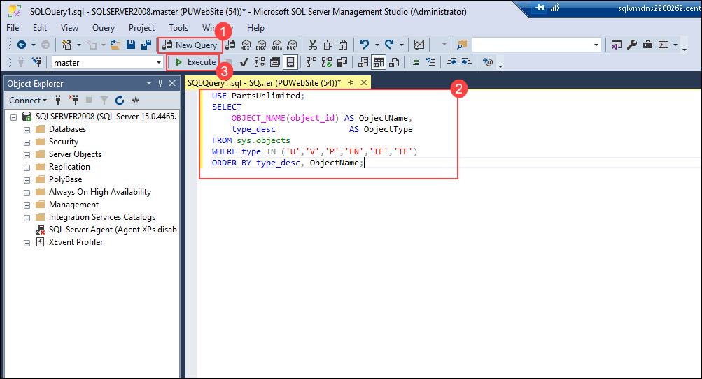

1. Review the results in the **Results** tab.

   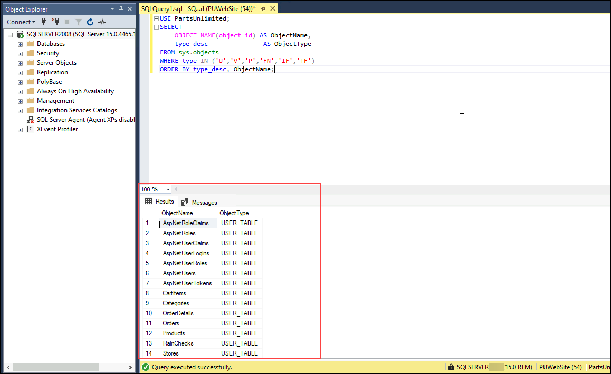

   > **Assessment Summary**: The `PartsUnlimited` database is confirmed as a strong candidate for migration to Azure SQL Database. No unsupported features or blocking compatibility issues were found. You may proceed to the next task.

## Task 3: Migrate the database schema using SQL Server Management Studio (SSMS)

Having reviewed the assessment results and confirmed the database's suitability for migration to Azure SQL Database, you will now use the **SSMS Generate Scripts wizard** to export all schema objects from the source `PartsUnlimited` database and deploy them to the target Azure SQL Database. This wizard generates a Transact-SQL script covering all tables, views, stored procedures, users, and constraints, which you will then execute against the target database.

> **Note**: The Data Migration Assistant (DMA) schema migration capability has been retired. The SSMS Generate Scripts wizard is the supported equivalent for schema-only migration and is available in all current versions of SSMS.

1. In the **Object Explorer**, expand **Databases (1)**, right-click **PartsUnlimited (2)**, point to **Tasks (3)**, and then select **Generate Scripts... (4)**.

   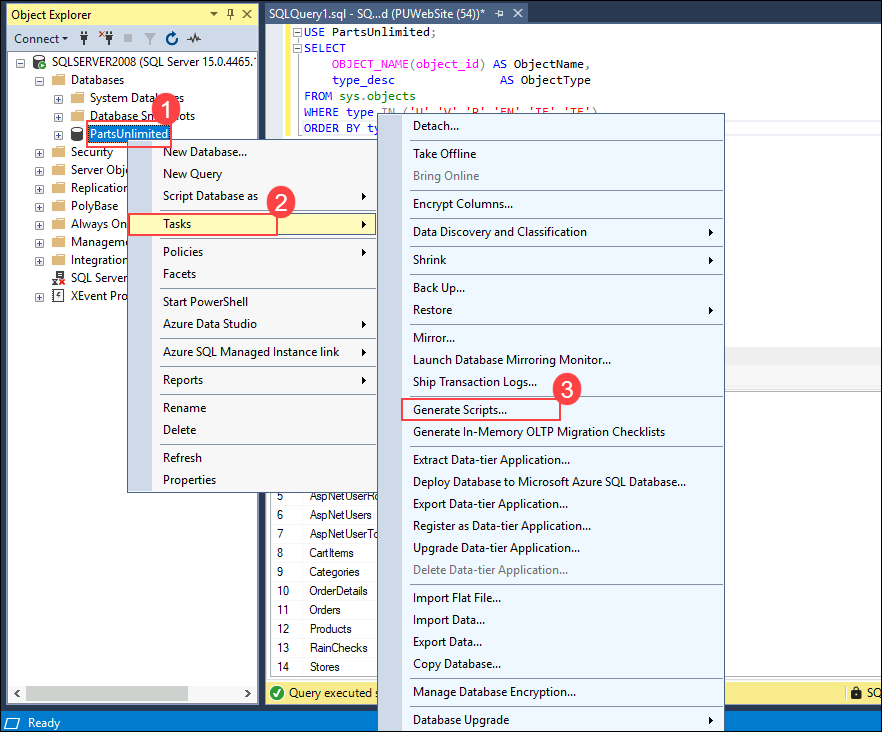

1. On the **Introduction** page of the Generate Scripts wizard, select **Next**.

   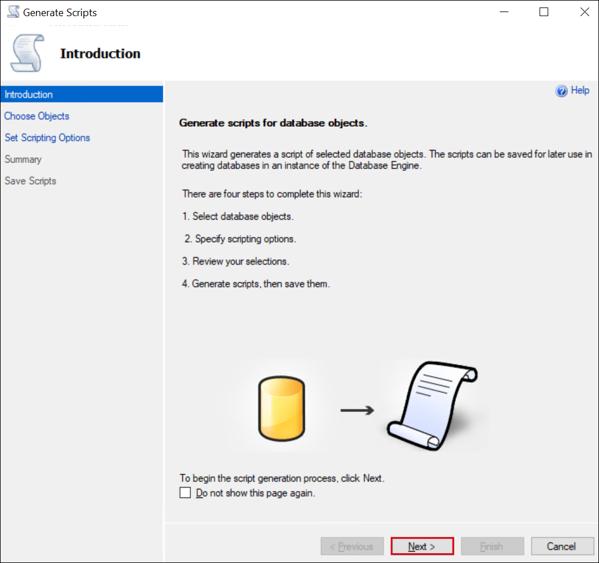

1. On the **Choose Objects** page, ensure that **Script entire database and all database objects (1)** is selected, and then click **Next (2)**.

   

1. On the **Set Scripting Options** page, click **Advanced (1)**. In the **Advanced Scripting Options** dialog, scroll down to locate **Script for the database engine type** and change its value to **Microsoft Azure SQL Database (2)**. Click **OK (3)** to close the dialog.

   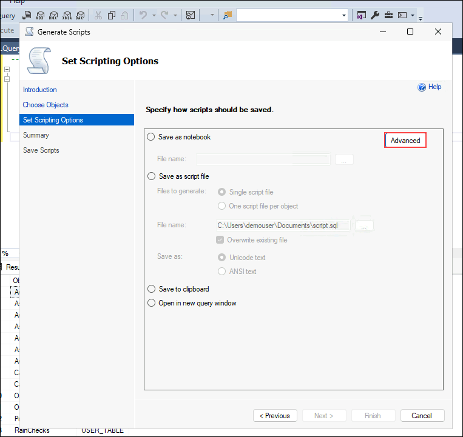

   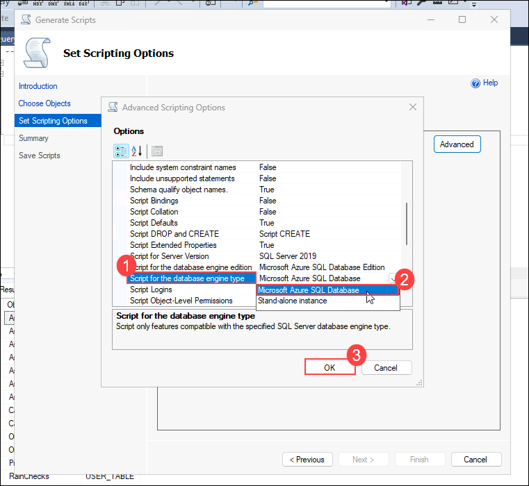

1. Returning to the **Set Scripting Options** page, under **Specify how scripts should be saved**, choose **Open in new query window (1)**, and then click **Next (2)**.

   

1. On the **Summary** page, review the listed objects and click **Next** to generate the script. 

   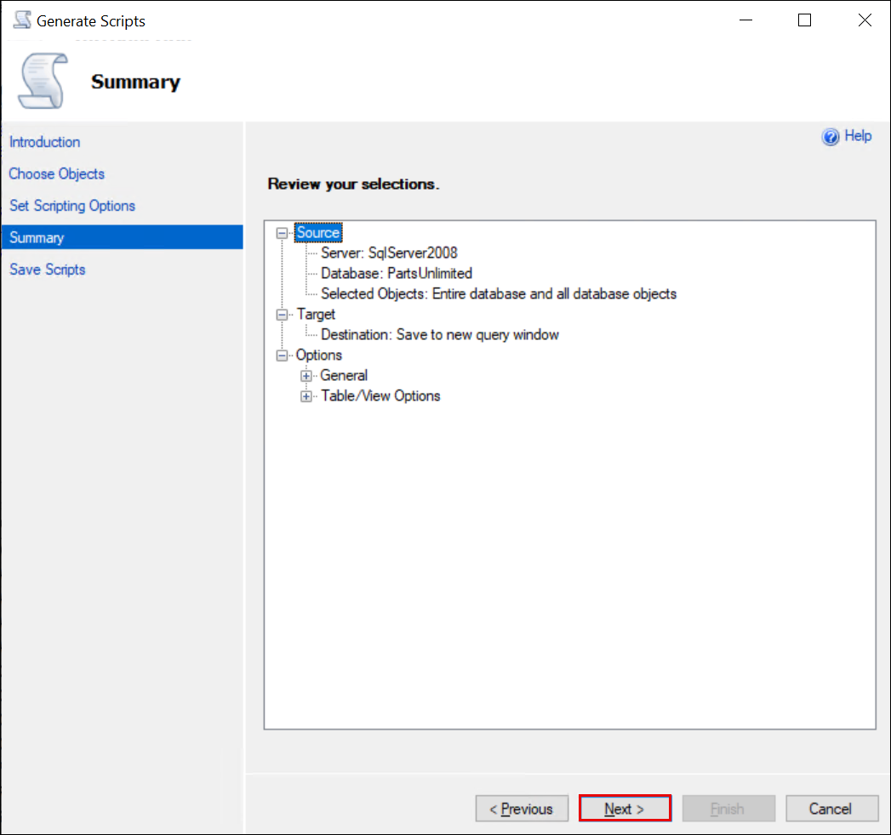

1. Once script generation is complete, click **Finish**.

   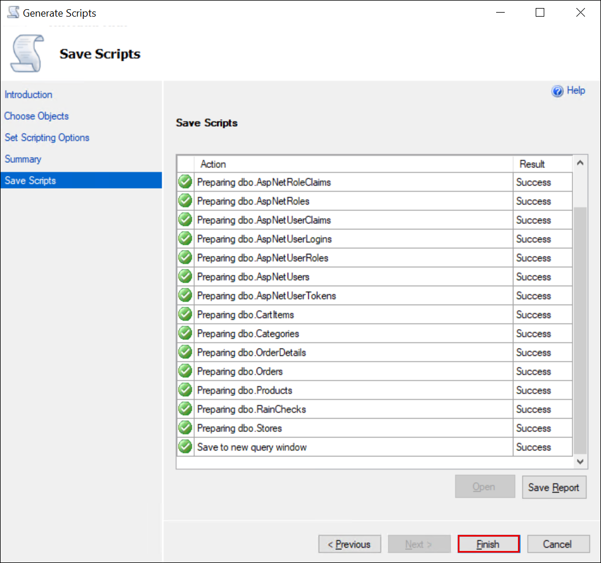

1. The script will now open in a new query window. Before executing it, you must remove specific database-level statements that are unsupported in Azure SQL Database. Press **Ctrl+H** to open the **Find and Replace** tool, then click **Ok**:

   - In the **Find** field, enter `ALTER DATABASE` **(1)**
   - Leave the **Replace with** field completely empty **(2)**
   - Click **Replace All (3)** and close the dialog

   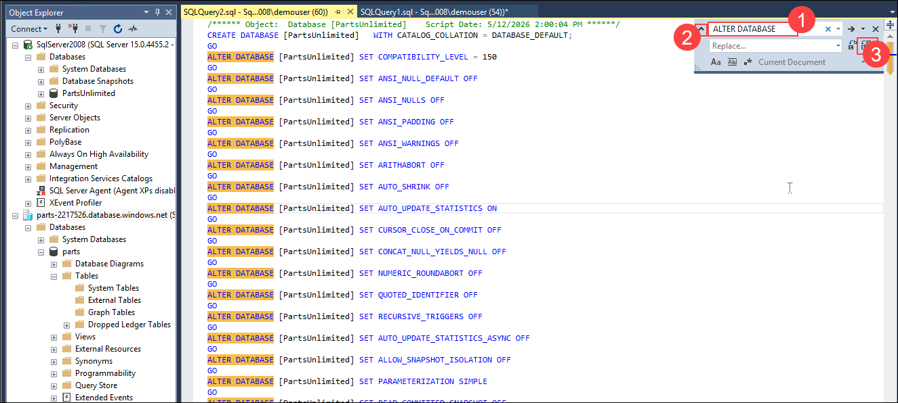

   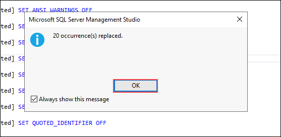

1. Next, scroll to the very top of the script. Locate and **manually delete** the following lines (if they are present), along with their associated `GO` statements:

   ```sql
      /****** Object:  Database [PartsUnlimited]    Script Date: 5/12/2026 2:00:04 PM ******/
   CREATE DATABASE [PartsUnlimited]   WITH CATALOG_COLLATION = DATABASE_DEFAULT;
   GO
   [PartsUnlimited] SET COMPATIBILITY_LEVEL = 150
   GO
   [PartsUnlimited] SET ANSI_NULL_DEFAULT OFF 
   GO
   [PartsUnlimited] SET ANSI_NULLS OFF 
   GO
   [PartsUnlimited] SET ANSI_PADDING OFF 
   GO
   [PartsUnlimited] SET ANSI_WARNINGS OFF 
   GO
   [PartsUnlimited] SET ARITHABORT OFF 
   GO
   [PartsUnlimited] SET AUTO_SHRINK OFF 
   GO
   [PartsUnlimited] SET AUTO_UPDATE_STATISTICS ON 
   GO
   [PartsUnlimited] SET CURSOR_CLOSE_ON_COMMIT OFF 
   GO
   [PartsUnlimited] SET CONCAT_NULL_YIELDS_NULL OFF 
   GO
   [PartsUnlimited] SET NUMERIC_ROUNDABORT OFF 
   GO
   [PartsUnlimited] SET QUOTED_IDENTIFIER OFF 
   GO
   [PartsUnlimited] SET RECURSIVE_TRIGGERS OFF 
   GO
   [PartsUnlimited] SET AUTO_UPDATE_STATISTICS_ASYNC OFF 
   GO
   [PartsUnlimited] SET ALLOW_SNAPSHOT_ISOLATION OFF 
   GO
   [PartsUnlimited] SET PARAMETERIZATION SIMPLE 
   GO
   [PartsUnlimited] SET READ_COMMITTED_SNAPSHOT OFF 
   GO
   [PartsUnlimited] SET  MULTI_USER 
   GO
   [PartsUnlimited] SET QUERY_STORE = OFF
   GO
   /****** Object:  User [PUWebSite]    Script Date: 5/12/2026 2:00:04 PM ******/
   CREATE USER [PUWebSite] FOR LOGIN [PUWebSite] WITH DEFAULT_SCHEMA=[dbo]
   GO
   sys.sp_addrolemember @rolename = N'db_owner', @membername = N'PUWebSite'
   GO
   /****** Object:  Table [dbo].[AspNetRoleClaims]    Script Date: 5/12/2026 2:00:04 PM ******/
   ```

1. At the very top of the newly cleaned script, add the following two lines to explicitly set the correct database context before any other statements are run:

   ```sql
   USE parts
   GO
   ```

   The top of your script should now look exactly like this:

   ```sql
   USE parts
   GO

   /****** Object:  Table [dbo].[AspNetRoleClaims]  ******/
   SET ANSI_NULLS ON
   GO
   ```
   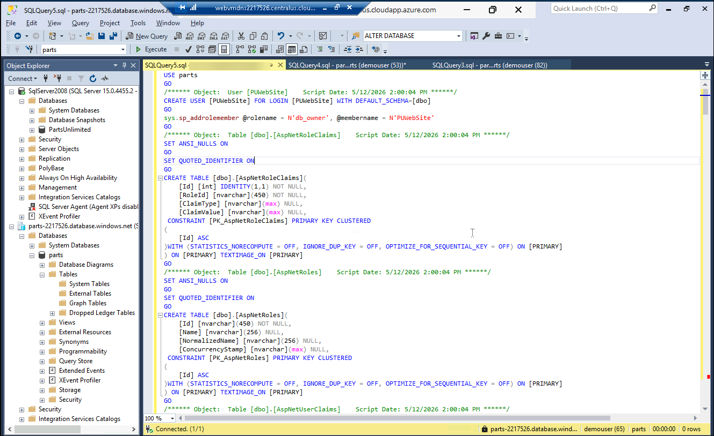
   
   Finally, scroll to the very bottom of your script and manually delete these final two lines:

   ```sql
   ALTER DATABASE [PartsUnlimited] SET  READ_WRITE 
   GO
   ```
   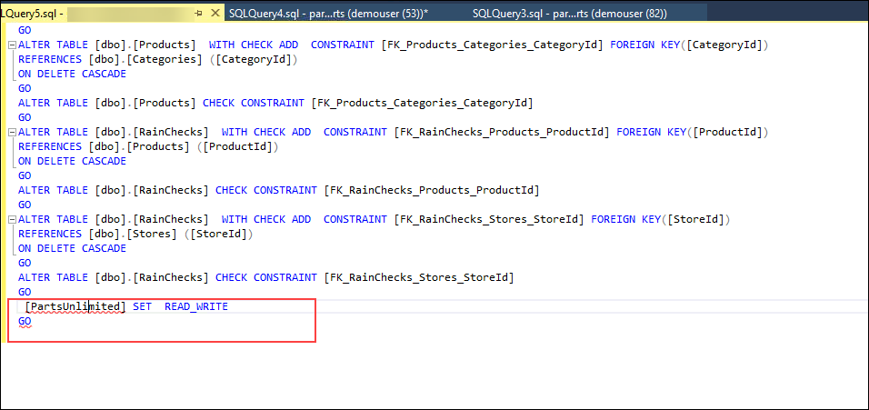

1. You will now connect SSMS to your Azure SQL Database target. In the **Object Explorer**, select **Connect (1)** > **Database Engine (2)**.

   

1. Enter the following details into the **Connect to Server** dialog:

   - **Server name**: Enter the exact server name of your Azure SQL Database — **<inject key="sqlDatabaseName" enableCopy="false"/>.database.windows.net (1)**
   - **Authentication**: Select **SQL Server Authentication (2)**
   - **Login**: Enter **demouser (3)**
   - **Password**: Enter **<inject key="SQLVM Password" /> (4)**
   - **Trust server certificate**: Check this box **(5)**
   - Click **Connect (6)**

   

1. From the **Available Databases** dropdown located in the query toolbar **(1)**, select **parts (2)** to verify that the execution context is correctly set to your target database.

   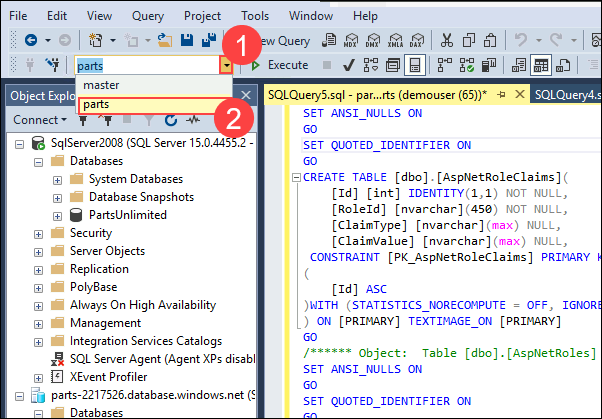

1. Click **Execute (F5) (1)** to run the sanitized schema script against the `parts` database. Monitor the **Messages** tab **(2)** for successful execution.

   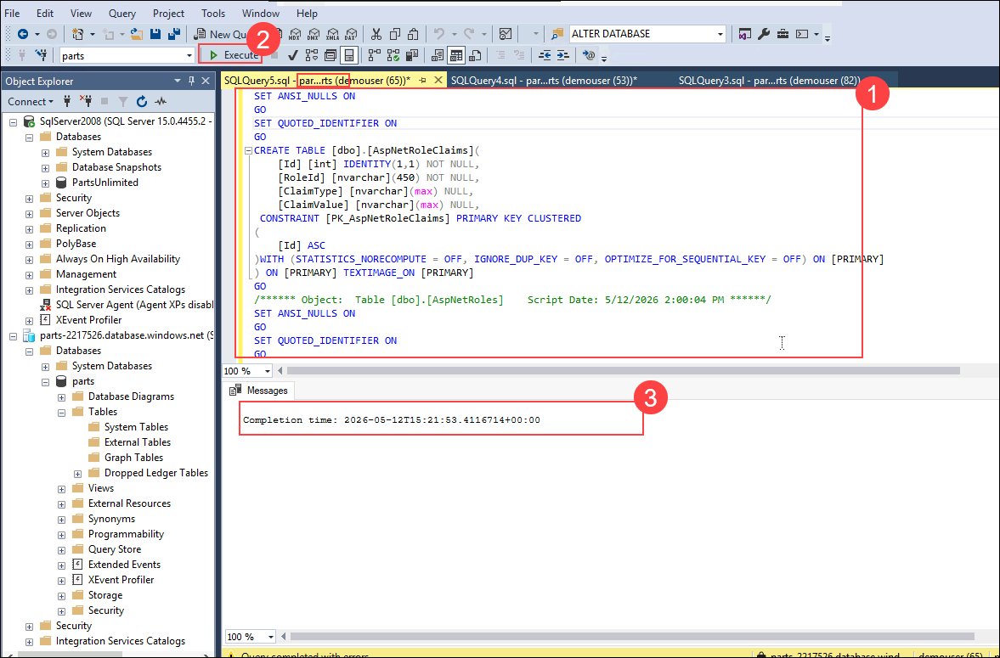

1. Once execution completes, expand **Databases (1)** → **parts (2)** → **Tables (3)** in the Object Explorer to verify that all schema tables were successfully created **(4)**.

   

1. Expand **Security (1)** > **Users (2)** to confirm that the database user **PUWebSite** was also successfully migrated **(3)**.

   

> **Note**: You may now safely disconnect from the **SQLVM**. The remaining steps will be performed from the **WebVM**.

## Task 4: Migrate the database using the Azure Database Migration Service

At this point, you have successfully migrated the database schema using the SSMS Generate Scripts wizard. In this task, you will migrate the actual data from the `PartsUnlimited` database into your new Azure SQL Database utilizing the **Azure Database Migration Service (DMS)**.

> The [Azure Database Migration Service](https://docs.microsoft.com/azure/dms/dms-overview) provides a comprehensive, highly available database migration solution. It supports both offline (one-time) and online (minimal-downtime) migrations. During an offline migration, source database downtime begins as soon as the migration starts. Once the migration is complete, you simply point your environment to the new target Azure SQL Database instance.

1. Within the [Azure portal](https://portal.azure.com), navigate to your Azure Database Migration Service by opening the **hands-on-lab-<inject key="DeploymentID" enableCopy="false"/>** resource group, and then selecting the **parts-dms-<inject key="DeploymentID" enableCopy="false"/>** Azure Database Migration Service from the resource list.

   

1. On the Azure Database Migration Service blade, click **+ New Migration**.

   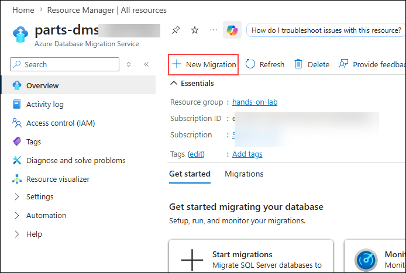

1. On the **New migration** blade, configure the following settings:

   - **Target server type**: Select **Azure SQL Database (1)**.
   - **Migration mode**: Select **Offline (2)**.
   - Click **Configure runtime settings (3)**.
   - When the **Configure integration runtime** pop-up appears, copy either one of the **two authentication keys (4)** to Notepad for safekeeping.

   

1. Navigate back to the **SQLVM** RDP session and click the **Start** button.

   

1. In the search box, type **Microsoft Integration Runtime (1)** and select the **Microsoft Integration Runtime (2)** application from the search results.

   

1. In the **Microsoft Integration Runtime Configuration Manager**, paste the authentication key you copied from the Azure portal **(1)** and click **Register (2)**.

   

1. Click **Finish**.

   

1. Once the Integration Runtime (Self-hosted) node displays as **registered successfully**, minimize the SQLVM RDP window.

1. Navigate back to the **Azure Database Migration Service** within the Azure portal. In the **Configure integration runtime** pop-up, click **OK (1)** and then click **Select (2)**.

   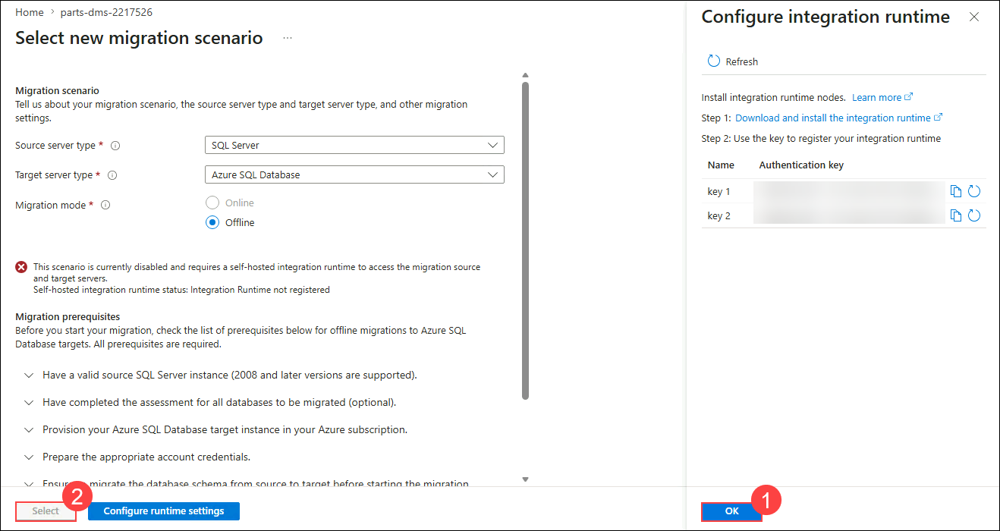

   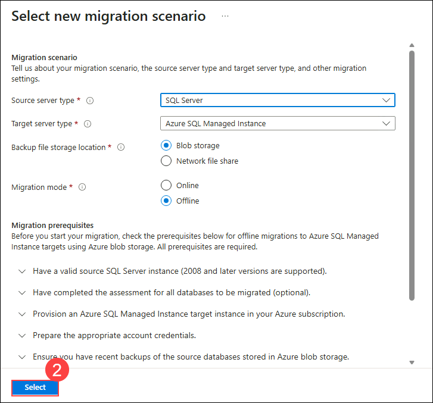
   >**Note:** You may need to refresh your browser to make the Select button visible.

1. On the **Source details** step of the migration wizard, configure the following settings:

   - **Is your source SQL Server instance tracked in Azure?**: Select **No (1)**
   - **Source Infrastructure Type**: Select **Virtual Machine** **(2)**. 
   - **Subscription**: Azure HOL (SUFFIX) / Sub 05 - (SUFFIX) **(3)**
   - **Resource group**: Select **hands-on-lab** **(4)**.
   - **Location** : Select **East US** **(5)**.
   - **SQL Server Instance Name**: Enter **sqlvm<inject key="DeploymentID" enableCopy="false"/>** **(6)**.
   - Click **Next: Connect to source SQL Server >>** **(7)**.

      
        > **Note**: The location must exactly match the region where the Arc-enabled SQL Server resource was registered. Select **East US** even if your other resources reside in a different region.

1. On the **Connect to source SQL Server** step, provide the following details:

   - **Source SQL Server instance name**: Enter the **Private IP address** of the SqlServer **(1)**

     > **Note**: To locate the private IP address, open a new browser tab, navigate to the Azure portal, search for and select the **SqlServer** VM, go to **Networking settings** under the **Networking** section, and copy the displayed **Private IP address**.

      

   - **Authentication type**: Select **SQL Authentication (2)**
   - **Username**: Enter **PUWebSite (3)**
   - **Password**: Enter **<inject key="SQLVM Password" /> (4)**
   - **Connection properties**: Check both **Encrypt connection** and **Trust server certificate (5)**
   - Click **Next: Select databases for migration >> (6)**

      

1. On the **Select databases for migration** step, check **PartsUnlimited (1)** and click **Next: Connect to target Azure SQL Database >> (2)**.

   

1. On the **Connect to target Azure SQL Database** step, enter the following details:

   - **Subscription**: Azure HOL (SUFFIX) / Sub 05 - (SUFFIX) **(1)**
   - **Resource Group**: Select **hands-on-lab (2)**
   - **Target Azure SQL Database Server**: Select **<inject key="sqlDatabaseName" enableCopy="false"/> (3)**
   - **Target server name**: Enter **<inject key="sqlDatabaseName" enableCopy="false"/>.database.windows.net (4)**
   - **Authentication type**: Select **SQL Authentication (5)**
   - **Username**: Enter **demouser (6)**
   - **Password**: Enter **<inject key="SQLVM Password" /> (7)**
   - Click **Next: Map source and target databases >> (8)**

      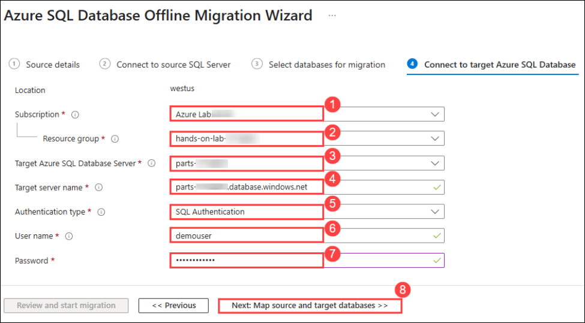

1. On the **Map to target databases** step, confirm that **PartsUnlimited (1)** is selected as the source database and **parts (2)** is mapped as the target database. Then, click **Next: Select database tables to migrate >> (3)**.

   

1. On the **Configure migration settings** step, expand the **PartsUnlimited** database and verify that all necessary tables are selected **(1)**. Then, click **Next: Database migration Summary >> (2)**.

   > **Note**: If certain tables appear greyed out, it indicates that the source table is empty. This is expected behavior. Only select the tables that are not greyed out or that currently contain data.

   

1. On the **Summary** step, click **Start migration**. You can monitor the migration's progress on the Database Migration Service overview page under **Migration Status**.

   

   

   > The data migration will take approximately 2–3 minutes to complete.

1. Once the migration has concluded, the status will update to **Succeeded**.

   

> **Congratulations** on completing the task! Now, it's time to validate it. Please follow these steps:
	
  - Click the **Validate** button for the corresponding task. If you receive a success message, you may proceed to the next task. 
  - If validation fails, carefully read the error message and retry the step following the instructions in the lab guide.
  - If you need any assistance, please contact us at cloudlabs-support@spektrasystems.com. We are available 24/7 to help you.

<validation step="ccf9af72-ea26-4f60-b49c-e6a8af3d0134" />
    
 ## Summary
 
In this exercise, you successfully migrated the on-premises database to Azure SQL Database.

### You have successfully completed the Exercise

**Click Next to proceed to the next exercise.**
