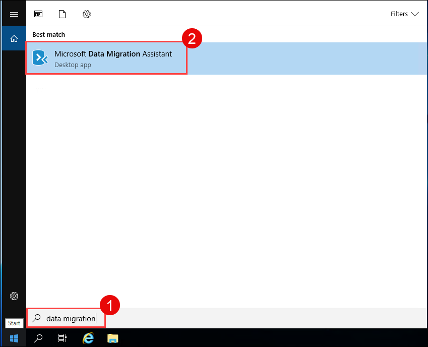
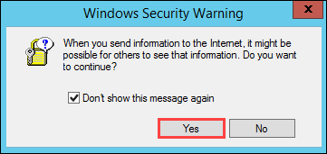
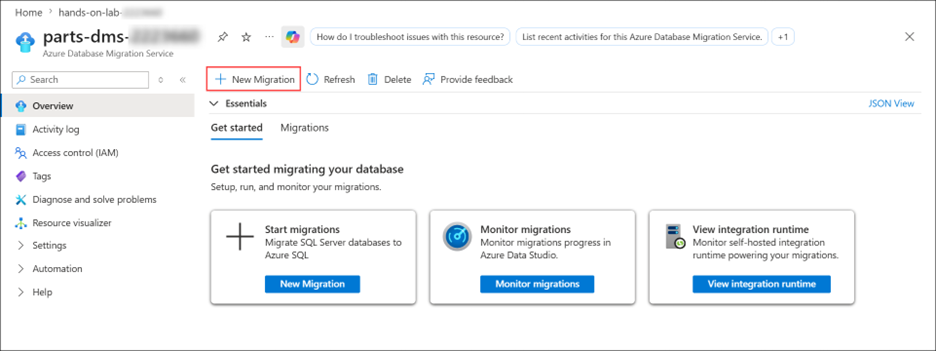
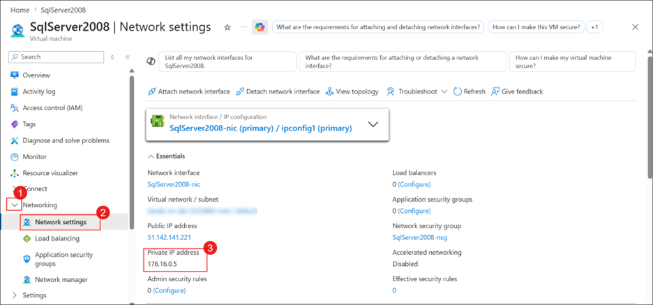
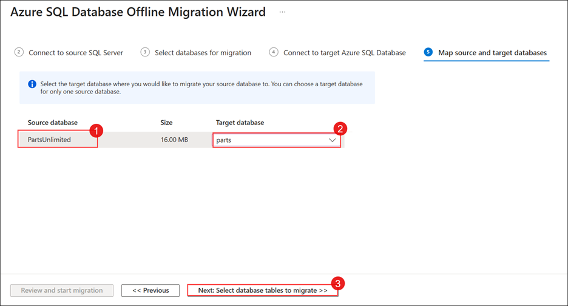
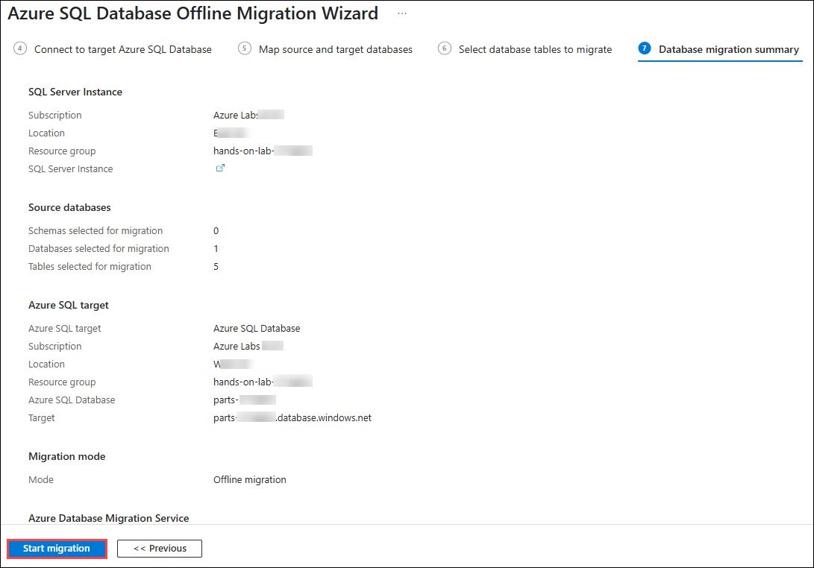

# Exercise 4: Migrate the On-prem Database to Azure and Configure it with your App Service

### Estimated Duration: 80 minutes

## Overview

The next step of Parts Unlimited's migration project is the assessment and migration of its database, which currently runs on SQL Server 2008 R2 on a virtual machine. You will use the **Microsoft Data Migration Assistant (DMA)** — an **Azure Migrate: Database Assessment** tool — to assess the `PartsUnlimited` database for migration to Azure SQL Database. The assessment generates a report detailing any feature parity and compatibility issues between the on-premises database and Azure SQL Database. You will then move the data with **Azure Database Migration Service (DMS)**, an **Azure Migrate: Database Migration** service. Throughout this exercise, the "on-premises" environment is simulated by virtual machines running in Azure.

## Objectives

You will be able to complete the following tasks:

- Task 1: Connect to your SqlServer2008 VM with RDP

- Task 2: Perform assessment for migration to Azure SQL Database

- Task 3: Retrieve connection information for SQL Databases (Optional)

- Task 4: Migrate the database schema using the Data Migration Assistant

- Task 5: Migrate the database using the Azure Database Migration Service 

## Task 1: Connect to your SqlServer2008 VM with RDP

In this task, you will open a Remote Desktop session to the SQLVM, where the source database and the Data Migration Assistant reside.

1. From your lab environment (**WebVM**), in the search bar, **Search (1)** for **RDP (2)** and **select** the **Remote Desktop Connection (3)** app.
   
   

2. Paste the **SQLVM DNS Name** in the **Computer (1)** field and click on **Connect (2)**.
   * **SQLVM DNS Name**: **<inject key="SQLVM DNS Name" style="color:blue" />**

    
 
3. Now, enter the SQLVM **Username (1)** and **Password (2)** provided below, then click the **OK (3)** button. Make sure you add a dot and backslash (`.\`) before the username.
   * **Username**: **<inject key="SQLVM Username" style="color:blue" />** 
   * **Password**: **<inject key="SQLVM Password" style="color:blue" />**
   
         

4. Next, click the **Yes** button to accept the certificate and add it to the trusted certificates.

   

## Task 2: Perform assessment for migration to Azure SQL Database

Parts Unlimited would like an assessment to identify any issues they might need to address before moving their database to Azure SQL Database. In this task, you will use the [Microsoft Data Migration Assistant](https://docs.microsoft.com/sql/dma/dma-overview?view=sql-server-2017) (DMA) to assess the `PartsUnlimited` database against Azure SQL Database (Azure SQL DB). DMA detects compatibility issues that could affect database functionality on the target platform and recommends performance and reliability improvements. The assessment generates a report detailing any feature parity and compatibility issues between the on-premises database and the Azure SQL DB service.

> **Note**: The Data Migration Assistant is already installed on the lab virtual machines. If it is not found, you can download it through Azure Migrate or from the [Microsoft Download Center](https://go.microsoft.com/fwlink/?linkid=2090807). DMA depends on .NET Framework 4.8, which you can download and install from [here](https://go.microsoft.com/fwlink/?LinkId=2085155). Restart the VM before installing DMA.

1. Launch DMA from Windows. Click on the **Start** menu.

   
  
1. Start typing **"data migration" (1)** into the search bar, and then select **Microsoft Data Migration Assistant (2)** from the search results.

    

    > **Note**: There is a known issue with screen resolution when using an RDP connection to Windows Server 2008 R2, which may affect some users. This issue presents itself as very small, hard to read text on the screen. The workaround for this is to use a second monitor for the RDP display, which should allow you to scale up the resolution to make the text larger.

1. In the DMA dialog, select **+** from the left-hand menu to create a new project.

   

1. In the **New** project pane, enter the following values:

   - **Project type (1)**: Select **Assessment**.
   - **Project name (2)**: Enter **Assessment**
   - **Assessment type (3)**: Select **Database Engine**.
   - **Source server type (4)**: Select **SQL Server**.
   - **Target server type (5)**: Select **Azure SQL Database**.
   - Select **Create (6)**.

        

1. On the **Options** screen, ensure that **Check database compatibility** and **Check feature parity** are both checked **(1)**, and then select **Next (2)**.

   

1. On the **Sources** screen, enter the following into the **Connect to a server** dialog that appears on the right-hand side:

    - **Server name**: Enter **SQLSERVER2008 (1)**
    - **Authentication type**: Select **SQL Server Authentication (2)**.
    - **Username**: Enter **PUWebSite (3)**
    - **Password**: Enter **<inject key="SQLVM Password" /> (4)**
    - **Encrypt connection**: Check this box if not checked **(5)**.
    - **Trust server certificate**: Check this box **(6)**.
    - Select **Connect (7)**.

        

1. In the **Add sources** dialog that appears next, check the box for `PartsUnlimited` **(1)** and select **Add (2)**.

    

1. Select **Start Assessment**.

    

1. Take a moment to review the assessment for migrating to Azure SQL DB. The SQL Server feature parity report shows that Analysis Services and SQL Server Reporting Services are unsupported, but neither affects any object in the `PartsUnlimited` database, so the migration is not blocked. If no feature parity issues are reported, proceed to the next step.

    

1. Now, select **Compatibility issues (1)** to review that report as well.

    

    > The DMA assessment reveals no compatibility issues that would prevent Parts Unlimited from migrating the `PartsUnlimited` database to Azure SQL DB.

1. Select **Upload to Azure Migrate** to upload assessment results to Azure.

    

1. Select the correct **Azure** environment **(1)** that contains your subscription. Select **Connect (2)** to proceed to the Azure login screen.

    

1. Use the credentials below to sign in.
    * Email/Username: <inject key="AzureAdUserEmail"></inject>

        

    * Temporary Access Password: <inject key="AzureAdUserPassword"></inject>

        

1. Click **Yes** if a security pop-up appears.

    

1. Select your subscription **(1)** and the **partsunlimitedweb<inject key="DeploymentID" enableCopy="false"/>** Azure Migrate project **(2)**. Select **Upload (3)** to start the upload to Azure.

    

    > **Note**: If you see **Failed to fetch subscription list from Azure, Strong Authentication is required (1)**, MFA is preventing some subscriptions from being listed. Your lab subscription should still appear.

     

1. Once the upload is complete, select **OK**.

    

1. Minimize the **SQLVM** and return to the Azure portal.

## Task 3: Retrieve connection information for SQL Databases (Optional)

In this task, you will retrieve the fully qualified domain name of the Azure SQL Database. You need this value to connect to the Azure SQL Database from the Data Migration Assistant and the Azure Database Migration Service.

1. Navigate back to the [Azure portal](https://portal.azure.com). From the **Search resources, services, and docs** blade, search for and select **SQL database (1)**, then select **Azure SQL database (2)** from the services.

   

1. Navigate to your **SQL database** resource by selecting the **parts SQL database** resource from the resources list.

   

1. On the **Overview** blade of your SQL database, copy the **Server name** and paste the value into a text editor, such as Notepad.exe — you will need it in the next two tasks.

   

## Task 4: Migrate the database schema using the Data Migration Assistant

After reviewing the assessment results and confirming the database is a candidate for migration to Azure SQL Database, use the Data Migration Assistant to migrate the schema to Azure SQL Database.

1. Navigate back to the SQLVM remote session. Return to the Data Migration Assistant and select the New **(+)** icon in the left-hand menu.

1. In the **New** project dialog, enter the following:

   - **Project type (1)**: Select **Migration**.
   - **Project name (2)**: Enter **Migration**
   - **Source server type (3)**: Select **SQL Server**.
   - **Target server type (4)**: Select **Azure SQL Database**.
   - **Migration scope (5)**: Select **Schema only**.
   - Select **Create (6)**.

        

1. On the **Select source** tab, enter the following:

   - **Server name**: Enter **SQLSERVER2008 (1)**.
   - **Authentication type**: Select **SQL Server Authentication (2)**.
   - **Username**: Enter **PUWebSite (3)**
   - **Password**: Enter **<inject key="SQLVM Password" /> (4)**
   - **Encrypt connection**: Check this box **(5)**.
   - **Trust server certificate**: Check this box **(6)**.
   - Select **Connect (7)**, and then ensure the `PartsUnlimited` database is selected **(8)** from the list of databases.
   - Select **Next (9)**.

        

1. On the **Select target** tab, enter the following:

   - **Server name**: Enter the server name of your Azure SQL Database that you copied into your text editor in the previous task - **<inject key="sqlDatabaseName" enableCopy="false"/>.database.windows.net (1)** 
   - **Authentication type**: Select **SQL Server Authentication (2)**.
   - **Username**: Enter **demouser (3)**
   - **Password**: Enter **<inject key="SQLVM Password" /> (4)**
   - **Encrypt connection**: Check this box **(5)**.
   - **Trust server certificate**: Check this box **(6)**.
   - Select **Connect (7)**, and then ensure the `parts` database is selected **(8)** from the list of databases.
   - Select **Next (9)**.

        

1. On the **Select objects** tab, leave all the objects checked **(1)**, and select **Generate SQL script (2)**.

    

1. On the **Script & deploy schema** tab, review the generated script. Note the confirmation that there are no blocking issues **(1)**. Now, select **Deploy schema (2)**.

    

1. After the schema is deployed, review the deployment results, and ensure there are no errors.

    

1. Click the Windows **Start** menu to launch **SQL Server Management Studio (SSMS)**.

    

1. Start typing **sql server management** **(1)** into the search bar, then select **SQL Server Management Studio 20 (2)** in the search results.

    

1. Close the **Connect to Server** pop-up.

    

1. Connect to your Azure SQL Database by selecting **Connect (1)** > **Database Engine (2)** in the **Object Explorer**.

    

1. Enter the following into the **Connect to Server** dialog:

    - **Server name**: Enter the server name of your Azure SQL Database - **<inject key="sqlDatabaseName" enableCopy="false"/>.database.windows.net (1)** 
    - **Authentication type**: Select **SQL Server Authentication (2)**.
    - **Login**: Enter **demouser (3)**
    - **Password**: Enter **<inject key="SQLVM Password" /> (4)**
    - **Remember password**: Check this box **(5)**.
    - Select **Connect (6)**.

        

1. Once connected, expand **Databases (1)**, then **parts (2)**, then **Tables (3)**, and observe the schema that has been created **(4)**. 

    

1. Expand **Security (1)** > **Users (2)** to confirm that the database user was migrated as well **(3)**.

    

    > **Note**: You can now minimize the **SQLVM** session and continue from the **WebVM**. Keep the session open — you will return to the SQLVM in Task 5 to register the integration runtime.

## Task 5: Migrate the database using the Azure Database Migration Service

At this point, you have migrated the database schema using DMA. In this task, you will migrate the data from the `PartsUnlimited` database into the new Azure SQL Database using the Azure Database Migration Service.

> The [Azure Database Migration Service](https://docs.microsoft.com/azure/dms/dms-overview) integrates some of the functionality of Microsoft's existing tools and services to provide customers with a comprehensive, highly available database migration solution. The service uses the Data Migration Assistant to generate assessment reports that provide recommendations to guide you through the changes required prior to performing a migration. When you're ready to begin the migration process, Azure Database Migration Service performs all of the required steps.

1. Navigate back to the [Azure portal](https://portal.azure.com). Navigate to your Azure Database Migration Service by selecting the **hands-on-lab-<inject key="DeploymentID" enableCopy="false"/>** resource group, then select the **parts-dms-<inject key="DeploymentID" enableCopy="false"/>** Azure Database Migration Service from the list of resources.

   

1. On the Azure Database Migration Service Blade, select **+ New Migration**.

    

1. On the New migration project blade, enter the following:

   - **Target server type**: Select **Azure SQL Database** **(1)**.
   - **Migration mode**: Select **Offline** **(2)**.
   - Select **Configure runtime settings** **(3)**.
   - When the **Configure integration runtime** pop-up appears, copy either of the **two keys (4)** into Notepad.

     

1. Navigate back to the **SQLVM**, click the **Start** button. 

    

1. In the search box, type **Microsoft Integration Runtime** **(1)** then select **Microsoft Integration Runtime** **(2)** from the search results.

    

1. Once the runtime opens, it asks for the authentication key you copied from the Azure portal. Paste the key **(1)** and click **Register (2)**.

   

1. Click on **Finish**.

   

1. Once the Integration Runtime (Self-hosted) node has been **registered successfully**, minimize the SQLVM RDP window.
    
    

1. Navigate back to **Azure Database Migration Service** in the Azure portal. In the **Configure integration runtime** pop-up, click **OK (1)** and then click **Select (2)**.

   

1. On the Migration Wizard **Source details** Blade, enter the following:

   - **Source Infrastructure Type**: Select **Virtual Machine** **(1)**. 
   - **Subscription**: Select the available Subscription **(2)**.
   - **Resource group**: Select **hands-on-lab-<inject key="DeploymentID" enableCopy="false"/>** **(3)**.
   - **Location**: Select **East US** **(4)**.
   - **SQL Server Instance Name**: Enter **sqlvm<inject key="DeploymentID" enableCopy="false"/>** **(5)**.
   - Select **Next: Connect to source SQL Server >>** **(6)**.

     

     > **Note**: If you encounter the validation error `Failed to create SQL Server instance. Insufficient permissions to register resource provider Microsoft.AzureArcData`, close the error and continue with the next step.

1. On the Migration Wizard **Select source** Blade, enter the following:

   - **Source Server name**: Enter the private IP address of **SqlServer2008** **(1)**.  
     >**Note**: To obtain the private IP address, search for and select **SqlServer2008** in the Azure portal. In the screenshot below, navigate to the **Networking (1)** section, open **Networking settings (2)**, and copy the **private IP address (3)** displayed there.

           

   - **Authentication type**: Select **SQL Authentication (2)**.
   
   - **Username**: Enter **PUWebSite** **(3)**
   
   - **Password**: Enter **<inject key="SQLVM Password" />** **(4)**.
   
   - **Connection properties**: Check both **Encrypt connection** and **Trust server certificate** **(5)**.
   
   - Select **Next: Select databases for migration** **(6)**. 
  
     
   
1. Select the **PartsUnlimited (1)** database. Select **Next: Connect to target Azure SQL Database >> (2)** to continue.
    
    

1. On the Migration Wizard **Select target** Blade, enter the following:

   - **Subscription**: Leave the default Subscription **(1)**
    
   - **Resource Group**: Select your **hands-on-lab-<inject key="DeploymentID" enableCopy="false"/>** resource group **(2)**

    - **Target Azure SQL Database Server**: Select **<inject key="sqlDatabaseName" 	enableCopy="false"/> (3)**
    
    - **Target server name**: Enter the server name of your Azure SQL Database - **<inject key="sqlDatabaseName" 	enableCopy="false"/>.database.windows.net (4)**
    
    - **Authentication type**: Select **SQL Authentication (5)**.
    
    - **Username**: Enter **demouser (6)**
    
    - **Password**: Enter **<inject key="SQLVM Password" /> (7)**
    
    - Select **Next: Map source and target databases >> (8)**.
    
        

1. On the Migration Wizard **Map to target databases** Blade, confirm that **PartsUnlimited (1)** is checked as the source database, and **parts (2)** is the target database on the same line, then select **Next: Select database tables to migrate >> (3)**.

    

1. On the Migration Wizard **Configure migration settings** Blade, expand the **PartsUnlimited** database, verify all the tables are selected **(1)** and select **Next: Database migration Summary >> (2)**.

    > **Note**: Any table shown as greyed out is empty in the source database and cannot be migrated. This is expected — select only the tables that are not greyed out.

    

1. On the Migration Wizard **Summary** blade, select **Start migration**, then monitor **Migration Status** on the Database Migration Service overview page.

    

    

    > The migration takes approximately 2-3 minutes to complete.

1. When the migration is complete, the status shows as **Succeeded**.

    

> **Congratulations** on completing the task! Now, it's time to validate it. Here are the steps:
	
  - Hit the Validate button for the corresponding task. If you receive a success message, you can proceed to the next task. 
  - If not, carefully read the error message and retry the step, following the instructions in the lab guide.
  - If you need any assistance, please contact us at cloudlabs-support@spektrasystems.com. We are available 24/7 to help you out.

<validation step="a8a1d661-ea26-4328-87ac-062ff7cf6dd2" />
    
## Summary
 
In this exercise, you have assessed the on-premises database with the Data Migration Assistant, deployed its schema to Azure SQL Database, and migrated the data using the Azure Database Migration Service.

### You have successfully completed the exercise

Now, click on **Next** from the lower right corner to move on to the next page.

