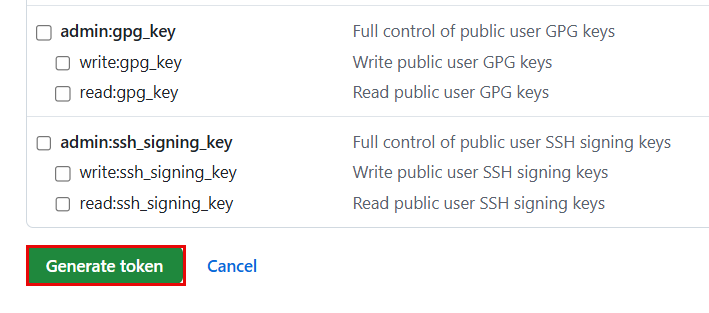
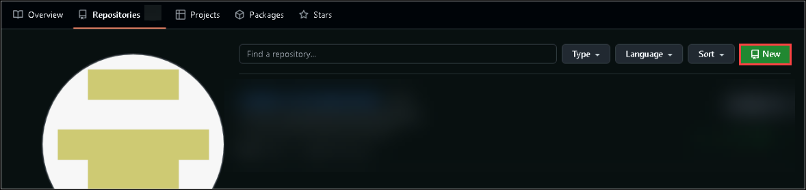
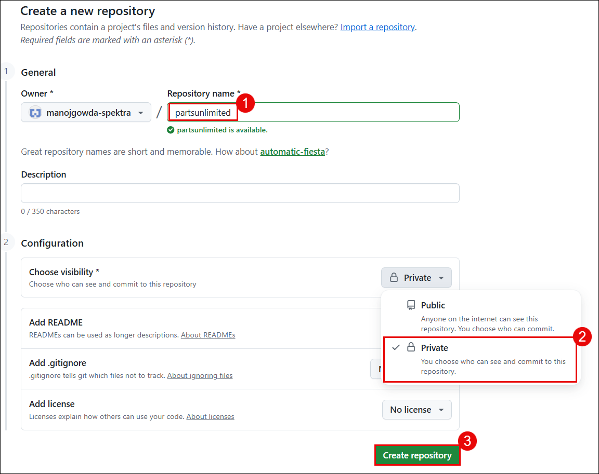
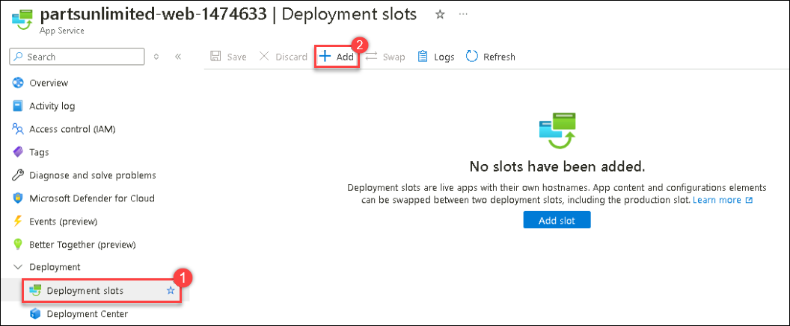
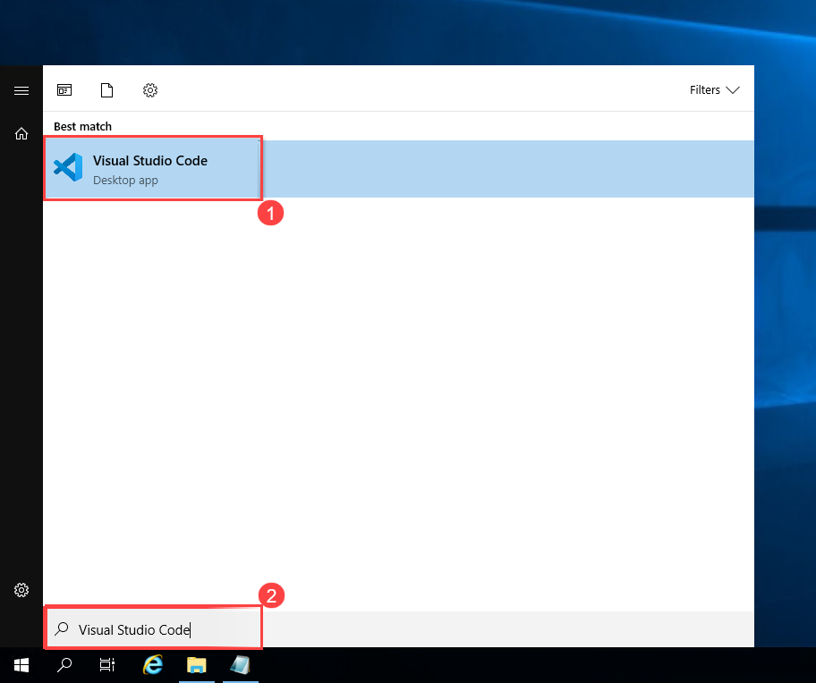
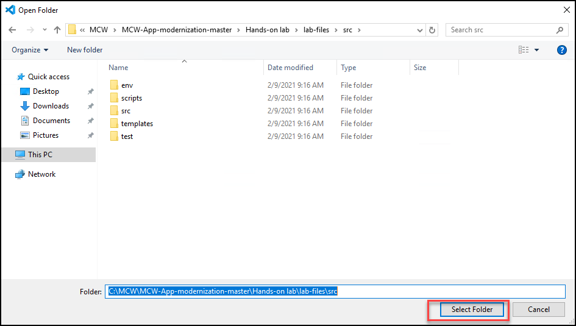
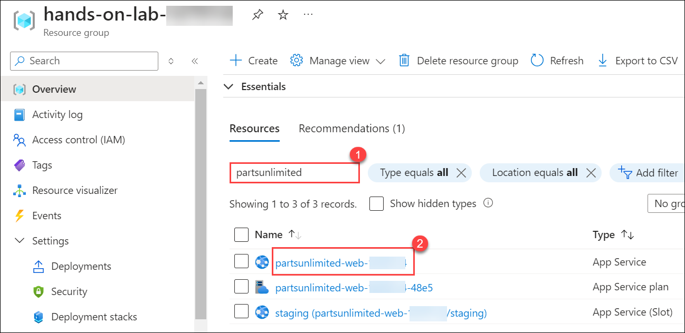
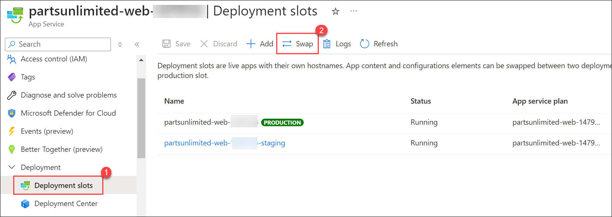

# Exercise 5: Set up CI/CD pipeline with GitHub Actions for the web app

### Estimated Duration: 80 minutes

In this exercise, you will move the codebase to a GitHub Repo, create a staging environment in Azure App Service using App Service Deployment Slots, and finally connect the pieces with a CI/CD Pipeline built on GitHub Actions.

### Lab objectives
In this lab, you will complete the following tasks:
   - Task 1: Moving the codebase to a GitHub repo
   - Task 2: Creating a staging deployment slot
   - Task 3: Setting up CI/CD with GitHub Actions
   - Task 4: Pushing code changes to staging and production
   - Task 5: Swap deployment slots to move changes in staging to production

### Task 1: Moving the codebase to a GitHub repo

In this task, you will learn how to create a GitHub repository, generate a Personal Access Token (PAT), initialize a Git repository locally, and push the source code to GitHub using PowerShell.

1. Browse to `https://github.com` in your web browser and log in using your GitHub credentials.

   > **Note:** If you do not have a GitHub account, navigate to `https://github.com/join` to create one.
  
1. Create a Personal Access Token by following the steps below:

     - In the upper-right corner of your GitHub page, click your profile photo, then select **Settings**.

        

     - From the left-hand menu, select **Developer settings**.

        

     - Next, click the **Personal access tokens (1)** dropdown and select **Tokens (classic) (2)**. Click the **Generate new token (3)** button on the right and select **Generate new token (classic) (4)** from the list. Provide your GitHub password if prompted.

        

     - Select the scopes or permissions you would like to grant this token:

        - **Note**: Enter **Auth-token** in the note field.

        - **Select scopes**: Check the following scopes when configuring your GitHub Personal Access Token:

            - `repo` - Full control of private repositories

            - `workflow` - Update GitHub Action workflows

            - `write:packages` - Upload packages to GitHub Package Registry

            - `delete:packages` - Delete packages from GitHub Package Registry

            - `read:org` - Read org and team membership, read org projects

                

            - Leave all other values as their defaults and select **Generate token**.

                
  
1. Click the **Copy** icon to copy the token to your clipboard and temporarily save it in Notepad. For security reasons, once you leave this page, you will not be able to view the token again. **DO NOT COMMIT THIS TOKEN TO YOUR REPOSITORY!**

     

1. In the upper-right corner of your GitHub page, click your profile photo, select **Your Repositories**, and click the **New** button positioned at the top of the repositories list. Alternatively, you can [navigate to the new repository page directly](https://github.com/new).

     

1. Type `partsunlimited` **(1)** as your repository name. Select **Private (2)** to restrict public access to the repository. Select **Create repository (3)** to continue.

     

1. Click the **copy to clipboard** button to copy the Git endpoint URL for your repository. Paste this value into a text editor (like Notepad) for later reference.

     

   We will now use the Lab VM to execute development tasks.

1. Right-click the Windows Start Menu and select **Windows PowerShell (Admin)** to launch a terminal window.

     

1. The Parts Unlimited website's source code is already copied onto the VM as part of the initial lab setup. Run the command below to navigate directly to the source code folder:

    ```PowerShell
    cd "C:\MCW\MCW-App-modernization-microsoft-app-modernization-v2\Hands-on lab\lab-files\src"
    ```
1. Run the following command to initialize a local Git repository:

    ```PowerShell
    git init
    ```

     

1. Next, we must define the remote endpoint as the origin for our local repository. Replace `{YourEndpointURL}` with the endpoint URL you copied previously from GitHub. Execute the command in your PowerShell terminal:

    ```PowerShell
    git remote add origin {YourEndpointURL}
    ```

    

1. Run the following commands to rename the current branch to **main** and stage all files for the initial commit:

    ```PowerShell
    git branch -M main
    git add .
    ```

1. Before committing our changes, we must configure our Git username and email. In the following command, replace `John Doe` with your actual name and `johndoe@example.com` with your email address. Once updated, run the commands in your PowerShell terminal:

    ```PowerShell
    git config --global user.name "John Doe"
    git config --global user.email johndoe@example.com
    ```

1. We are now ready to commit the source code to our local Git repository. Run the following command:

    ```PowerShell
    git commit -m "Initial Commit"
    ```

1. Let's push the code to GitHub. Run the following command in your PowerShell terminal:

    ```PowerShell
    git push -u origin main
    ```

1. The GitHub authentication screen will pop up. Provide the **Personal Access Token** you generated earlier and click **Sign in**.

    > **NOTE**: Occasionally, an authentication screen may not pop up. Instead, you might be prompted to enter your credentials directly within the PowerShell window.
      
     > If this occurs, provide your GitHub account details:
      
     > - **Username:** Enter your GitHub Username
     > - **Password:** Paste the **Personal Access Token** you copied earlier in Step 3.

1. Return to GitHub and verify that the repository is now populated with your source code.

    

### Task 2: Creating a staging deployment slot

In this task, you will learn how to set up a staging deployment slot in your Azure App Service. This allows you to test updates in a production-like environment without affecting the live site.

1. Return to your lab resource group and navigate to your **partsunlimited-web-<inject key="DeploymentID" enableCopy="false"/> (2)** App Service resource. You can search for `partsunlimited-web` **(1)** to quickly locate your Web App.

   

1. Switch to the **Deployment slots (1)** tab and select **+ Add (2)**.

    

1. Enter **staging (1)** as the name for the new slot. Select your app service name from the **Clone settings from (2)** dropdown menu. This action will replicate the website configurations from the production environment to the staging environment, providing a solid foundation. Click **Add (3)** to create the new slot.

    

1. Once you receive the success message, **Close (1)** the panel. You can now observe **(2)** the two distinct environments available for your App Service in the deployment slots list.

    

### Task 3: Setting up CI/CD with GitHub Actions

In this task, you will learn how to automate application deployments using GitHub Actions and a staging deployment slot in Azure App Service.

1. Select your staging slot from the list of deployment slots.

1. From the toolbar menu, select **Download publish profile**. The publish profile is used to securely authenticate GitHub with Azure.

    

    >**Note:** Click **OK** on the **Download publish profile** pop-up, then repeat Step 2 if necessary.

1. Open the downloaded file in a text editor. Keep this editor open for the next steps.

1. In a web browser, return to your GitHub repository and select the **Settings** tab.

    

1. From the left menu, select **Secrets and variables (1)**. Next, click **Actions (2)** and select **New repository secret (3)**.

    

1. Enter the following values in the **New secret** form, then select **Add secret**:

    | Field | Value |
    |-------|-------|
    | Name  | AZURE_WEBAPP_PUBLISH_PROFILE |
    | Secret | Copy and paste the entire contents of the downloaded publish profile from your text editor. |

    

1. Select the **Actions** tab.

    

1. On the **Get started with GitHub Actions** screen, select the **set up a workflow yourself** link.

    

1. On the workflow editor screen, provide the file name **stagingdeploy.yml**. Commit your initial changes by clicking the **Commit Changes** button twice.

    

1. Open a PowerShell window. Execute the following commands to pull the newly created `stagingdeploy.yml` file to your local repository. We will update its contents using a pre-configured template:

    ```cmd
    cd "C:\MCW\MCW-App-modernization-microsoft-app-modernization-v2\Hands-on lab\lab-files\src"
    ```
    ```cmd
    git pull
    ```

    

1. Open File Explorer and copy the `stagingdeploy.yml` file from `C:\MCW\MCW-App-modernization-microsoft-app-modernization-v2\Hands-on lab\lab-files\workflow\stagingdeploy.yml`, then paste it into the `C:\MCW\MCW-App-modernization-microsoft-app-modernization-v2\Hands-on lab\lab-files\src\.github\workflows\` directory, overwriting the default GitHub workflow YAML file.

1. Open the `stagingdeploy.yml` file in Visual Studio Code. Replace the suffix value on lines 7 and 11 with **<inject key="DeploymentID" />** to properly target your lab environment. Save the file by pressing **CTRL+S**.

    

1. You have just updated the `partsunlimited` GitHub workflow. It is time to save and push your changes. Execute these commands in your terminal window:

    ```cmd
    cd "C:\MCW\MCW-App-modernization-microsoft-app-modernization-v2\Hands-on lab\lab-files\src"
    git add .
    git commit -am "Updated the stagingdeploy.yml"
    git push 
    ```

1. In GitHub, navigate to the **Actions** tab. The workflow will display as currently in progress.

    

1. Return to your lab resource group on the Azure portal and navigate to your `staging (partsunlimited-web-/staging)` **(2)** App Service resource. You can search for `staging` **(1)** to easily find your staging slot.

    

1. Notice the dedicated web link provided for your staging slot. Click the URL to navigate to the website and view the result of your successful deployment through the CI/CD pipeline.

    

### Task 4: Pushing code changes to staging and production

In this task, you will learn how to push code changes to the staging environment for testing before deploying them to production using Visual Studio Code and GitHub.

1. Open the Windows Start menu, search for **Visual Studio Code**, and launch the application.

    

1. Open the **File (1)** menu and select **Open Folder... (2)**.

    

1. Navigate to `C:\MCW\MCW-App-modernization-microsoft-app-modernization-v2\Hands-on lab\lab-files\src` and click **Select Folder (1)**.

    

1. Select **Yes, I trust the authors**.

   

1. We are going to introduce a brand-new change to the Parts Unlimited website. In the Explorer window, navigate to **src > PartsUnlimitedWebSite > Views > Home** and open **Index.cshtml (4)** for editing. Update the page title **(5)** by adding the word **New** at the beginning of the sentence. Save the file by opening the **File** menu and clicking **Save**. You will notice that the underlying Git repository instantly detects a change **(6)** in your codebase.

    

1. Select the **Source Control (1)** tab in Visual Studio Code. Because we previously updated the workflow directly in GitHub, the remote repository is now ahead of our local codebase. Open the **Views and more actions... (2)** menu and select **Pull (3)** to synchronize the latest changes from the remote repository.

    

1. Select **Stage Changes (1)** (the `+` icon). Type a descriptive commit message **(2)** for your changes. Finally, click **Commit (3)**.

    

1. Open the **Views and more actions... (1)** menu and select **Push (2)** to upload your committed changes to GitHub.

    

1. Open your GitHub repository and check the **Actions** page to observe the automatic execution of your CI/CD pipeline triggered by your push.

    

1. Navigate to the staging environment endpoint in your browser to verify that the page title has successfully updated.

    

Now that Parts Unlimited has a dedicated staging environment for their e-commerce site, developers can confidently push new source code and functionality to the repository. The CI/CD pipeline will automatically build and deploy these changes to the staging slot for rigorous testing.

### Task 5: Swap deployment slots to move changes in staging to production

In this task, you will learn how to swap the staging and production slots in your Azure App Service, effectively moving changes from the staging environment directly to production. This action is instantaneous and allows you to seamlessly revert changes by simply swapping back if necessary.

Once Parts Unlimited is satisfied with the changes tested in the staging environment, they can execute a slot swap to instantly deploy the changes to production. The environment swap occurs with zero downtime, and if any issues arise, the team can easily roll back the changes by swapping the slots again.

1. Return to your lab resource group and navigate to your **partsunlimited-web-<inject key="DeploymentID" enableCopy="false"/>** **(2)** App Service resource. You can search for `partsunlimited-web` **(1)** to quickly find your app service.

   

1. Switch to the **Deployment slots (1)** tab and click **Swap (2)**.

    

1. Click the **Start Swap** button to immediately swap the staging slot with the production slot.

    

1. Once you receive the success message, close the swap panel.

1. Visit both the production and staging slot endpoints in your browser to observe how the title change has seamlessly moved to the production environment.

  > **Congratulations** on completing the task! Now, it's time to validate it. Here are the steps:
	
  - Click the **Validate** button for the corresponding task. If you receive a success message, you may proceed to the next task. 
  - If validation fails, carefully read the error message and retry the step following the instructions in the lab guide.
  - If you require any assistance, please contact us at cloudlabs-support@spektrasystems.com. We are available 24/7 to help you.
    
<validation step="82050f07-804c-4044-8a1a-4e0eb6d9c630" />

## Summary
 
In this exercise, you have successfully completed the following:

   - Created a staging deployment slot in Azure App Service.
   
   - Set up a CI/CD pipeline built on GitHub Actions, successfully pushing code changes to both staging and production deployment slots.

Click **Next** in the lower right corner to proceed to the next page.


