# Exercise 5: Set up CI/CD pipeline with GitHub Actions for the web app

### Estimated Duration: 80 Minutes

In this exercise, you will move the codebase to a GitHub Repo, create a staging environment in Azure App Service using App Service Deployment Slots, and finally connect the pieces with a CI/CD Pipeline built on GitHub Actions.

### Objectives

In this exercise, you will complete the following tasks:
   - Task 1: Moving the codebase to a GitHub repo
   - Task 2: Creating a staging deployment slot
   - Task 3: Setting up CI/CD with GitHub Actions
   - Task 4: Pushing code changes to staging and production
   - Task 5: Swap deployment slots to move changes in staging to production

### Task 1: Moving the codebase to a GitHub repo

In this task, you will learn how to create a GitHub repository, generate a personal access token (PAT), initialize a Git repository locally, and push the source code to GitHub using PowerShell.

1. Browse to `https://github.com` in your browser and log in to your **personal account** using your own GitHub credentials.

   > **Note:** If you don't have a GitHub account, navigate to the following link: `https://github.com/join` and create one.
  
2. Create a Personal Access Token as described below.

     - In the upper-right corner of your GitHub page, select your profile photo, then click **Settings**.

        

     - From the left-hand side menu, select **Developer settings**.

        

     - Now, click **Personal access tokens (1)** dropdown and select **Tokens (classic) (2)**, click on **Generate new token (3)** button on the right and select **Generate new token (classic) (4)** from the list. Provide the GitHub password if prompted.

        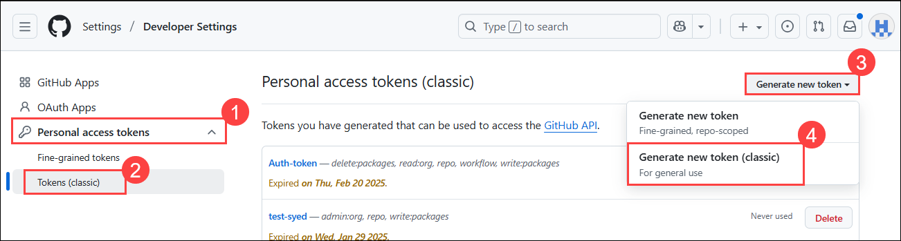

     - Select the scopes or permissions you would like to grant this token.

        - Note: Enter **Auth-token** in the note field.

        - Select scopes: Select the following scopes when configuring your GitHub Personal Access Token

            - `repo` - Full control of private repositories

            - `workflow` - Update GitHub Action workflows

            - `write:packages` - Upload packages to GitHub Package Registry

            - `delete:packages` - Delete packages from GitHub Package Registry

            - `read:org` - Read org and team membership, read org projects

                

            - Leave other values as default and select **Generate token**.

                
  
 3. Click on the **Copy** icon to copy the token to your clipboard and save it on your notepad. For security reasons, after you get off the page, you will not be able to see the token again. **DO NOT COMMIT THIS TO YOUR REPO!**

     

 4. In the upper-right corner of your GitHub page, select your profile photo, then click **Repositories** and select the **New** button positioned on the top of the repositories list. As an alternative, you can [navigate to the new repository site here](https://github.com/new).

     

5. Type in `partsunlimited` **(1)** as your repository name. Click on the dropdown menu **(2)** for Choose visibility and select **Private (3)** to prevent public access to the repository. Select **Create repository (4)** to continue.

     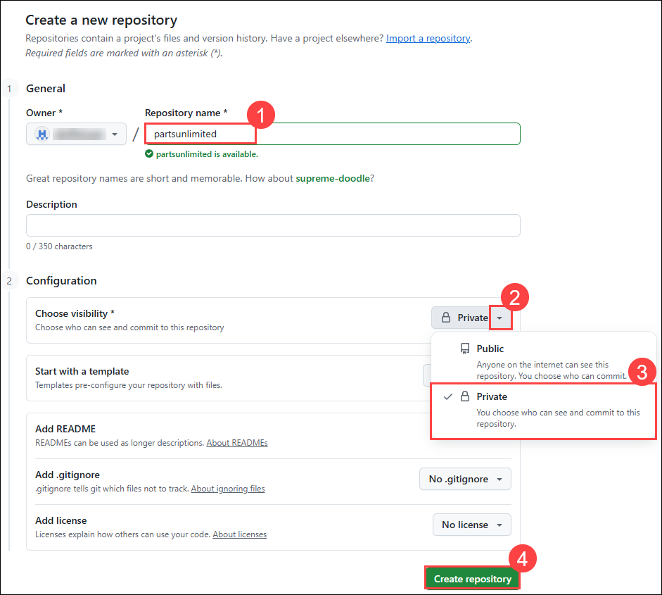

6. Select the **clipboard copy command** to copy the Git endpoint for your repository and paste the value into a text editor, such as Notepad.exe, for later reference.

     

   >**Note:** We will use the Lab VM to execute some development tasks.

7. Right-click on the Windows Start Menu and select **Windows PowerShell (Admin)** to launch a terminal window.

     

8. The Parts Unlimited website's source code is already copied into the VM as part of the **Before the hands-on lab exercises**. Run the command below to navigate to the source code folder.

    ```PowerShell
    cd "C:\MCW\MCW-App-modernization-microsoft-app-modernization-v2\Hands-on lab\lab-files\src"
    ```
9. Run the following command to initialize a local Git repository.

    ```PowerShell
    git init
    ```

     

10. Next, we will define the remote endpoint as an origin to our local repository. Replace `{YourEndpointURL}` with the endpoint URL you copied previously from GitHub. Run the final command in your PowerShell terminal.

    ```PowerShell
    git remote add origin {YourEndpointURL}
    ```

    

11. Run the following commands to rename the current branch to **Main** and stage all the files for a git commit.

    ```PowerShell
    git branch -M main
    git add .
    ```

12. Before we commit our changes, we have to identify our git user name and e-mail. In the following command, replace `John Doe` with your name and `johndoe@example.com` with your e-mail address. Once ready, run the command in your PowerShell terminal.

    ```PowerShell
    git config --global user.name "John Doe"
    git config --global user.email johndoe@example.com
    ```

13. We are ready to commit the source code to our local Git repository. Run the following command to continue.

    ```PowerShell
    git commit -m "Initial Commit"
    ```

14. Let's push our code to GitHub. Run the following command in your PowerShell terminal.

    ```PowerShell
    git push -u origin main
    ```

15. The GitHub authentication screen will pop up. Switch to the **Token tab (1)**, provide the **Personal Access Token(2)** that you noted earlier and click on **Sign in (3)**.

    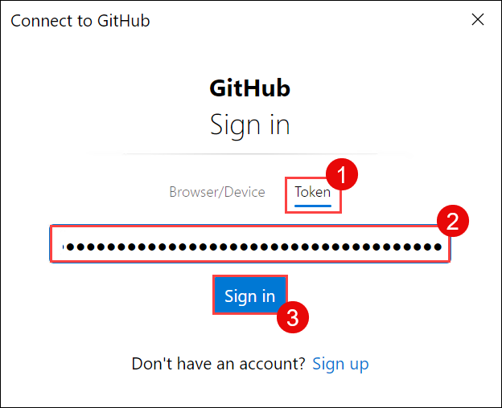

    > **NOTE**: Sometimes an authentication screen might not pop up, instead, it might ask you to enter your credentials on PowerShell itself.   
      
     > Fill in your GitHub account with the following details to sign in from PowerShell.
      
     > - **Username:** Enter your GitHub Username
     > - **Password:** Paste the **Personal Access Token** that you copied earlier in Step 3.

16. Go back to GitHub and observe the repository with the source code uploaded.

    

### Task 2: Creating a staging deployment slot

In this task, you will learn how to set up a staging deployment slot in your Azure App Service. This allows you to test updates in a production-like environment without affecting the live site.

1. Go back to your lab resource group, navigate to your **partsunlimited-web-<inject key="DeploymentID" enableCopy="false"/> (2)** App Service resource. You can search for `partsunlimited-web` **(1)** to find your Web App and App Service Plan.

   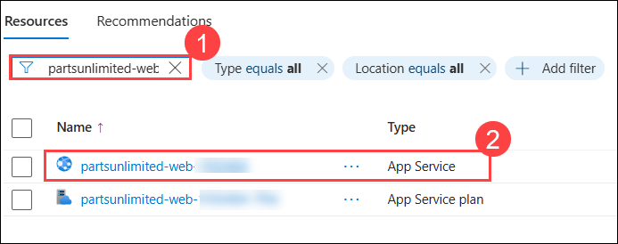

2. Navigate to **Deployment slots (1)** under Deployment from the left navigation pane and select **+ Add (2)**.

    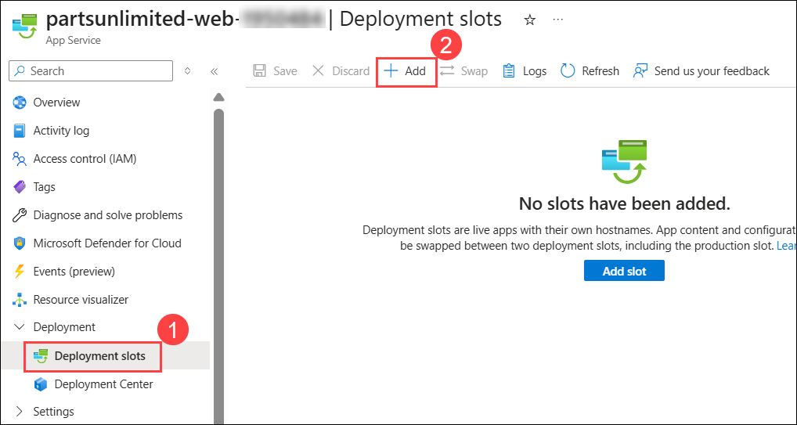

3. Enter **staging (1)** as the name for the new slot. Choose your app service name from the **Clone settings from (2)** dropdown menu. This action will replicate our website configurations from the production environment to the staging environment as a foundation. Click **Add (3)** to create the new slot.

    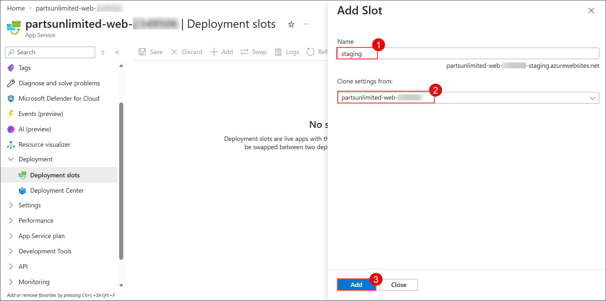

4. Once you receive the success message, **Close (1)** the panel. Observe **(2)** the two environments we have for the App Service in the deployment slots list.

    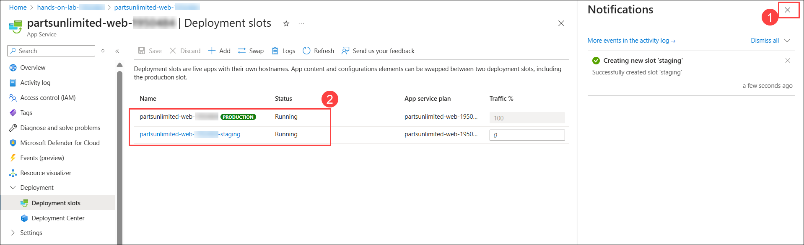

### Task 3: Setting up CI/CD with GitHub Actions

In this task, you will learn how to automate application deployment using GitHub Actions and a staging deployment slot in Azure App Service.

1. Select your staging slot from the list of deployment slots.

2. From the toolbar menu, select **Download publish profile**. The publish profile is used to authenticate between GitHub and Azure.

    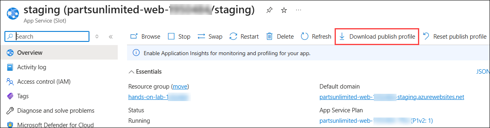

    >**Note:** Click **OK** on the **Download publish profile** pop-up, then repeat Step 2.

3. Open the downloaded file in a text editor. Keep this editor open.

4. In a web browser, return to the GitHub repository for this lab, and select the **Settings** tab.

    

5. From the left menu, select **Secrets and variables (1)**. Then, click on **Actions (2)** and select **New repository secret (3)**.

    

6. Enter the following values in the **New secret** form, then select **Add secret**.

    | Field | Value |
    |-------|-------|
    | Name  | AZURE_WEBAPP_PUBLISH_PROFILE |
    | Secret | Copy and paste the contents of the downloaded publish profile, and open it in the text editor. |

    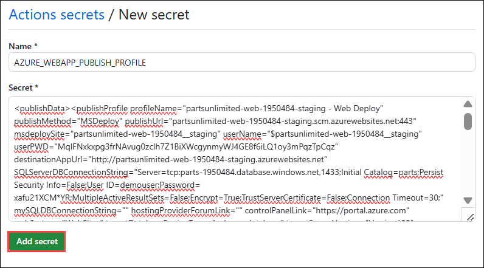

7. Select the **Actions** tab.

    

8. On the **Get started with GitHub Actions** screen, select the **set up a workflow yourself** link.

    

9. On the workflow editor screen, provide the file name **stagingdeploy.yml**. Add the **below content** and commit your changes by selecting the **Commit Changes** button twice.

    ```yaml
    name: Build and deploy app

    on:
      push

    env:
      AZURE_WEBAPP_NAME: partsunlimited-web-suffix   # replace suffix
      AZURE_WEBAPP_PACKAGE_PATH: '.'
      DEPLOYMENT_SLOT: staging
      DOTNET_VERSION: '3.1'
      AZURE_RESOURCEGROUP_NAME: hands-on-lab-suffix  # replace suffix

    jobs:
      build-and-deploy:
        runs-on: windows-latest
        steps:
          # Checkout the repo
          - uses: actions/checkout@main

          # Use Node.js
          - name: Use Node.js
            uses: actions/setup-node@v3
            with:
              node-version: '10.x'

          # Setup .NET Core SDK
          - name: Setup .NET Core
            uses: actions/setup-dotnet@v1
            with:
              dotnet-version: ${{ env.DOTNET_VERSION }}

          # Run dotnet build and publish
          - name: dotnet build and publish
            run: |
              dotnet build PartsUnlimited.sln --configuration Release
              dotnet publish PartsUnlimited.sln -c Release -o PartsUnlimitedWebsite

          # Deploy to Azure Web app slot
          - name: 'Run Azure webapp deploy action using publish profile credentials'
            uses: azure/webapps-deploy@v2
            with:
              app-name: ${{ env.AZURE_WEBAPP_NAME }}
              publish-profile: ${{ secrets.AZURE_WEBAPP_PUBLISH_PROFILE }}
              package: '${{ env.AZURE_WEBAPP_PACKAGE_PATH }}/PartsUnlimitedWebsite'
              slot-name: ${{ env.DEPLOYMENT_SLOT }}
    ```

    >**Note:** The job runs on **windows-latest**, not `ubuntu-latest`. The .NET Core 3.1 SDK needs OpenSSL 1.1, which is no longer present on the Ubuntu runner image, and the build aborts with *"No usable version of libssl was found"*.

    

10. Open the Command window. Execute the following code to pull your newly created GitHub stagingdeploy.yml file locally. You are going to update the file content with the template stagingdeploy.yml.

    ```cmd
    cd "C:\MCW\MCW-App-modernization-microsoft-app-modernization-v2\Hands-on lab\lab-files\src"
    ```
    ```cmd
    git pull
    ```

    

11. Open the newly updated stagingdeploy.yml file from the file path`C:\MCW\MCW-App-modernization-microsoft-app-modernization-v2\Hands-on lab\lab-files\src\.github\workflows\stagingdeploy.yml` in Visual Studio Code. Replace the suffix value on lines 7 and 11 with **<inject key="DeploymentID" />** to match your lab. Save the file by pressing **CTRL+S**.

    

12. You have just updated the `partsunlimited` GitHub project. It is time to save and push your changes. Execute these commands in a Web VM Command window.

    ```cmd
    cd "C:\MCW\MCW-App-modernization-microsoft-app-modernization-v2\Hands-on lab\lab-files\src"
    git add .
    git commit -am "Updated the stagingdeploy.yml"
    git push 
    ```

13. In GitHub, select **Actions**. The workflow will display as in progress.

    

14. Once the workflow is completed go back to your lab resource group on the Azure Portal, and navigate to your `staging (partsunlimited-web-/staging)` **(2)** App Service resource. You can search for `staging` **(1)** to find your App Service (Slot) for staging.

    

15. Notice the dedicated web link for your staging slot. Select to navigate to the website to see the result of your successful deployment through the CI/CD pipeline.

    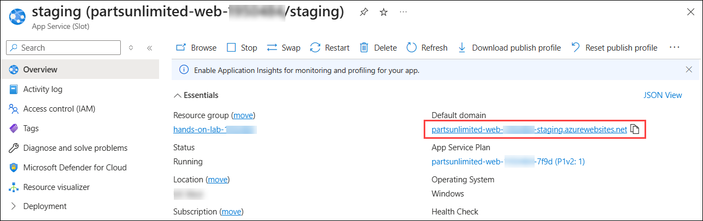

### Task 4: Pushing code changes to staging and production

In this task, you'll learn how to push code changes to the staging environment for testing before deploying to production using Visual Studio Code and GitHub.

1. Select the Start menu and search for **Visual Studio Code**. Select **Visual Studio Code** to run it.

    

2. Open the **File (1)** menu and select **Open Folder... (2)**.

    

3. Navigate to `C:\MCW\MCW-App-modernization-microsoft-app-modernization-v2\Hands-on lab\lab-files\src` and select **Select Folder (1)**.

    

4. Select **Yes, I trust the authors**.

   

5. We are going to introduce a brand-new change to Parts Unlimited's website. In the Explorer window, navigate to **src > PartsUnlimitedWebSite > Views > Home** and select **Index.cshtml (4)** for editing. Change the Title of the page **(5)** by adding **New** at the beginning of the sentence, and save the file by going to the File menu and selecting Save. Notice that the underlying Git repository detects a change **(6)** in the codebase.

    

6. Select the **Source Control (1)** tab in Visual Studio Code. Since we worked on the codebase in our repo on the virtual machine, the codebase in the repo on GitHub has changed. Open the **Views and more actions... (2)** menu and select **Pull (3)** to get the latest from the remote repository.

    

7. Select **Stage Changes (1)**. Type in a commit message **(2)** for the changes. Select **Commit (3)**.

    

8. Open the **Views and more actions... (1)** menu and select **Push (2)** to push the changes to GitHub.

    

9. Open the GitHub repository and observe the Actions page for the latest execution of the CI/CD Pipeline.

    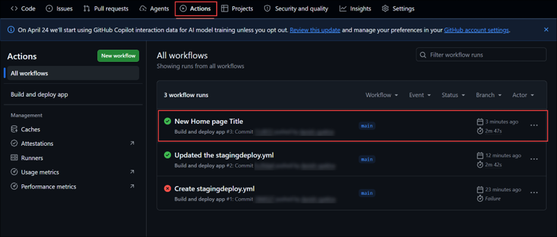

10. Navigate to the staging environment endpoint in your browser and observe the Title change.

    

Now that Parts Unlimited has a separate staging environment for their e-commerce site, they can push new source code and functionality to the repo that will automatically be built and deployed to their staging for testing.

### Task 5: Swap deployment slots to move changes in staging to production

In this task, you will learn how to swap the staging and production slots in your Azure App Service to move changes from the staging environment to production. This action is quick and allows you to revert the changes easily by swapping back if needed.

Once Parts Unlimited is happy with the changes tested in their staging environment, they can swap the two environments and have the changes go to production. Environment Swap happens very fast and can help Parts Unlimited pull back changes by switching back if needed.

1. Go back to your lab resource group, navigate to your **partsunlimited-web-<inject key="DeploymentID" enableCopy="false"/>** **(2)** App Service resource. You can search for `partsunlimited-web` **(1)** to find your app service.

   

2. Switch to the **Deployment slots (1)** tab and select **Swap (2)**.

    

3. Select the **Start Swap** button to swap the staging slot with the production slot.

    

4. Once you receive the success message, close the swap panel.

5. Visit both production and staging slot endpoints and observe how the Title change is moved to production.

  > **Congratulations** on completing the task! Now, it's time to validate it. Here are the steps:
	
  - Hit the Validate button for the corresponding task. If you receive a success message, you can proceed to the next task. 
  - If not, carefully read the error message and retry the step, following the instructions in the lab guide.
  - If you need any assistance, please contact us at cloudlabs-support@spektrasystems.com. We are available 24/7 to help you out.
    
<validation step="54659bb3-b86f-403f-b2fd-0cf1236e197e" />

## Summary
 
In this exercise, you have covered the following:

   - Create a staging deployment slot in Azure App Service.
   
   - Set up CI/CD Pipeline built on GitHub Actions and pushed the code changes to stage and production deployment slots.

Now, click on **Next** from the lower right corner to move on to the next page.


