# Exercise 6: Using serverless Azure Functions to process orders
 
### Estimated Duration: 45 Minutes
 
With its migration to Azure complete, Parts Unlimited plans to launch a series of campaigns to increase sales. Their current architecture processes purchase orders synchronously and is tightly coupled to the front end, so they are looking for a way to decouple order processing and let it scale independently from the web front end as order volume grows.  

You suggest a serverless approach that handles order processing and generates invoices for processed orders. In this exercise, you will deploy an Azure Function that listens to an Azure Storage queue and processes orders as they arrive. Parts Unlimited has already made the application changes required to push those jobs onto the queue.
 
### Objectives

In this exercise, you will complete the following tasks:
   - Task 1: Deploying Azure Functions
   - Task 2: Connecting Function App and App Service
   - Task 3: Testing serverless order processing
   - Task 4: Enable Application Insights on the Function App

### Task 1: Deploying Azure Functions

In this task, you will deploy an Azure Function using Visual Studio Code. You will install the required extensions, sign in to Azure, and publish the function to your Function App.

1. Select the Start menu and search for **Visual Studio Code**. Select **Visual Studio Code** to run it.

    

2. Open the **File (1)** menu and select **Open Folder... (2)**.

    

3. Navigate to `C:\MCW\MCW-App-modernization-microsoft-app-modernization-v2\Hands-on lab\lab-files\src-invoicing-functions\FunctionApp` and select **Select Folder**.

4. Select **Install** to install the extensions required for your Azure Functions project. This installs the C# and Azure Functions extensions for Visual Studio Code.

    

    >**Note:** If the pop-up does not appear, install the extensions manually:

    - Click **Extensions (1)** in the left panel.
    - Search for **C# (2)** and select **C# (3)** from the results.
    - Click **Install (4)**.
    
      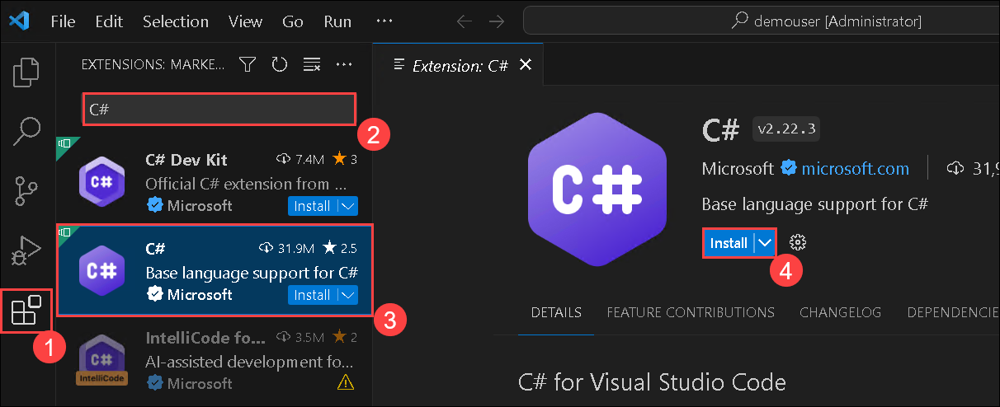

    - Similarly, follow the steps below to install the **Azure Functions** extension.

      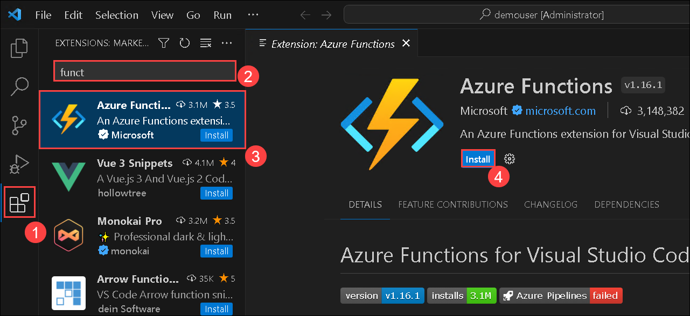

5. Once the installation is **Finished (1)**, select **Restore (2)** to download the project's dependencies.

    
    
    > **Note:** If the C# extension is already present in VS Code, you may not be prompted to restore.

6. When the restore is complete, close the two **Extension (1) (2)** tabs and the **Welcome tab (3)**. Select **Azure (4)** from the left menu, select **Sign in to Azure (5)**, and click **Allow** on the *"Azure resources wants to sign in..."* window. Select **Edge** as your browser if prompted.

   

7. Enter the Azure credentials below and sign in.

   *  Email/Username: <inject key="AzureAdUserEmail"></inject>

      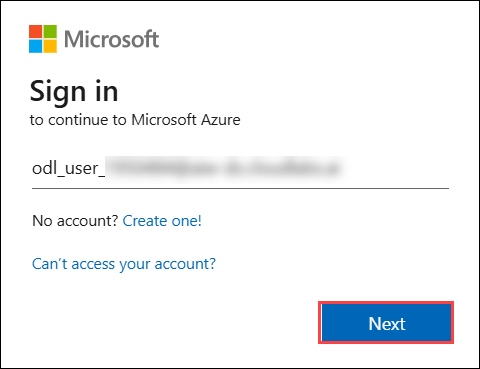

    *  Password: <inject key="AzureAdUserPassword"></inject>   
   
       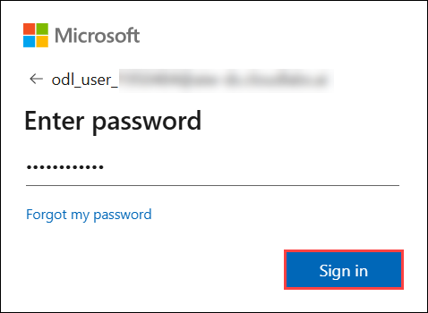

8. Once sign-in is complete, close the browser tab and minimize the browser window.

   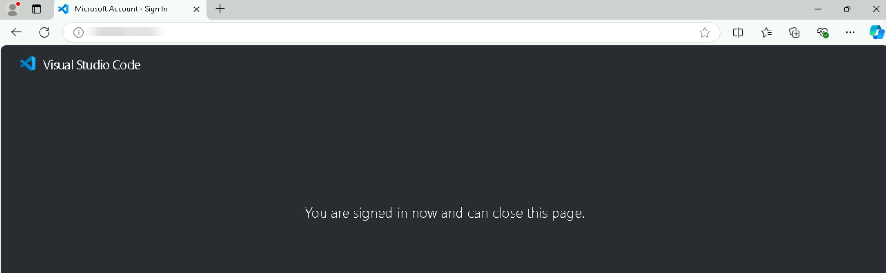

9. Within the Visual Studio Code window, expand the resources in your subscription **(1)**. Expand **Function App (2)**, right-click your Function App named **parts-func-<inject key="DeploymentID" enableCopy="false"/> (3)**, 
and select **Deploy to Function App... (4)**.

   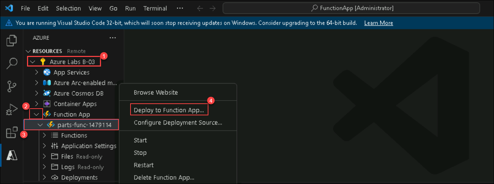

10. Select **Deploy**.

    

### Task 2: Connecting Function App and App Service

In this task, you will connect the App Service and the Function App to the resources they depend on, by adding a storage connection string to the web app and a database connection string to the Function App.

1. In the [Azure portal](https://portal.azure.com), navigate to your `parts` Storage Account resource by selecting the **hands-on-lab-<inject key="DeploymentID" enableCopy="false"/>** resource group, and selecting the **parts<inject key="DeploymentID" enableCopy="false"/>** Storage Account from the list of resources.

   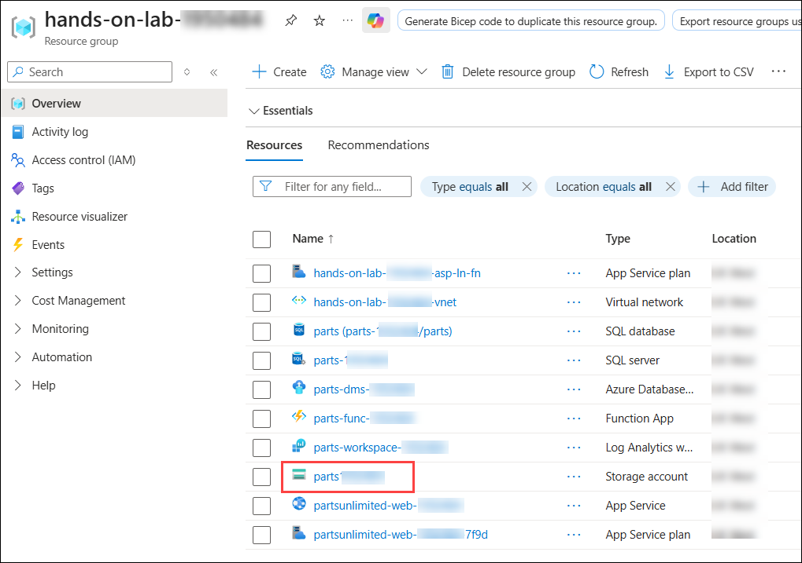

2. Switch to the **Access keys (1)** blade under the **Security + networking** section and select **Show (2)** next to the connection string value. Select the copy button for the first **connection string (3)** and paste the value into a text editor, such as Notepad.exe — you will need it in step 5.

   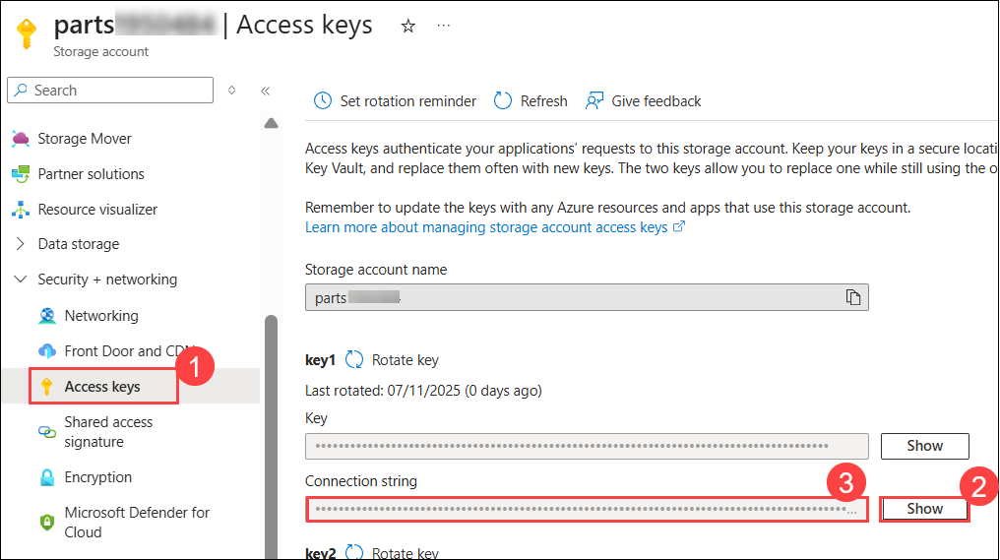

3. Go back to the resource list and search for `partsunlimited-web` **(1)** to find your Web App and App Service plan, then select the **partsunlimited-web-<inject key="DeploymentID" enableCopy="false"/> (2)**
App Service resource.

   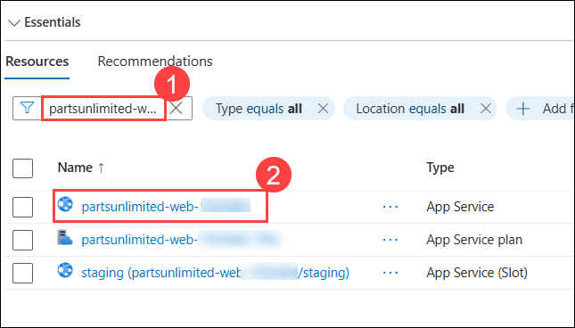

4. Switch to the **Environment variables (1)** blade under the **Settings** section, select **Connection strings (2)**, and click **+ Add (3)**.

   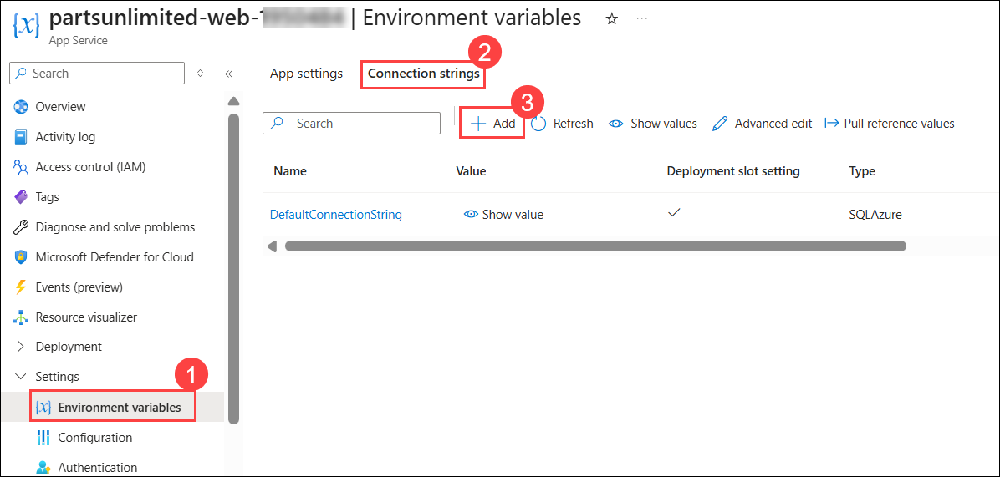

5. On the **Add/Edit connection string** panel, enter the following:

   - **Name (1):** Enter `StorageConnectionString`
   
   - **Value (2):** Enter the storage connection string you copied in step 2.

   - **Type (3):** Select **Custom**
   
   - **Deployment slot setting (4):** Select this option so that the connection string stays with its deployment slot, allowing different settings for staging and production.
   
   - Select **Apply (5)**.

     

6. Select **Apply**, then **Confirm** in the confirmation dialog.

7. Go back to the resource list and search for **`func` (1)** to find your Function App, then select the **parts-func-<inject key="DeploymentID" enableCopy="false"/> (2)** Function App resource.

   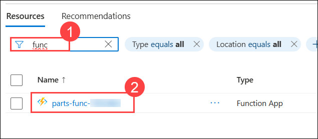

8. Switch to the **Environment variables (1)** blade under the **Settings** section, select **App settings (2)**, and click **+ Add (3)**.

   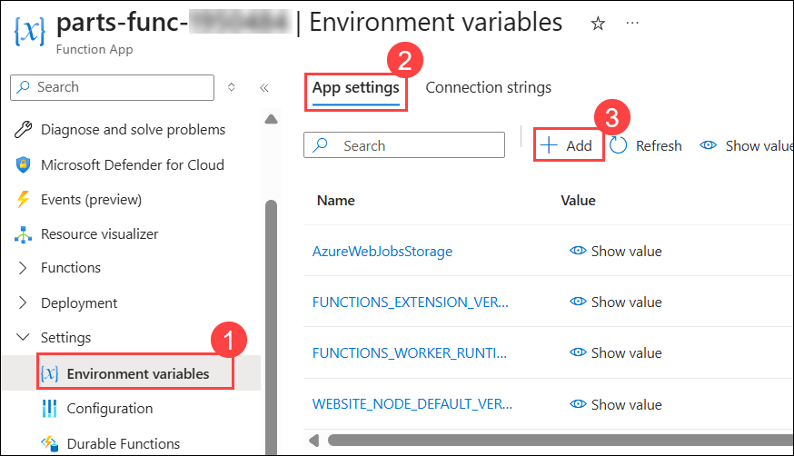

9. On the **Add/Edit application setting** panel, enter the following:

   - **Name (1):** Enter `DefaultConnection`
    
   - **Value (2):** Enter the SQL connection string you completed in Exercise 3, Task 2, Step 3.
    
   - Select **Apply (3)**.

     

10. Select **Apply**, then **Confirm** in the confirmation dialog.

### Task 3: Testing serverless order processing

In this task, you will submit a new order on the Parts Unlimited website and watch it being processed on the order details page. When the order is submitted, the web front end places a job on an Azure Storage queue. The Function App you deployed in Task 1 listens to that queue and pulls jobs for processing. Once processing is complete, a PDF invoice is created and a link to it appears on the order details page.

1. Go back to the resource list and search for **`partsunlimited-web` (1)** to find your Web App and App Service plan, then select the **partsunlimited-web-<inject key="DeploymentID" enableCopy="false"/> (2)**
App Service resource.

   

2. In the **Overview (1)** section, select **Default domain (2)** to browse to the Parts Unlimited website hosted in Azure App Service.

   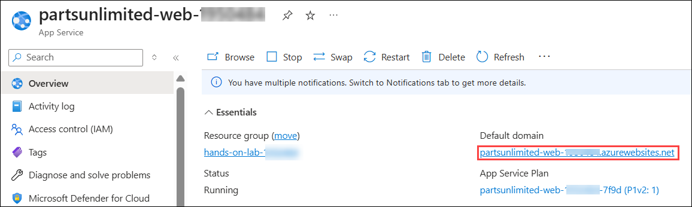

3. Select **Login (1)**. If you did not create an account in an earlier exercise, select **Register as a new user? (2)**; otherwise, skip ahead to step 6 and log in.

   

4. Enter `test@test.com` as the email **(1)** and `Password.1!!` as the password **(2)**. Select **Register (3)**.

    

5. On the next screen, select **Click here to confirm your email** to confirm your email.

6. Select **Click here to Login (1)**, enter the credentials listed below, and click the **Login (4)** button.

   - **Email (2):** test@test.com
   - **Password (3):** Password.1!!

     

7. Select a product from the home page, then select **Add to Cart** on the product detail page.

   

8. Select **Checkout** on the next screen.

9. Fill in sample shipping information **(1)**, making sure every field is completed. Enter the coupon code **FREE (2)** and select **Submit Order (3)**.

   

10. Once checkout is complete, select **View your order** to see the order details.

    

11. Observe the invoice field. Your order is currently flagged as in processing: the order job has been placed on the Azure Storage queue and is waiting to be picked up by Azure Functions. Refresh the page every 15 seconds to watch for a change.

    

12. Once your order has been processed, an invoice is created and a download link appears. Select it to download the PDF invoice that Azure Functions generated for your order.

    

    Here is your invoice.

    

### Task 4: Enable Application Insights on the Function App

In this task, you will add Application Insights to your Function App in the Azure portal so that you can collect telemetry on function executions.

1. In the [Azure portal](https://portal.azure.com), navigate to your **Function App** by selecting the **hands-on-lab-<inject key="DeploymentID" enableCopy="false"/>**
resource group, and selecting the **parts-func-<inject key="DeploymentID" enableCopy="false"/>** Function App from the list of resources.

   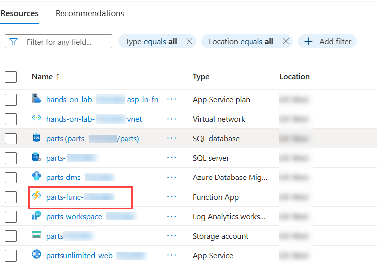

2. On the Function App blade, select **Application Insights (1)** under **Monitoring** in the left-hand menu. On the Application Insights blade, select **Turn on Application Insights (2)**.

   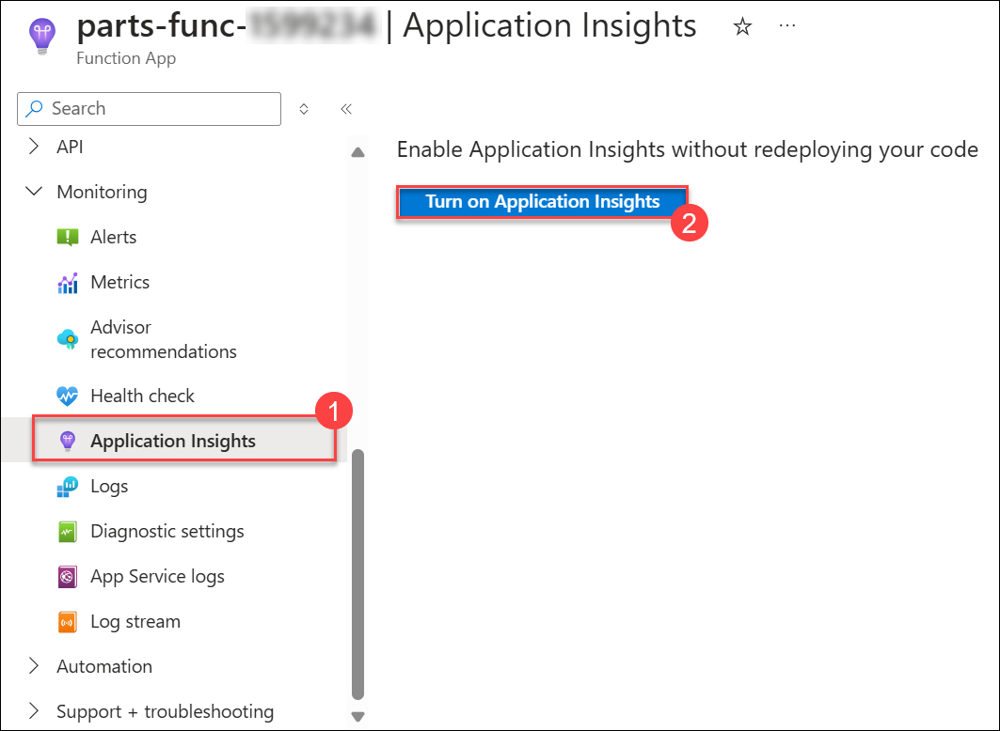

3. On the Application Insights blade, provide the following information.

   - Select **Create new resource (1)** and accept the default resource name and location. 
   
   - From the dropdown, select the existing Log Analytics workspace **parts-Workspace-<inject key="DeploymentID" enableCopy="false"/> (2)**, as shown in the screenshot below.
   
   - Click **Apply (3)**, then select **Yes** when prompted to restart the Function App so that the monitoring settings take effect.

     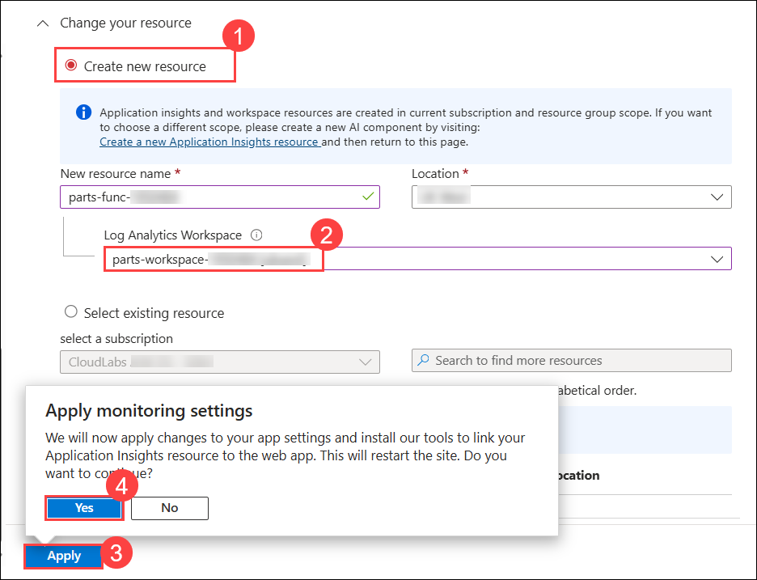

4. After the Function App restarts, select **View Application Insights data**.

   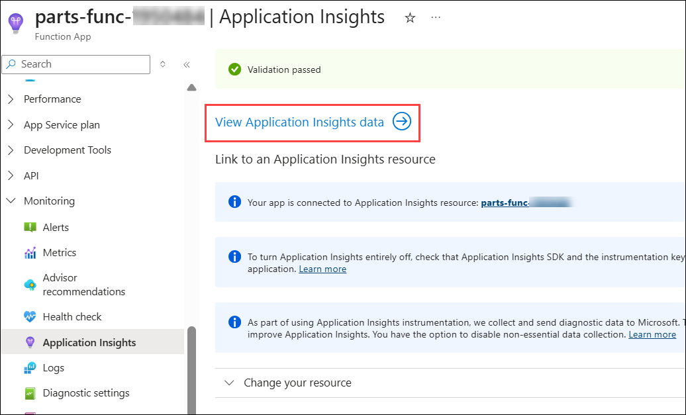

5. On the Application Insights blade, select **Live Metrics (1)** under **Investigate**.

   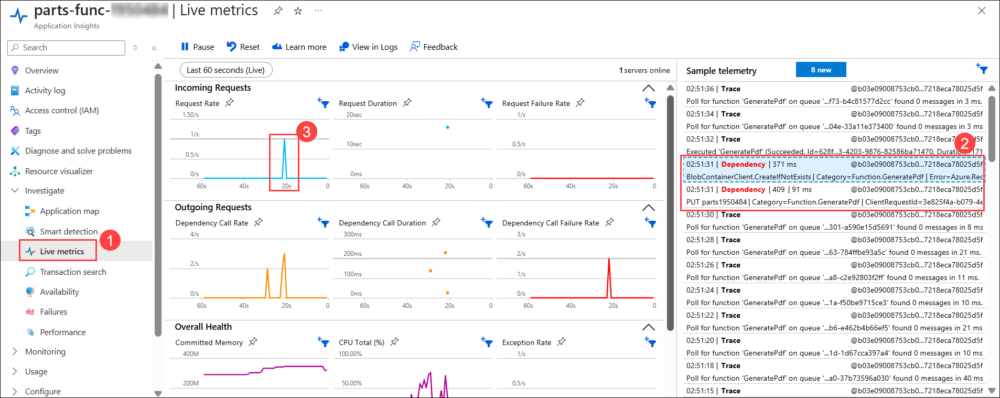

   > It might take a few minutes for Live Metrics to load. Refresh the page if nothing appears.
    
   > While Live Metrics is running, submit a new order on the Parts Unlimited website. In the **sample telemetry (2)**, you will see the blob storage call that uploads the invoice PDF, and the execution will register as a spike on the request rate **graph (3)**.

> **Congratulations** on completing the task! Now, it's time to validate it. Here are the steps:
>
>- Hit the Validate button for the corresponding task. If you receive a success message, you can proceed to the next task. 
>- If not, carefully read the error message and retry the step, following the instructions in the lab guide.
>- If you need any assistance, please contact us at cloudlabs-support@spektrasystems.com. We are available 24/7 to help you out.
    
  <validation step="3a924157-f14d-474c-afef-bf53b68d7362" />

## Summary
 
In this exercise, you have covered the following:
  
   - Deployed a serverless Azure Function that processes orders from a storage queue. 
   - Connected the Function App and the App Service, and tested serverless order processing end to end.
   - Enabled Application Insights on the Function App and observed executions in Live Metrics.

Now, click on **Next** from the lower right corner to move on to the next page.

