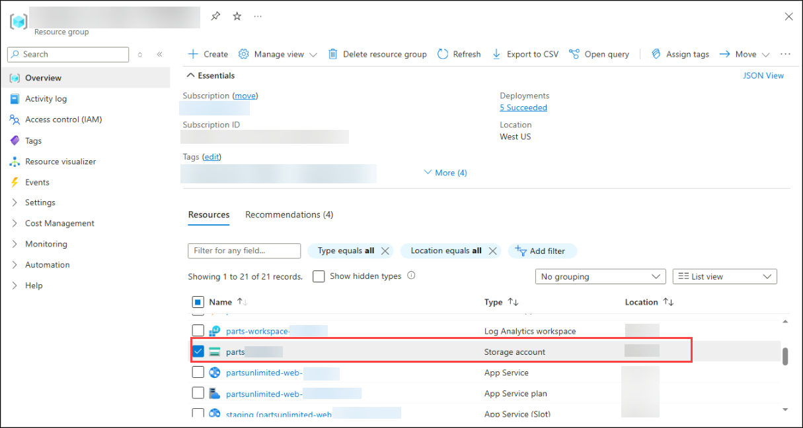
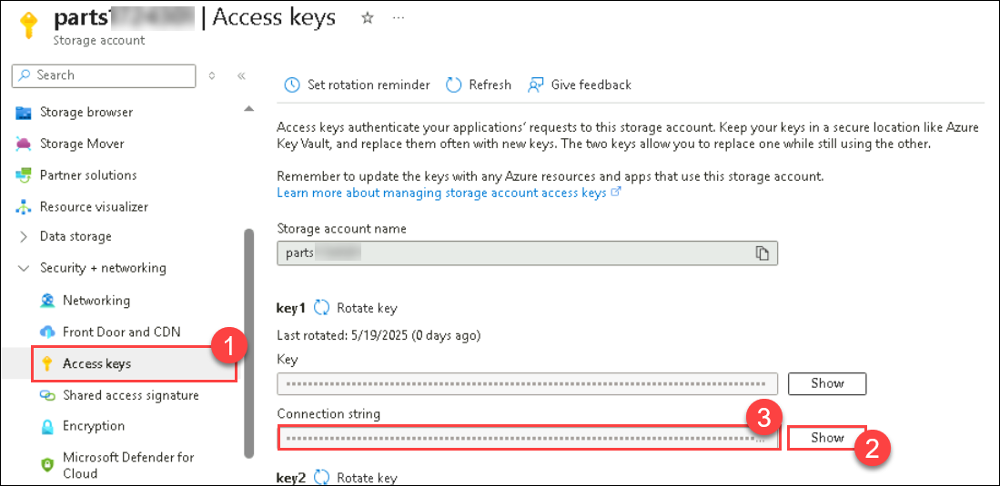
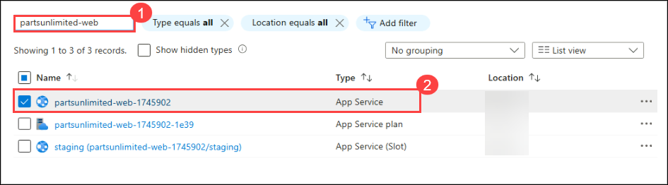
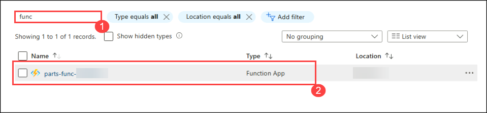
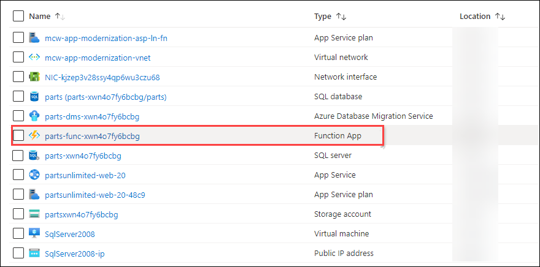
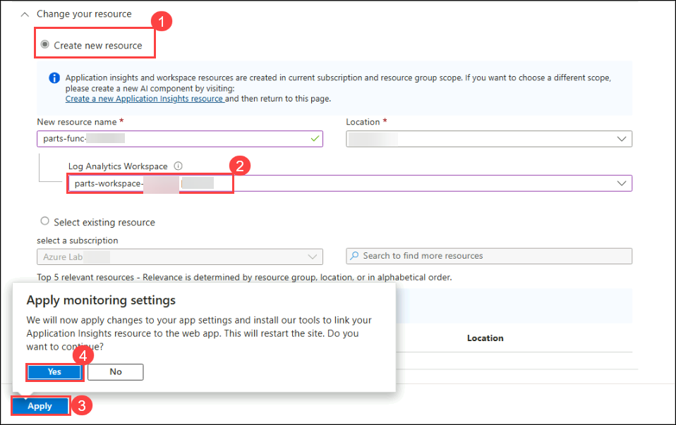

# Exercise 6: Using serverless Azure Functions to process orders
 
### Estimated Duration: 45 minutes 
 
Following its migration to Azure, Parts Unlimited plans to launch a series of marketing campaigns to drive sales. Their legacy architecture processes purchase orders synchronously, tightly coupling order processing with the web front end. Parts Unlimited is seeking ways to decouple the order processing system, ensuring it can scale independently from the web front end during high-traffic order periods.  

You suggest a serverless architecture to handle order processing and invoice generation asynchronously. In this exercise, you will deploy a serverless Azure Function designed to monitor an Azure Storage Queue and process incoming orders as they arrive. Parts Unlimited has already implemented the necessary codebase changes to push jobs into this queue.
 
### Lab objectives
In this lab, you will complete the following tasks:
   - Task 1: Deploying Azure Functions
   - Task 2: Connecting Function App and App Service
   - Task 3: Testing serverless order processing
   - Task 4: Enable Application Insights on the Function App

### Task 1: Deploying Azure Functions

In this task, you will learn how to deploy an Azure Function using Visual Studio Code. You will install the required extensions, authenticate with Azure, and seamlessly publish your function app to the cloud.

1. Open the Windows Start menu, search for **Visual Studio Code**, and select **Visual Studio Code** to launch it.

    

1. Open the **File (1)** menu and select **Open Folder... (2)**.

    

1. Navigate to `C:\MCW\MCW-App-modernization-microsoft-app-modernization-v2\Hands-on lab\lab-files\src-invoicing-functions\FunctionApp` and click **Select Folder**.

1. Click **Install** to acquire the necessary extensions for your Azure Functions project. This will automatically install the *C# for Visual Studio Code* and *Azure Functions for Visual Studio Code* extensions.

    

    >**Note:** If you do not see an installation pop-up, follow these manual steps:

    - Click **Extensions (1)** from the left sidebar panel.
    - Search for **C# (2)** and select the **C# (3)** extension.
    - Click **Install (4)**.
    
      

    - Similarly, follow the steps below to install the **Azure Functions** extension.

      

1. Once the installation is **Finished (1)**, click **Restore (2)** to download all required dependencies for the project.

    
    
    > **Note:** If the C# extension was already present in Visual Studio Code, you may not be prompted to restore dependencies.

1. When the restore process is complete, close the **Extension (1) (2)** and **Welcome (3)** tabs. Click the **Azure (4)** icon from the left sidebar and select **Sign in to Azure (5)**. If prompted, choose **Edge** as your browser.

   

1. Enter your Azure credentials provided below and sign in.

   *  Email/Username: <inject key="AzureAdUserEmail"></inject>

      

    *  Password: <inject key="AzureAdUserPassword"></inject>   
   
       

1. Close the browser tab and minimize the browser window once your sign-in is complete.

   

1. Within the Visual Studio Code Azure pane, drill down **(1)** into the resources listed under your subscription. Expand the **Function App (2)** section, right-click on your Azure Function named **parts-func-<inject key="DeploymentID" enableCopy="false"/> (3)**, and select **Deploy to Function App... (4)**.

   

1. Click **Deploy**.

    

### Task 2: Connecting Function App and App Service

In this task, you will learn how to securely connect your Azure Function App and App Service to required resources by configuring environment variables and connection strings.

1. In the [Azure portal](https://portal.azure.com), navigate to your `parts` Storage Account resource by opening the **hands-on-lab-<inject key="DeploymentID" enableCopy="false"/>** resource group and selecting the **parts<inject key="DeploymentID" enableCopy="false"/>** Storage Account from the list of resources.

   

1. Switch to the **Access keys (1)** blade and click the **Show (2)** button located next to the Connection String values. Click the copy button for the first **Connection string (3)**. Paste this value into a text editor (such as Notepad) for later reference.

   

1. Return to the resource list and navigate to your **partsunlimited-web-<inject key="DeploymentID" enableCopy="false"/> (2)** App Service resource. You can search for `partsunlimited-web` **(1)** to quickly locate your Web App and App Service Plan.

   

1. Switch to the **Environment variables (1)** blade, select **Connection strings (2)**, and click **+ Add (3)**.

   

1. On the **Add/Edit connection string** panel, provide the following details:

   - **Name (1):** Enter `StorageConnectionString`
   
   - **Value (2):** Paste the Storage Connection String you copied in Step 2.

   - **Type (3):** Select **Custom**
   
   - **Deployment slot setting (4):** Check this option to ensure the connection string is pinned to this specific deployment slot. This guarantees that your staging and production environments maintain completely separate configurations.
   
   - Click **Apply (5)**.

     

1. Click **Apply** and then **Confirm** in the subsequent confirmation dialog.

1. Return to the resource list and navigate to your **parts-func-<inject key="DeploymentID" enableCopy="false"/> (2)** Function App resource. You can search for **`func` (1)** to quickly find your function app.

   

1. Switch to the **Environment variables (1)** blade, select **App settings (2)**, and click **+ Add (3)**.

   

1. On the **Add/Edit application setting** panel, provide the following details:

   - **Name (1):** Enter `DefaultConnection`
    
   - **Value:** Paste the SQL Connection String you copied earlier in Exercise 4, Task 6, Step 3.
    
   - Click **Apply (3)**.

     

1. Click **Apply** and then **Confirm** in the subsequent confirmation dialog.

### Task 3: Testing serverless order processing

In this task, you will submit a new order on the Parts Unlimited website and monitor its progress on the order details page. Upon order submission, the web front end asynchronously places a job into an Azure Storage Queue. The serverless Function App you just deployed continuously listens to this queue and pulls jobs for processing. Once the order is successfully processed, a PDF invoice is dynamically generated, and a download link will become available on the order details page.

1. Return to the resource list and navigate to your **partsunlimited-web-<inject key="DeploymentID" enableCopy="false"/> (2)** App Service resource. You can search for **`partsunlimited-web` (1)** to easily locate your Web App.

   

1. In the **Overview (1)** section, click the **Default domain (2)** link to navigate to the Parts Unlimited website hosted on Azure App Service.

   

1. Click **Login (1)**. If you did not create a login during an earlier exercise, click **Register as a new user? (2)**. If you already have an account, skip directly to step 6 to log in.

   

1. Type `test@test.com` for the email **(1)** and `Password.1!!` **(2)** for the password. Click **Register (3)**.

    

1. On the next screen, click **Click here to confirm your email** to verify your account.

1. Click **Login (1)**, enter the credentials listed below, and click the **Log in (4)** button.

   - **Email (2):** test@test.com
   - **Password (3):** Password.1!!

     

1. Select a product from the home page and click **Add to Cart** once you are on the product detail page.

   

1. Click **Checkout** on the following screen.

1. Fill in sample shipping information **(1)** for testing purposes. Enter the coupon code **FREE (2)** and click **Submit Order (3)**.

   

1. Once checkout is complete, click **View your order** to access the order details.

    

1. Observe the invoice field. Currently, your order is flagged as "in processing." An order job has been successfully submitted to the Azure Storage Queue and is awaiting processing by Azure Functions. Refresh the page approximately every 15 seconds to monitor the status of your order.

    

1. Once your order has been processed, an invoice is dynamically created, and a download link will appear. Click the download link to view the PDF invoice generated by Azure Functions.

    

    Here is a sample of the generated invoice:

    

### Task 4: Enable Application Insights on the Function App

In this task, you will enable Application Insights for your Function App via the Azure portal. This will allow you to collect deep telemetry and execution metrics for your serverless functions.

1. In the [Azure portal](https://portal.azure.com), navigate to your **Function App** by opening the **hands-on-lab-<inject key="DeploymentID" enableCopy="false"/>** resource group and selecting the **parts-func-<inject key="DeploymentID" enableCopy="false"/>** Function App from the list of resources.

   

1. On the Function App blade, select **Application Insights (1)** under the Settings menu on the left. On the Application Insights blade, click **Turn on Application Insights (2)**.

   

1. On the Application Insights configuration blade, provide the following details:

   - Select **Create new resource (1)** and accept the default resource name and location provided. 
   
   - Choose the existing Log Analytics workspace named **parts-Workspace-<inject key="DeploymentID" enableCopy="false"/> (2)** from the dropdown menu, as shown in the screenshot below.
   
   - Click **Apply (3)** and select **Yes** when prompted to restart the Function App to finalize the monitoring settings.

     

1. After the Function App successfully restarts, click **View Application Insights data**.

   

1. On the Application Insights blade, select **Live Metrics (1)** under the **Investigate** menu.

   

   > **Note:** It may take a few minutes for the Live Metrics stream to initialize and load data. Refresh the page if necessary to view the metrics.
    
   > While monitoring the Live Metrics stream, try submitting another new order on the Parts Unlimited website. Within the telemetry data, you will see the function accessing blob storage to upload the **PDF (3)**, the execution count spiking on the **graph (2)**, and underlying **server details (4)**.

> **Congratulations** on completing the task! Now, it's time to validate it. Please follow these steps:
	
  - Click the **Validate** button for the corresponding task. If you receive a success message, you may proceed to the next task. 
  - If validation fails, carefully read the error message and retry the step following the instructions in the lab guide.
  - If you require any assistance, please contact us at cloudlabs-support@spektrasystems.com. We are available 24/7 to help you.
    
  <validation step="58dafb08-1310-41d8-9bcf-0faac798e2df" />

## Summary
 
In this exercise, you have successfully completed the following:
  
   - Created and deployed an Azure Function app. 
   - Connected the Azure Function app to the App Service.
   - Tested serverless order processing directly within the application.

Click **Next** in the lower right corner to proceed to the next page.

