# Exercise 7: Publish the application via Application Gateway and Firewall (Optional)

### Estimated Duration: 45 Minutes

Having moved the Parts Unlimited application to Azure, the next concern is how it is exposed to the internet. In this exercise, you will place an Azure Firewall and an Application Gateway with a Web Application Firewall (WAF) in front of the application, so that inbound traffic is inspected and filtered before it reaches the web tier.

### Objectives
In this exercise, you will complete the following tasks:
   - Task 1: Provision Azure Firewall
   - Task 2: Provision Application Gateway with WAF
   - Task 3: Publish Application via Azure Firewall & Application Gateway

### Task 1: Provision Azure Firewall

In this task, you will create an Azure Firewall and note its public IP address for use in Task 3.

1. Select your **resource group**.

    

2. Select **Create** inside the resource group to add a new resource.
    
    

3. Type **firewall** into the search box and select **Firewall** from the dropdown.

    

4. Select **Create** to continue.

    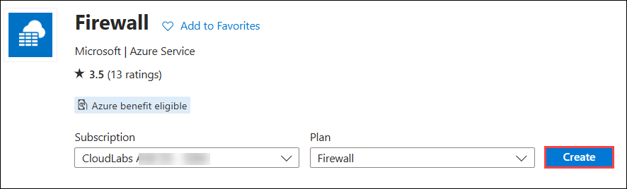
    
5. Under the **Basics** tab of the **Create a firewall** page, enter the information below:

    - Subscription: Choose your **Subscription (1)** from the drop-down list.
    - Resource group: Select **hands-on-lab-<inject key="DeploymentID" enableCopy="false"/> (2)** from the drop-down list
    - Name: Enter **firewall<inject key="DeploymentID" enableCopy="false"/> (3)**
    - Region: **<inject key="location" enableCopy="false" />** **(4)**
    - Firewall SKU: **Standard (5)**
    - Firewall management: **Use a Firewall Policy to manage this firewall (6)**

      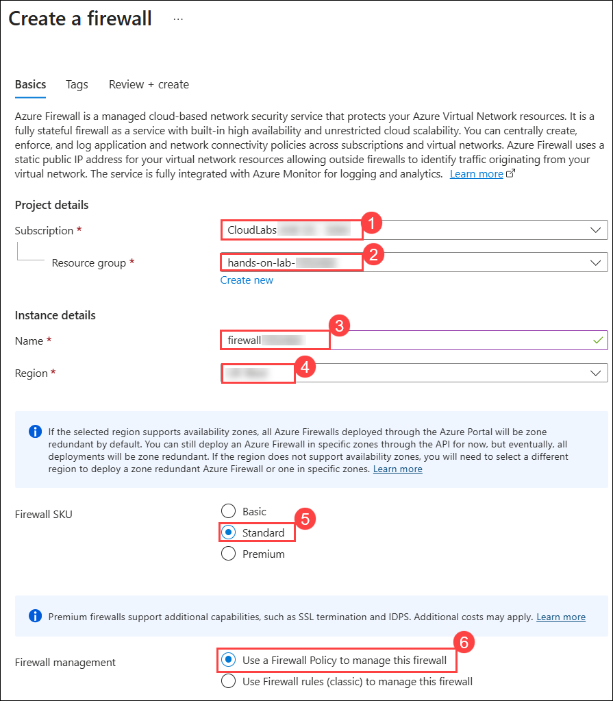

    - Firewall policy: 
        * Click on **Add new (1)**
        * Enter Policy name as **appmod-policy (2)** 
        * Region as **<inject key="location" enableCopy="false"/>** **(3)**
        * Choose Policy tier as **Standard (4)**
        * Click on **OK (5)**
     
          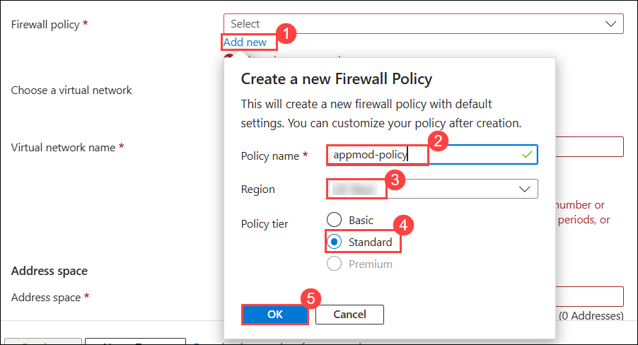
         
    - Choose a virtual network: **Create new**
     
    - Virtual network name: **app-vnet**
     
    - Address space: **10.0.0.0/16**
     
    - Subnet address space: **10.0.0.0/24**
     
      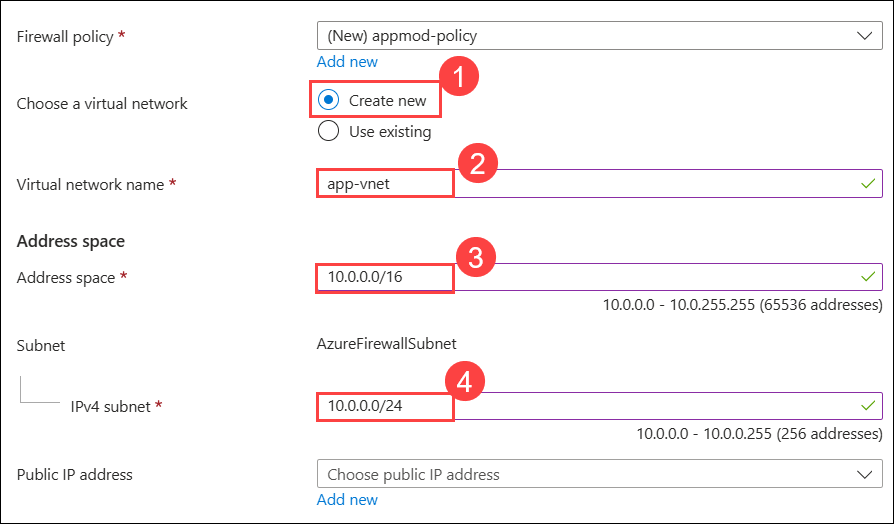
     
    - Public IP Address: 
      * Click on **Add new (1)**
      * Enter Name as **pip-firewall (2)** 
      * Click on **OK (3)**

        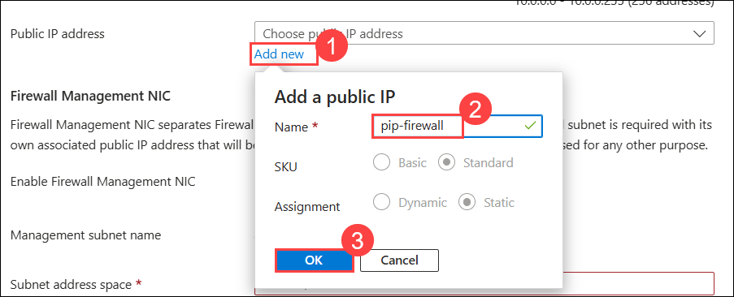

    - Firewall Management NIC:
        * Enable Firewall Management NIC: Uncheck the box

          

6. Select **Next: Tags**. Leave the **Tags** tab at its defaults and click **Next: Review + Create**.

7. On the **Review + Create** tab, wait for **Validation passed**, then click **Create (1)**.

    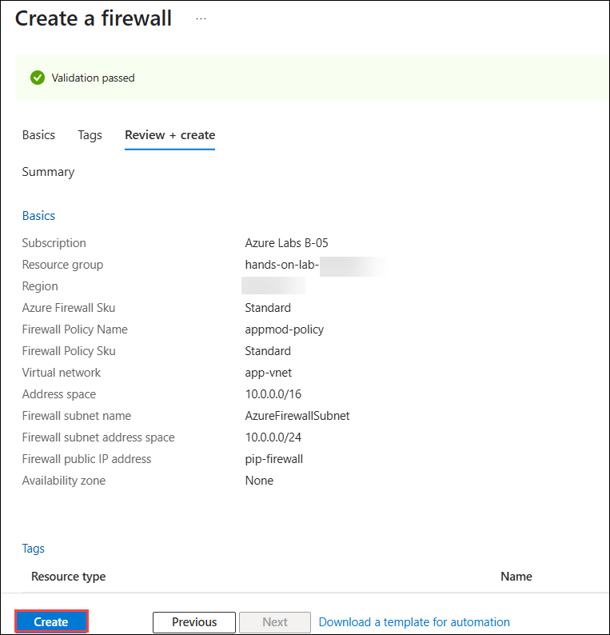
    
8. After the firewall is created successfully, click **Go to resource**.

    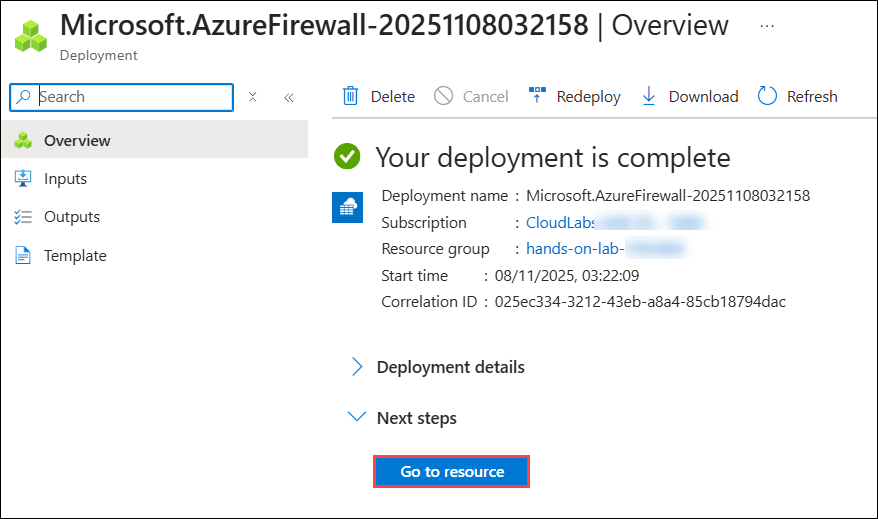
    
    > Note: The firewall might take up to 5 minutes to deploy.
  
9. On the **Overview** page of the firewall, select **Firewall public IP**.

    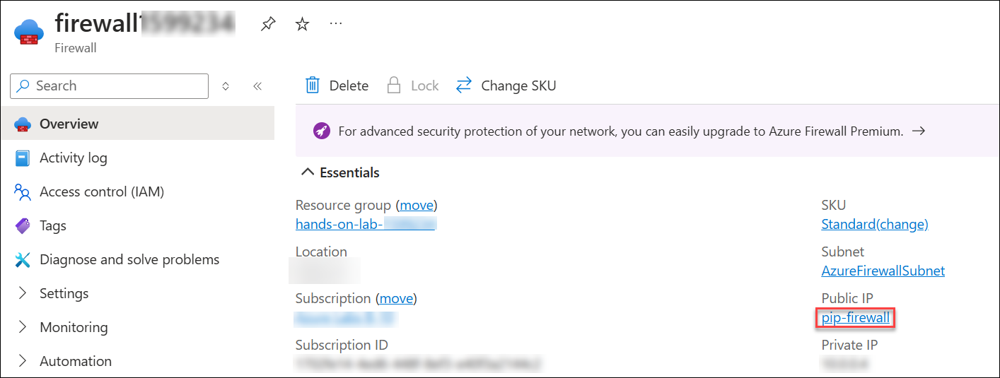
    
10. Copy the **Public IP address** of the firewall and note it down in a text editor. You will use it when you create the DNAT rule in Task 3.

    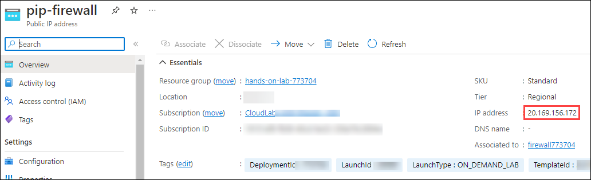

> **Congratulations** on completing the task! Now, it's time to validate it. Here are the steps:
	
- Hit the Validate button for the corresponding task. If you receive a success message, you can proceed to the next task. 
- If not, carefully read the error message and retry the step, following the instructions in the lab guide.
- If you need any assistance, please contact us at cloudlabs-support@spektrasystems.com. We are available 24/7 to help you out.

<validation step="6d5e2fb0-3665-4e44-9e89-4463025d1106" />

### Task 2: Provision Application Gateway with WAF

In this task, you will create an Application Gateway with a Web Application Firewall and point it at the WebVM as its backend.  

1. On the Azure portal **Home** page, search for **Application Gateways (1)** and select **Application Gateways (2)**.

    
    
2. From the **Application gateways (1)** section, click **Create (2)** and select **Application Gateway (3)** from the dropdown.

    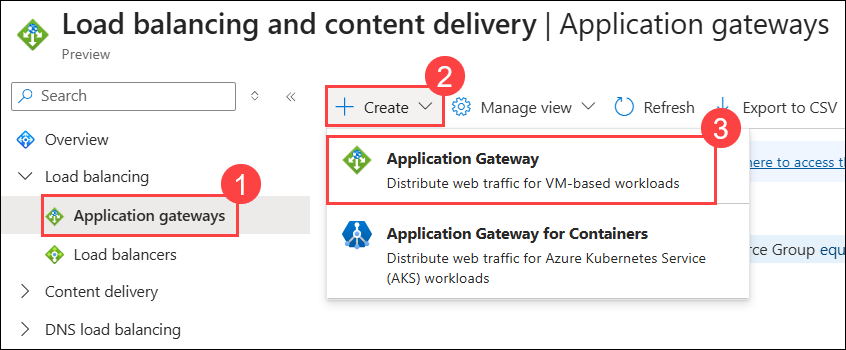
     
3. On the **Basics** tab of the **Create application gateway** page, enter the details below:

    - Subscription: Select your **Subscription (1)** from the drop-down list

    - Resource group: Select **hands-on-lab-<inject key="DeploymentID" enableCopy="false"/> (2)**

    - Application gateway name: Enter **appgateway<inject key="DeploymentID" enableCopy="false"/> (3)**

    - Region: **<inject key="location" enableCopy="false" />** **(4)**

    - Tier: **WAF V2 (5)**

    - Maximum instance count: **2 (6)**

    - HTTP2: **Disabled (7)**
    
    - WAF Policy: **Create new (8)** 

      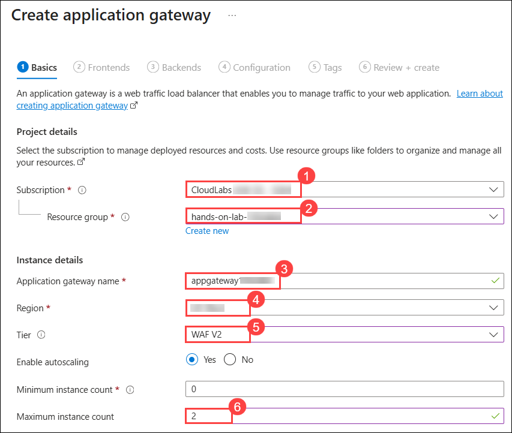
      
      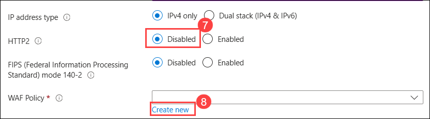

4. On the **Create Web Application Firewall Policy** tab, enter the **Name** as **appmodpolicy (1)** and click **OK (2)**.

      

5. Back on the **Basics** tab of the **Create application gateway** page, enter the details below:

    - Virtual network: Select **hands-on-lab-<inject key="DeploymentID" enableCopy="false"/>-vnet (1)**

    - Subnet: Select **subnet2 (2)** subnet from the drop-down list.

    - Select **Next : Frontends (3)**

      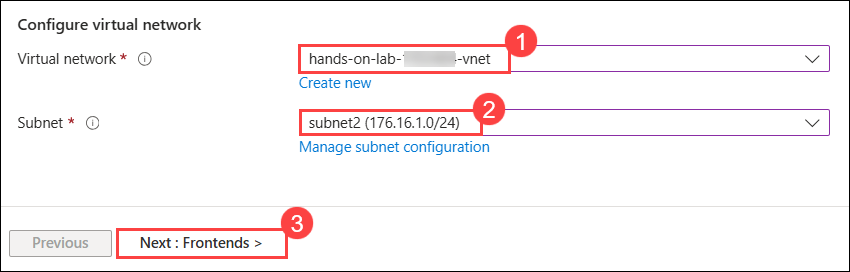
        
6. Under the **Frontends** tab, select **Both (1)** for **Frontend IP address type**. Next, click **Add new (2)** under **Public IP address**, enter the name as **appmodpip (3)**, and click **OK (4)**.
 
      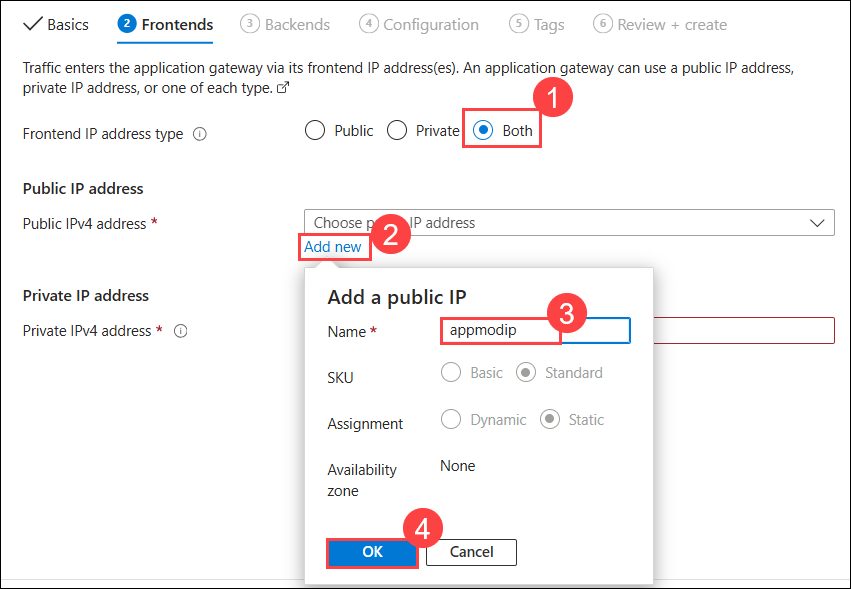
   
7. For **Private IP address**, enter `176.16.1.100`. Then select **Next: Backends**. 

      
        
8. Under the **Backends** tab, select **Add a backend pool**.

    
      
9. On the **Add a backend pool** page, enter the details below:

    - Name: Enter **appmod-backend (1)**
    - Add backend pool without targets: Select **No (2)**
    - Target type: Select **Virtual Machine** from the drop-down list
    - Target: Select **WebVM-nic (3)**
    - Select **Add (4)**

      
        
10. Now, select **Next: Configuration** under **Create application gateway**.

11. On the **Configuration** tab, select **+ Add a routing rule**.

    
     
12. On the **Add a routing rule** page, enter the details below:

    - Name: **appmod-routingrule (1)**
    - Priority: **100 (2)** 
    - Listener name: **appmod-listener (3)**     
    - Frontend: Select **Private (4)** from the drop-down list
    - Now select **Backend targets (5)**

       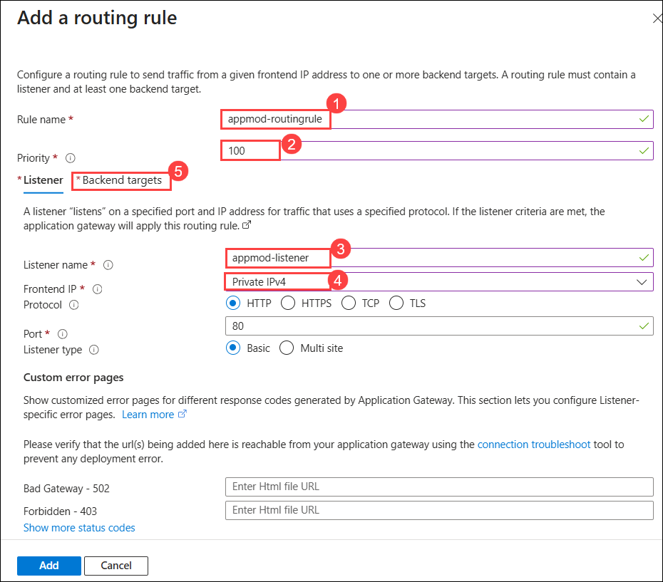
       
    - Under **Backend targets**, select the backend target **appmod-backend (1)** and select **Add new (2)** for Backend settings.

      
         
      - On the **Add Backend setting** page, enter **Backend settings name** as **appmod-http (1)** and click **Add (2)**.

        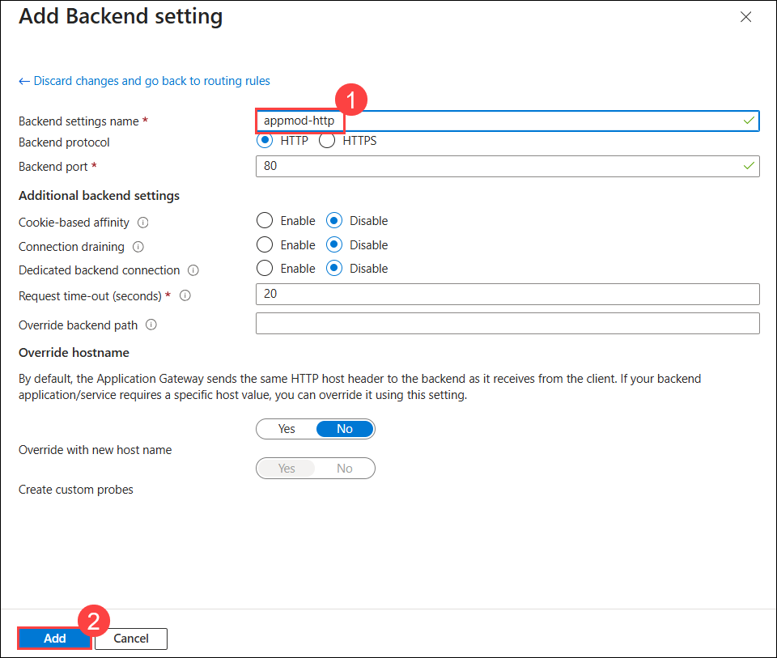
              
    - Click **Add** on the **Add a routing rule** page.

      
        
13. Click **Next: Tags** on the **Create application gateway** page.

14. Select **Review + create**.

     
      
15. Review the configuration and select **Create**.

    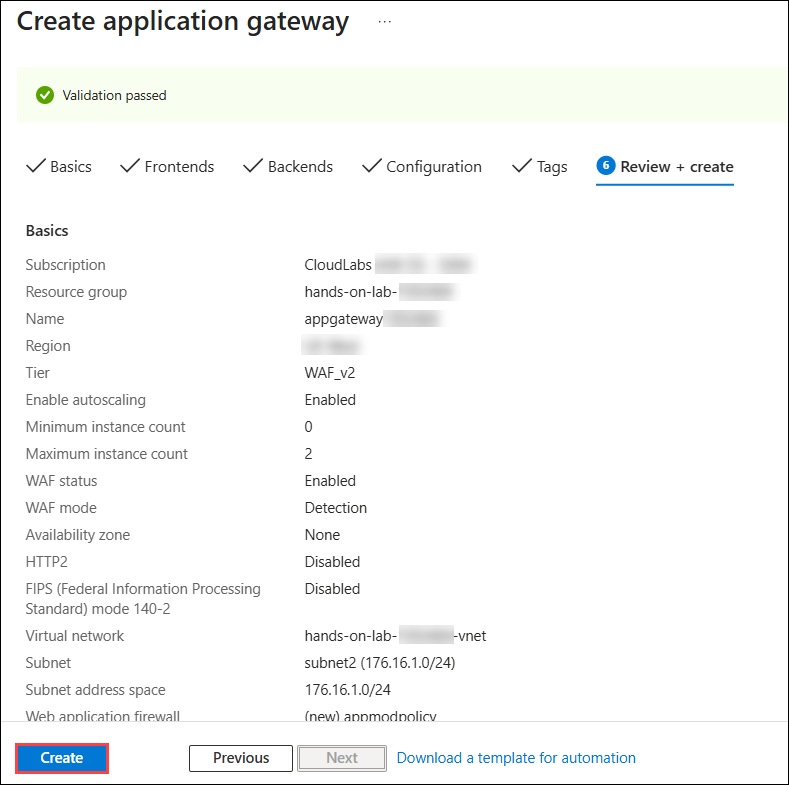
      
16. Once the deployment succeeds, click **Go to resource group**.
   
    > **Note**: The deployment takes up to 20 minutes to complete.

    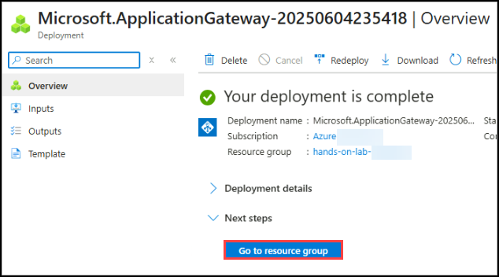
      
17. On the resource group overview page, confirm that the Application Gateway was deployed and click on it.

    
     
18. Copy the **Private IP address** from the overview page and note it down in a text editor. You will use it as the translated address in Task 3.

    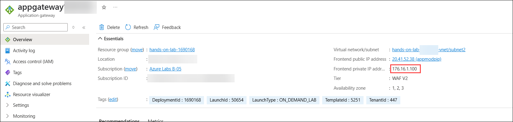

> **Congratulations** on completing the task! Now, it's time to validate it. Here are the steps:
	
  - Hit the Validate button for the corresponding task. If you receive a success message, you can proceed to the next task. 
  - If not, carefully read the error message and retry the step, following the instructions in the lab guide.
  - If you need any assistance, please contact us at cloudlabs-support@spektrasystems.com. We are available 24/7 to help you out.

<validation step="b056f2f3-44e0-4e5f-a67a-8c9076bcd4dd" />
        
### Task 3: Publish Application via Azure Firewall & Application Gateway

In this task, you will add a DNAT rule to the firewall policy so that traffic arriving at the firewall's public IP address is forwarded to the Application Gateway, publishing the application through both.

1. On the Azure portal **Home** page, search for **Firewall (1)** and select **Firewalls (2)**.

   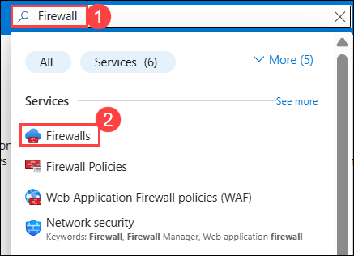
    
2. Click on the **firewall<inject key="DeploymentID" enableCopy="false"/>**.

   
     
3. Select **Firewall Manager (1)** under **Settings** and click **Visit Azure Firewall Manager to configure and manage this firewall (2)**.

   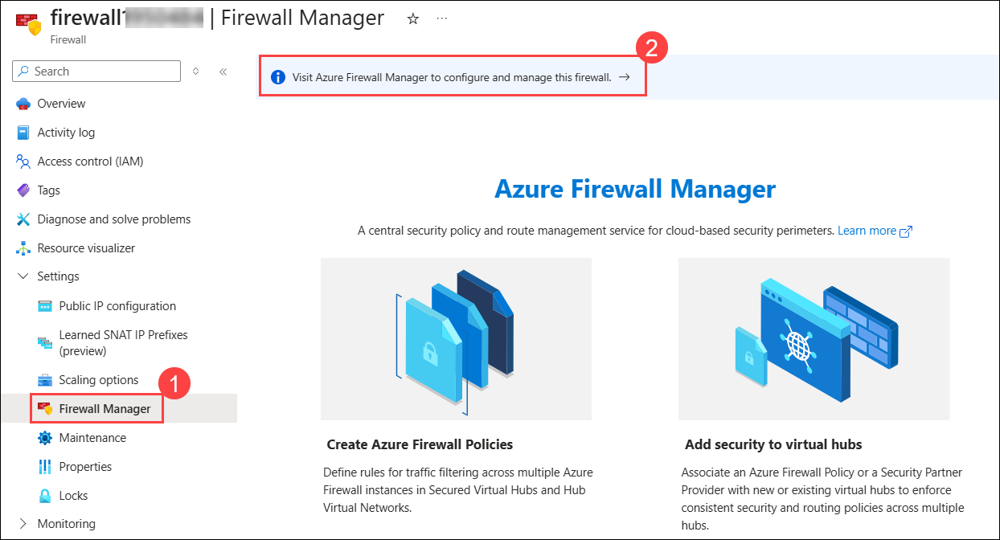
    
4. Select **Azure Firewall Policies (1)** from the **Firewall Manager** page and click the firewall policy **appmod-policy (2)**.

   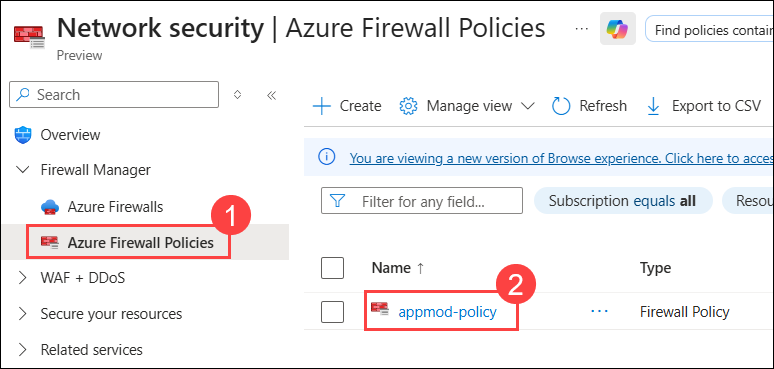
   
5. Select **DNAT Rules (1)** from the **Rules** tab under the **Firewall Policy** page and select **+ Add a rule collection (2)**.

   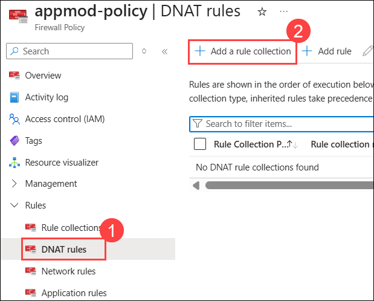
    
6. On the **Add a rule collection** page, enter the details below:

   - Name: **appmod-firewall-rulecollection (1)**
   - Rule Collection type: **DNAT (2)**
   - Priority: **100 (3)**
   - Rule collection group: **DefaultDnatRuleCollectionGroup (4)**
   - Under **Rules (5)**, enter the following details:
     - Name: **appmod-dnat-http**
     - Source type: Select **IP Address** from the drop-down list
     - Source: Enter `*`
     - Protocol: Select **TCP** from the drop-down list
     - Destination Ports: **80**
     - Destination: Enter the public IP address of the **Firewall** that you copied in Task 1
     - Translated address: Enter the private IP address of the **Application Gateway** that you copied in Task 2 
     - Translated port: **80**
     
   - Click on **Add (6)**

      
          
7. Now, to test the application, copy and paste the IP address of **Application Gateway** into a new browser tab.

   
       
8. This will confirm that you have published the Parts Unlimited web application via Azure Firewall & Application Gateway.

> **Congratulations** on completing the task! Now, it's time to validate it. Here are the steps:
	
  - Hit the Validate button for the corresponding task. If you receive a success message, you can proceed to the next task. 
  - If not, carefully read the error message and retry the step, following the instructions in the lab guide.
  - If you need any assistance, please contact us at cloudlabs-support@spektrasystems.com. We are available 24/7 to help you out.
    
<validation step="7f656a44-98ee-4604-9f3c-79b8fbbe5a13" />

## Summary
 
In this exercise, you have covered the following:
  
   - Created an Azure Firewall and an Application Gateway with a Web Application Firewall. 
   - Published the Parts Unlimited application through the firewall and Application Gateway using a DNAT rule. 
   
Now, click on **Next** from the lower right corner to move on to the next page.

