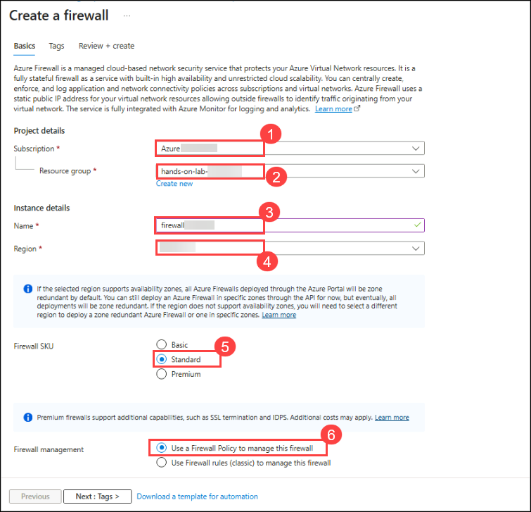
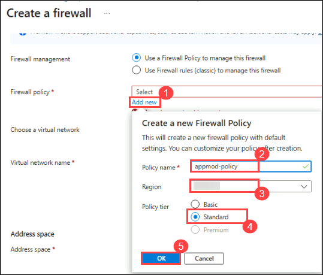
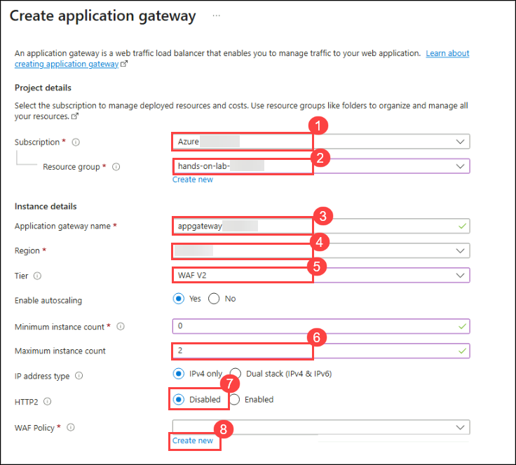
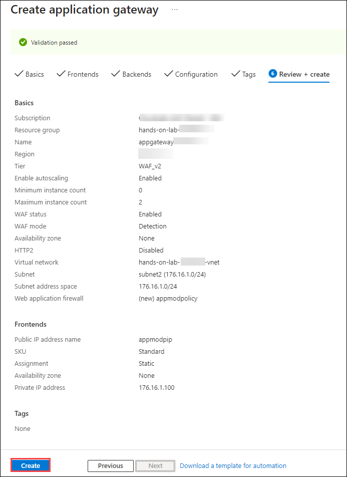
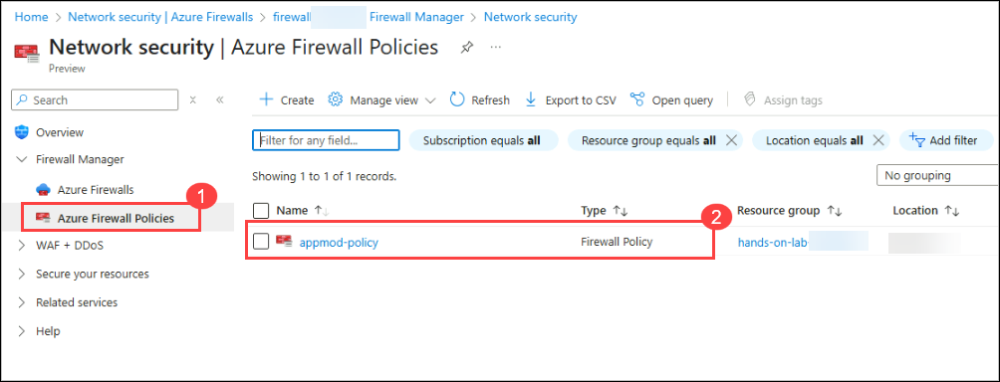
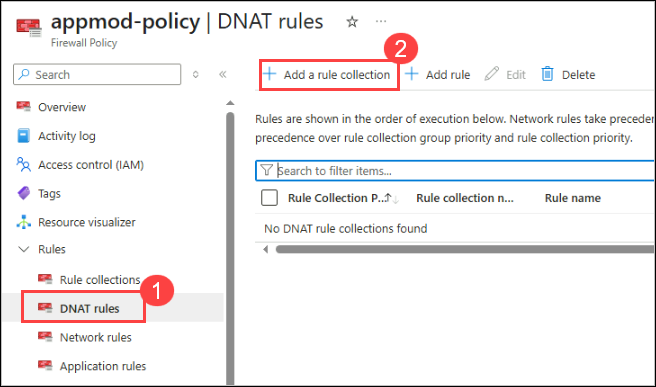

# Exercise 7: Publish the application via Application Gateway and Firewall (Optional)

### Estimated Duration: 45 minutes

### Lab objectives
In this lab, you will complete the following tasks:
   - Task 1: Provision Azure Firewall
   - Task 2: Provision Application Gateway with WAF
   - Task 3: Publish Application via Azure Firewall & Application Gateway

### Task 1: Provision Azure Firewall

In this task, you will provision an Azure Firewall to secure your network resources.

1. Select your lab **resource group**.

    

1. Click **Create** inside the resource group to add a new resource.
    
    

1. Type **firewall** into the search box and select **Firewall** from the dropdown menu.

    

1. Click **Create** to continue.

    
    
1. On the **Basics** tab of the **Create a firewall** page, provide the following information:

    - **Subscription**: Choose your **Subscription (1)** from the drop-down list.
    - **Resource group**: Select **hands-on-lab-<inject key="DeploymentID" enableCopy="false"/> (2)** from the drop-down list.
    - **Name**: Enter **firewall<inject key="DeploymentID" enableCopy="false"/> (3)**.
    - **Region**: **<inject key="location" enableCopy="false" />** **(4)**.
    - **Firewall SKU**: **Standard (5)**.
    - **Firewall management**: **Use a Firewall Policy to manage this firewall (6)**.

      

    - **Firewall policy**: 
        * Click **Add new (1)**.
        * Enter the Policy name as **appmod-policy (2)**.
        * Set the Region to **<inject key="location" enableCopy="false"/>** **(3)**.
        * Choose the Policy tier as **Standard (4)**.
        * Click **OK (5)**.
     
          
         
    - **Choose a virtual network**: **Create new**
     
    - **Virtual network name**: **app-vnet**
     
    - **Address space**: **10.0.0.0/16**
     
    - **Subnet address space**: **10.0.0.0/24**
     
      
     
    - **Public IP Address**: 
      * Click **Add new (1)**.
      * Enter the Name as **pip-firewall (2)**.
      * Click **Ok (3)**.

        

    - **Firewall Management NIC**:
        * **Enable Firewall Management NIC**: Uncheck the box.

          

1. Click **Next: Tags**. On the **Tags** tab, leave the default settings and click **Next: Review + create**.

1. On the **Review + create** tab, once validation passes, click **Create (1)**.

    
    
1. After the firewall is successfully deployed, click **Go to resource**.

    
    
    > **Note:** The firewall deployment may take up to 5 minutes to complete.
  
1. Select **Firewall public IP** from the Overview page of your **firewall**.

    
    
1. Copy the **Public IP Address** of the firewall and save it in a text editor (like Notepad). You will need this IP address in the upcoming tasks.

    

> **Congratulations** on completing the task! Now, it's time to validate it. Please follow these steps:
	
- Click the **Validate** button for the corresponding task. If you receive a success message, you may proceed to the next task. 
- If validation fails, carefully read the error message and retry the step following the instructions in the lab guide.
- If you require any assistance, please contact us at cloudlabs-support@spektrasystems.com. We are available 24/7 to help you.

  <validation step="10283f80-331d-4dd5-a57d-ddae8d420cd2" />

### Task 2: Provision Application Gateway with WAF

In this task, you will create an Azure Application Gateway equipped with a Web Application Firewall (WAF).  

1. On the Azure portal **Home** page, search for **Application Gateways (1)** and select **Application Gateways (2)** from the results.

    
    
1. Click **Create application gateway** on the Application Gateways page.

    
     
1. On the **Basics** tab of the **Create application gateway** page, provide the following details:

    - **Subscription**: Select your **Subscription (1)** from the drop-down list.

    - **Resource group**: Select **hands-on-lab-<inject key="DeploymentID" enableCopy="false"/> (2)**.

    - **Application gateway name**: Enter **appgateway<inject key="DeploymentID" enableCopy="false"/> (3)**.

    - **Region**: **<inject key="location" enableCopy="false" />** **(4)**.

    - **Tier**: **WAF V2 (5)**.

    - **Maximum instance count**: **2 (6)**.

    - **HTTP2**: **Disabled (7)**.
    
    - **WAF Policy**: **Create new (8)**. 

      
      
1. On the **Create Web Application Firewall Policy** panel, enter **appmodpolicy (1)** as the **Name** and click **OK (2)**.

      

1. Returning to the **Basics** tab of the **Create application gateway** page, continue with the following details:

    - **Virtual network**: Select **hands-on-lab-<inject key="DeploymentID" enableCopy="false"/>-vnet (1)**.

    - **Subnet**: Select the **subnet2 (2)** subnet from the drop-down list.

    - Click **Next : Frontends (3)**.

      
        
1. On the **Frontends** tab, select **Both (1)** for the **Frontend IP address type**. Next, click **Add new (2)** under **Public IP address**, enter the name **appmodpip (3)**, and click **OK (4)**.
 
      
   
1. For the **Private IP address**, enter `176.16.1.100`. Then, click **Next: Backends**. 

      
        
1. On the **Backends** tab, click **Add a backend pool**.

    
      
1. On the **Add a backend pool** panel, configure the following details:

    - **Name**: Enter **appmod-backend (1)**.
    - **Add backend pool without targets**: Select **No (2)**.
    - **Target type**: Select **Virtual Machine** from the drop-down list.
    - **Target**: Select **WebVM-nic (3)**.
    - Click **Add (4)**.

      
        
1. Click **Next: Configuration** at the bottom of the page.

1. On the **Configuration** tab, click **+ Add a routing rule**.

    
     
1. On the **Add a routing rule** page, provide the details below:

    - **Name**: **appmod-routingrule (1)**.
    - **Priority**: **100 (2)**. 
    - **Listener name**: **appmod-listener (3)**.     
    - **Frontend**: Select **Private (4)** from the drop-down list.
    - Now, select the **Backend targets (5)** tab.

       
       
    - Under the **Backend targets** tab, select **appmod-backend (1)** as the Backend target, and click **Add new (2)** for Backend settings.

      
         
      - On the **Add Backend setting** panel, enter **appmod-http (1)** as the **Backend settings name**, then click **Add (2)**.

        
              
    - Click **Add** on the **Add a routing rule** page to finalize the rule.

      
        
1. Click **Next: Tags** at the bottom of the page.

1. Click **Next: Review + create**.

     
      
1. Review your configuration carefully and click **Create**.

    
      
1. After the deployment is successful, click **Go to resource group**.
   
    > **Note**: The deployment may take up to 20 minutes to complete.

    
      
1. Navigate to the overview page of your resource group, verify that the Application Gateway has been successfully deployed, and click on it.

    
     
1. Copy the **Private IP address** from the Application Gateway's Overview page and save it in your text editor. You will need this for the next task.

    

> **Congratulations** on completing the task! Now, it's time to validate it. Please follow these steps:
	
  - Click the **Validate** button for the corresponding task. If you receive a success message, you may proceed to the next task. 
  - If validation fails, carefully read the error message and retry the step following the instructions in the lab guide.
  - If you require any assistance, please contact us at cloudlabs-support@spektrasystems.com. We are available 24/7 to help you.

<validation step="61adc3d9-bf7e-43db-a2f4-cfb88ee8c8fa" />
        
### Task 3: Publish Application via Azure Firewall & Application Gateway             

In this task, you will publish the Parts Unlimited application by routing traffic through both the Azure Firewall and the Application Gateway.

1. On the Azure portal **Home** page, search for **Azure Firewalls (1)** and select **Firewalls (2)**.

    
    
1. Click on your newly created **firewall<inject key="DeploymentID" enableCopy="false"/>**.

    
     
1. Select **Firewall Manager (1)** from the **Settings** menu and click on **Visit Azure Firewall Manager to configure and manage this firewall (2)**.

    
    
1. Select **Azure Firewall Policies (1)** from the **Firewall Manager** page and click on your Firewall Policy **appmod-policy (2)**.

   
   
1. Select **DNAT Rules (1)** from the **Rules** tab on the **Firewall Policy** page, then click **+ Add a rule collection (2)**.

   
    
1. On the **Add a rule collection** page, configure the following settings:

   - **Name**: **appmod-firewall-rulecollection (1)**
   - **Rule Collection type**: **DNAT (2)**
   - **Priority**: **100 (3)**
   - **Rule collection group**: **DefaultDnatRuleCollectionGroup (4)**
   - Under **Rules (5)**, provide the details below:
     - **Name**: **appmod-dnat-http**
     - **Source type**: Select **IP Address** from the drop-down list
     - **Source**: Enter `*`
     - **Protocol**: Select **TCP** from the drop-down list
     - **Destination Ports**: **80**
     - **Destination**: Enter the **Public IP address** of the **Firewall** that you copied during Task 1.
     - **Translated address**: Enter the **Private IP address** of the **Application Gateway** that you copied during Task 2. 
     - **Translated port**: **80**
     
    - Click **Add (6)**.

      
          
1. Now, to test the application, copy and paste the IP address of the **Application Gateway** into a new browser tab.

    
       
1. This will confirm that you have successfully published the Parts Unlimited web application securely via the Azure Firewall and Application Gateway.

  > **Congratulations** on completing the task! Now, it's time to validate it. Please follow these steps:
	
  - Click the **Validate** button for the corresponding task. If you receive a success message, you may proceed to the next task. 
  - If validation fails, carefully read the error message and retry the step following the instructions in the lab guide.
  - If you require any assistance, please contact us at cloudlabs-support@spektrasystems.com. We are available 24/7 to help you.
    
    <validation step="458adc4c-04a4-46be-acf9-984ff52fb25b" />

## Summary
 
In this exercise, you have successfully completed the following:
  
   - Provisioned an Azure Firewall and an Application Gateway with a Web Application Firewall (WAF). 
   - Published an application securely via the Azure Firewall and Application Gateway. 
   
Click **Next** in the lower right corner to proceed to the next page.

