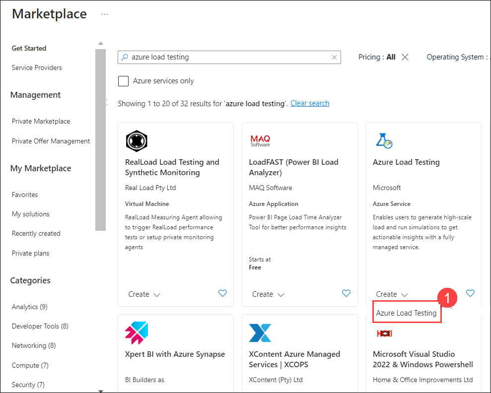
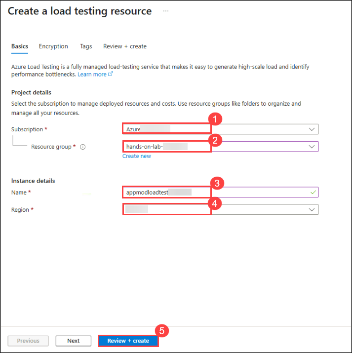
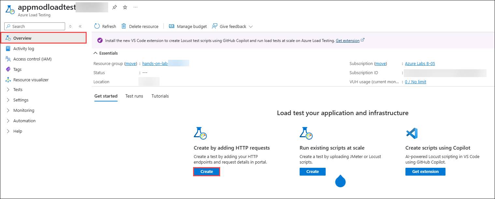
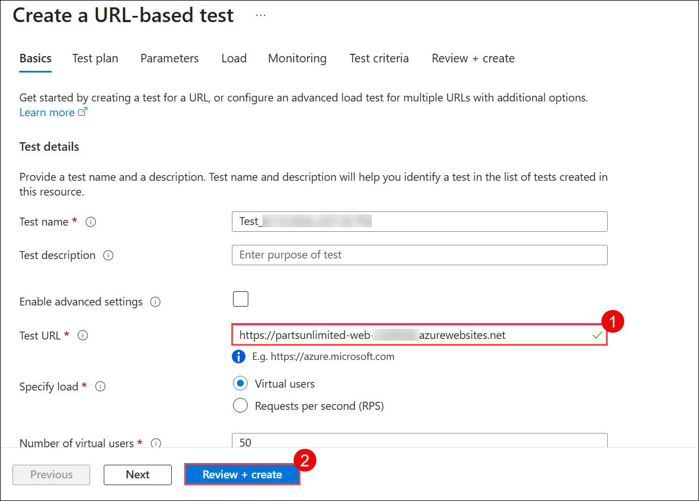
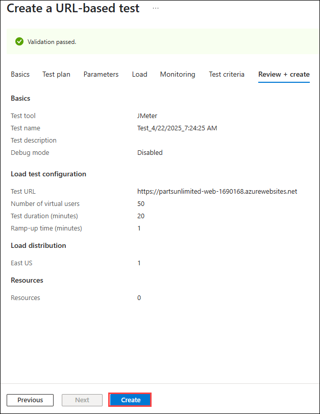

# Exercise 8: Performance testing of web app (Optional)

### Estimated Duration: 45 minutes

Azure Load Testing is a fully managed load-testing service that enables you to generate high-scale load against your applications. Regardless of where your applications are hosted, this service simulates realistic traffic patterns. It can be heavily utilized by developers, testers, and quality assurance (QA) engineers to evaluate and enhance the speed, scalability, and capacity of their applications.

> **Note:** Azure Load Testing is continuously evolving, so specific configuration options may change over time.

### Lab objectives
In this lab, you will complete the following tasks:
   - Task 1: Performance testing of web app (Optional)

### Task 1: Performance testing of web app (Optional)

In this task, you will learn how to load test the Parts Unlimited web application using Azure Load Testing directly from the Azure portal.

1. First, you will create an Azure Load Testing resource. In the Azure portal, click the **Show portal menu (1)** icon and select **+ Create a resource (2)**.

   

1. Search for **Azure Load Testing** in the search box and select **Azure load testing** from the suggested results.
 
   

1. Click **Create** and select **Azure Load Testing (1)**.

   

1. Provide the following information to configure the Load Testing resource:

   - **Subscription:** Ensure that your assigned **Subscription (1)** is selected.
   
   - **Resource group:** Select the **hands-on-lab-<inject key="DeploymentID" enableCopy="false"/> (2)** resource group from the drop-down menu.
   
   - **Name:** Enter **appmodloadtest<inject key="DeploymentID" enableCopy="false"/>** as the name for the load test resource **(3)**.
   
   - **Region:** Set the region to **<inject key="location" enableCopy="false" /> (4)**.
   
   - Click **Review + create (5)**.
 
      
    
1. Once validation passes, click **Create**.

    R.png)

1. Upon successful deployment, click **Go to resource** to view your newly created resource.

    .png)

1. You will now create a new load test using the Parts Unlimited web application URL.

1. On the **Overview** page, click **Create** under the **Create by adding HTTP requests** option, located in the *Load test your application and infrastructure* section.

   

1. On the Quick test page, provide the following details:

   - **Test URL:** Enter `https://partsunlimited-web-<inject key="DeploymentID" enableCopy="false"/>.azurewebsites.net` **(1)**.

     > **Note:** If you do not see the Test URL field, ensure that the **Enable advanced settings** checkbox is unchecked.
   
   - The remaining settings are optional, and their default values are sufficient for this task.
   
   - Click **Review + create (2)**.

      

   - Finally, click **Create**. This will initialize and automatically start the load test.

      

1. Once the load test begins, you will be redirected to the test run dashboard. Azure Load Testing actively records both client-side and server-side metrics while the load test is underway. 

1. On the dashboard, you can observe the client-side metrics updating in real-time. By default, the data refreshes every five seconds.

     

  > **Congratulations** on completing the task! Now, it's time to validate it. Please follow these steps:
	
  - Click the **Validate** button for the corresponding task. If you receive a success message, you may proceed to the next task. 
  - If validation fails, carefully read the error message and retry the step following the instructions in the lab guide.
  - If you require any assistance, please contact us at cloudlabs-support@spektrasystems.com. We are available 24/7 to help you.

<validation step="cf58fac6-0d16-449f-9c04-00620b5a0adb" />
    
## Summary
 
In this exercise, you have successfully completed the following:
  
   - Created an Azure Load Testing resource. 
   - Conducted a high-scale load test against the Parts Unlimited web application using Azure Load Testing directly from the Azure portal. 

Click **Next** in the lower right corner to proceed to the next page.

