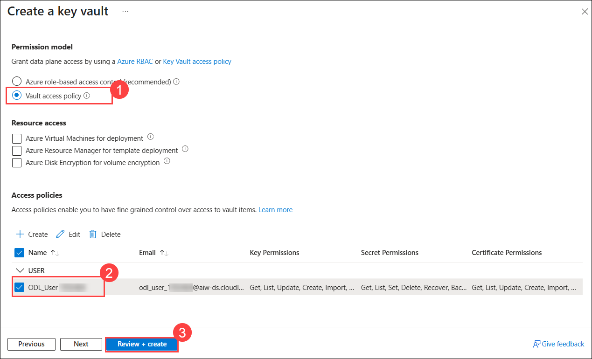
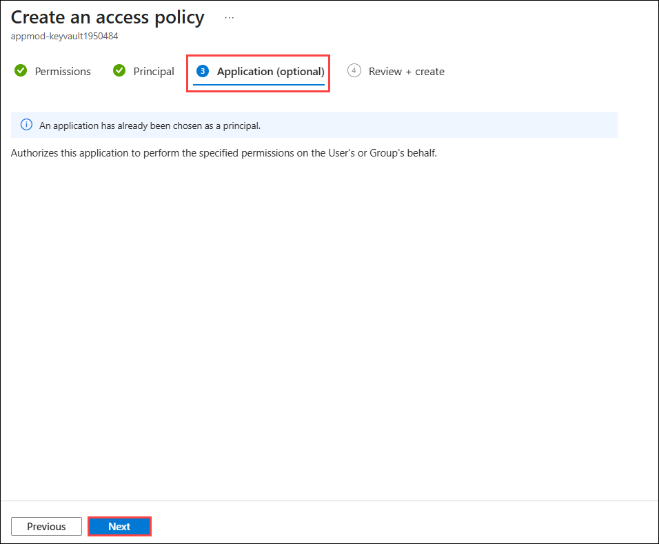
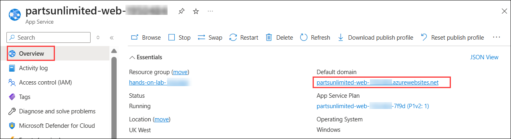

# Exercise 9: Securing web app connection string with Azure Key Vault and Managed Identity (Optional)

### Estimated Duration: 55 Minutes

The database connection string is currently stored in plain text in the App Service configuration. In this exercise, you will move it into an Azure key vault and give the web app a system-assigned managed identity, so that the app retrieves the secret at runtime instead of holding a copy of the credentials.

### Objectives
In this exercise, you will complete the following tasks:
   - Task 1: Setting up Azure Key vault
   - Task 2: Create and assign system-assigned managed identity
   - Task 3: Securing the web app connection string with secret

### Task 1: Setting up Azure Key vault

In this task, you will create an Azure key vault and store the SQL connection string in it as a secret.

1. Select your **resource group** named **hands-on-lab-<inject key="DeploymentID" enableCopy="false"/>**

   

2. Select **Create** inside the resource group to add a new resource.

   
    
3. Type **Key Vault (1)** into the search box and select **Key Vault (2)** from the dropdown.

   

4. Select **Create** and click on **Key Vault** to continue.

   
    
5. On the **Basics** tab, enter the Key Vault name as **appmod-keyvault<inject key="DeploymentID" enableCopy="false"/>** **(1)**, leave all other options as default, and click **Next (2)**.

   

6. On the **Access configuration** tab, select **Vault access policy (1)** as the permission model and select **ODL_USER_<inject key="DeploymentID"/> (2)** under Access policies. Click **Review + create (3)**.

   

7. On the **Review + create** page, review all the options and click **Create**.

   
    
8. After the key vault is created successfully, click **Go to resource**.

   

9. Switch to the **Secrets (1)** blade under the **Objects** section and select **+ Generate/Import (2)**.

   
   
10. On the **Create a secret** panel, enter the following details and click **Create**.
   
    - **Upload options**: `Manual`
    - **Name**: Enter `DB-secret`
    - **Value**: Enter the SQL connection string you completed in Exercise 3, Task 2, Step 3.

       
   
11. Once the secret is created successfully, click on it to open its details.

    

12. On the Secret Version panel, copy the **Secret Identifier** value and paste it into Notepad — you will need it in Task 3.

    

> **Congratulations** on completing the task! Now, it's time to validate it. Here are the steps:

- Hit the Validate button for the corresponding task. If you receive a success message, you can proceed to the next task. 
- If not, carefully read the error message and retry the step, following the instructions in the lab guide.
- If you need any assistance, please contact us at cloudlabs-support@spektrasystems.com. We are available 24/7 to help you out.

<validation step="d5ea3d61-f8f2-437e-8c74-5e3a7eb7d545" />

### Task 2: Create and assign system-assigned managed identity

In this task, you will enable a system-assigned managed identity for your App Service and grant it read access to the key vault through an access policy.

1. Go back to the resource list and search for **`partsunlimited-web`** **(1)** to find your Web App and App Service plan, then select the **partsunlimited-web-<inject key="DeploymentID" enableCopy="false"/> (2)** App Service resource.

   
   
2. Switch to the **Identity** blade under Settings.
   
   
   
3. On the **System assigned (1)** tab, set **Status** to **On (2)** and click **Save (3)**. Click **Yes** on the **Enable system assigned managed identity** pop-up.

   
   
4. Once the managed identity is assigned, copy the **Object (principal) ID** and paste it into Notepad — you will need it in step 8.

   
   
5. Go back to the resource group, search for `appmod-keyvault` **(1)** to find your key vault, and click on it **(2)**.

   
   
6. From the left navigation pane, select **Access policies (1)** and click **Create (2)** to create a new access policy for the key vault.

   
 
7. On the **Permissions** tab of the **Create an access policy** panel, select the following:

   - **Configure from template**: Select `Secret Management` **(1)**
   - **Secret permissions**: Select `Get` **(2)**
   - Click on **Next (3)**

     
   
8. On the **Principal** tab, enter the **system-assigned managed identity (1)** object ID you copied in step 4, and select it from the results **(2)**. Click **Next (3)**.

   
   
9. On the **Application (Optional)** tab, leave all the values at their defaults and click **Next**.

   

10. On the **Review + create** tab, click **Create**.

    
     
11. Once the access policy is created, confirm that it is listed as shown below.

    

> **Congratulations** on completing the task! Now, it's time to validate it. Here are the steps:

- Hit the Validate button for the corresponding task. If you receive a success message, you can proceed to the next task. 
- If not, carefully read the error message and retry the step, following the instructions in the lab guide.
- If you need any assistance, please contact us at cloudlabs-support@spektrasystems.com. We are available 24/7 to help you out.

<validation step="9cc92802-2d42-4fc9-9c06-35b312613149" />

### Task 3: Securing the web app connection string with secret

In this task, you will replace the plain-text connection string in the web application with a reference to the Azure Key Vault secret, so that the database credentials are no longer stored in the App Service configuration.

1. Go back to the resource list and search for **`partsunlimited-web`** **(1)** to find your Web App, then select the **partsunlimited-web-<inject key="DeploymentID" enableCopy="false"/> (2)** App Service resource.

   

2. Switch to the **Environment variables (1)** blade, select **Connection strings (2)**, and then select the connection string named **DefaultConnectionString (3)**.

   
   
3. Replace the value with a Key Vault reference in the **@Microsoft.KeyVault(SecretUri=Secret_identifier)** format, substituting **Secret_identifier** with the value you copied in Task 1, Step 12. The finished value looks like this:

   `@Microsoft.KeyVault(SecretUri=https://appmod-keyvault776057.vault.azure.net/secrets/DB-secret/ffd4c9d21f8e4582956ee42b20f74e13)`
 
4. Select **Apply**, then click **Confirm** in the **Save changes** pop-up.
   
5. Scroll down to the connection string details and observe that **DefaultConnectionString** now shows **Key Vault** as its source.
   
   
   
6. Switch to the **Overview (1)** blade and select **Default domain (2)** to browse to the Parts Unlimited website. The site continues to work, now reading its database credentials from the key vault.

   
    
   
        
   >**Note:** The banner image on the page rotates, so you may see a different image than the one shown above.

## Summary
 
In this exercise, you have covered the following:

   - Created an Azure key vault and stored the SQL connection string in it as a secret.
   - Enabled a system-assigned managed identity on the web app and granted it access to the key vault.
   - Replaced the plain-text connection string with a Key Vault reference.

### You have successfully completed the lab.
