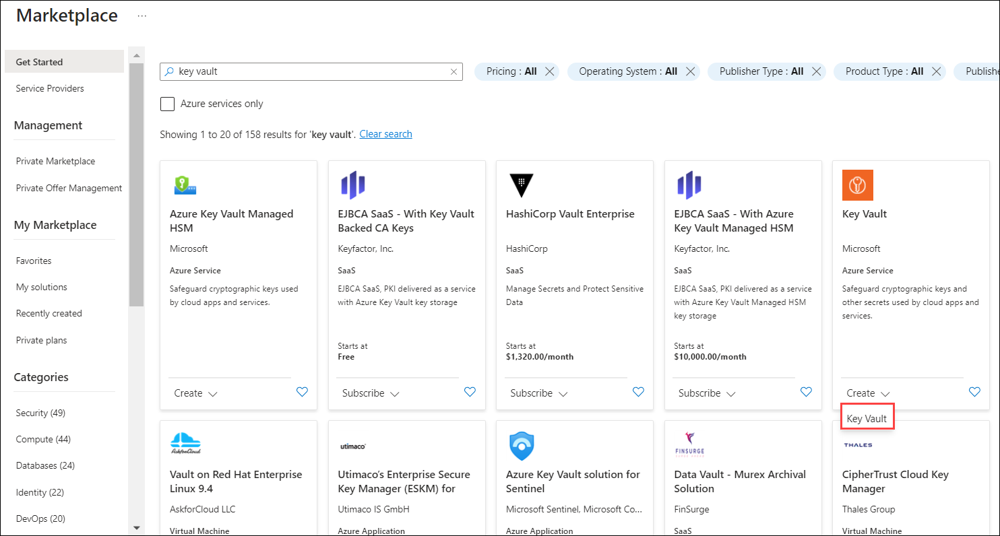
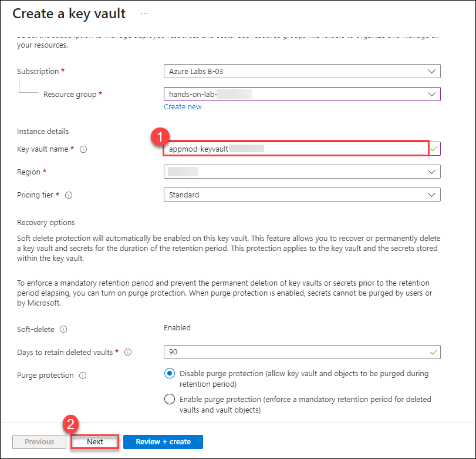
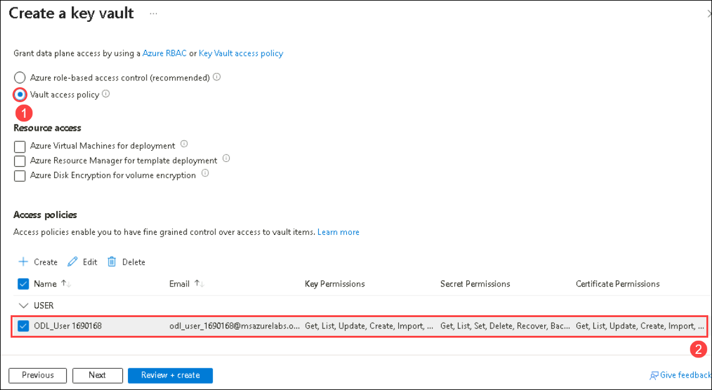
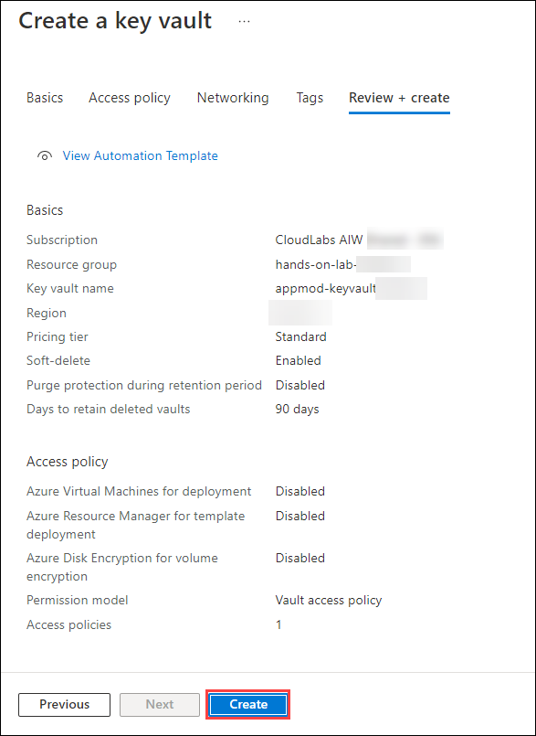
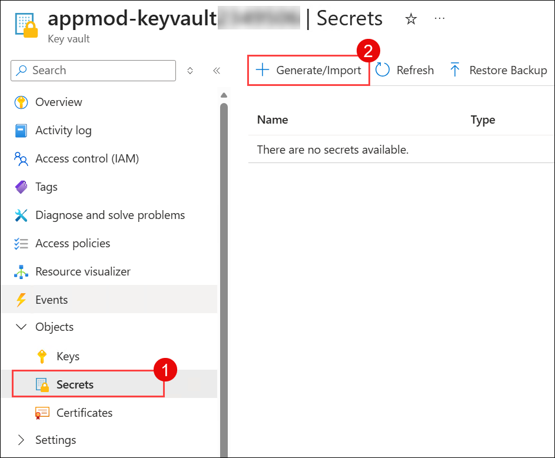
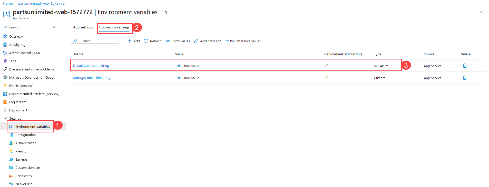
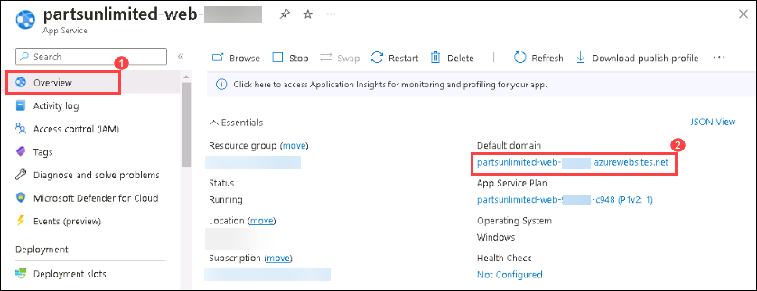

# Exercise 9: Securing web app connection string with Azure Key Vault and Managed Identity (Optional)

### Estimated Duration: 55 minutes 

In this exercise, you will create an Azure Key Vault and configure the Azure web application to securely retrieve a database connection string from a Key Vault secret. You will utilize a system-assigned managed identity to seamlessly and securely authenticate the web app with the Key Vault.

### Lab objectives
In this lab, you will complete the following tasks:
   - Task 1: Setting up Azure Key vault
   - Task 2: Create and assign system assigned managed identity
   - Task 3: Securing the web app connection string with secret

### Task 1: Setting up Azure Key vault

In this task, you will learn how to create and configure an Azure Key Vault to securely store secrets, such as a SQL connection string.

1. Select your lab **resource group** named **hands-on-lab-<inject key="DeploymentID" enableCopy="false"/>**.

   

1. Click **Create** inside the resource group to add a new resource.

   
    
1. Type **Key Vault (1)** into the search box and select **Key Vault (2)** from the dropdown menu.

   

1. Click **Create** and select **Key Vault** to continue.

   
    
1. On the **Basics** tab of the key vault configuration, enter **appmod-keyvault<inject key="DeploymentID" enableCopy="false"/>** **(1)** as the Key Vault name. Leave all other options at their default settings and click **Next (2)**.

   

1. On the **Access configuration** tab, select **Vault access policy (1)** for the Permission model and select **ODL_USER_<inject key="DeploymentID"/> (2)** under Access policies.

   

1. On the **Review + create** page, review your configuration settings and click **Create**.

   
    
1. After the Key Vault is successfully deployed, click **Go to resource**.

   

1. Switch to the **Secrets (1)** blade and click **+ Generate/Import (2)**.

   
   
1. On the **Create a secret** panel, enter the following details, then click **Create**:
   
    - **Upload options**: `Manual`
    - **Name**: Enter `DB-secret`
    - **Value**: Paste the SQL Connection String you copied in Exercise 4, Task 6, Step 3.

       
   
1. Once the secret is successfully created, click on the newly created secret to view its versions and retrieve the secret identifier.

    

1. On the Secret Version panel, copy the **Secret Identifier** value and paste it into Notepad for use in a later task.

    

     > **Congratulations** on completing the task! Now, it's time to validate it. Please follow these steps:
	
     - Click the **Validate** button for the corresponding task. If you receive a success message, you may proceed to the next task. 
     - If validation fails, carefully read the error message and retry the step following the instructions in the lab guide.
     - If you require any assistance, please contact us at cloudlabs-support@spektrasystems.com. We are available 24/7 to help you.

     <validation step="d31b59e5-c3d3-4dc8-a900-40e78ceaed5a" />

### Task 2: Create and assign system-assigned managed identity

In this task, you will learn how to enable a system-assigned managed identity for your App Service and grant it access to a Key Vault using appropriate access policies.

1. Return to the resource list and navigate to your **partsunlimited-web-<inject key="DeploymentID" enableCopy="false"/>(2)** App Service resource. You can search for **`partsunlimited-web`** **(1)** to easily locate your Web App.

   
   
1. Switch to the **Identity** blade under the Settings menu.
   
   
   
1. On the **System assigned (1)** tab, toggle the Status to **On (2)** and click **Save (3)**. Click **Yes** when prompted by the **Enable system assigned managed identity** dialog.

   
   
1. Once the managed identity is successfully enabled, copy the generated **Object (principal) ID** and paste it into Notepad.

   
   
1. Return to your resource group, search for **(1)** `appmod-keyvault` to locate your newly created Key Vault, and click on it **(2)**.

   
   
1. From the left navigation pane, select **Access policies (1)** and click **Create (2)** to define a new access policy for the Key Vault.

   
 
1. On the **Permissions** tab of the **Create an access policy** panel, configure the following:

   - **Configure from template**: Select `Secret Management` **(1)**
   - **Secret permissions**: Select `Get` **(2)**
   - Click **Next (3)**

     
   
1. On the **Principal** tab, paste the **system-assigned managed identity (1)** Object ID you copied previously in Step 4, and select the corresponding principal from the list **(2)**. Click **Next (3)**.

   
   
1. On the **Application (optional)** tab, leave all values at their defaults and click **Next**.

   

1. Click **Create** on the **Review + create** tab to finalize the access policy.

    
     
1. Once the access policy creation is complete, verify that the application's access policy is actively listed as shown below.

    

    > **Congratulations** on completing the task! Now, it's time to validate it. Please follow these steps:
    
    - Click the **Validate** button for the corresponding task. If you receive a success message, you may proceed to the next task. 
    - If validation fails, carefully read the error message and retry the step following the instructions in the lab guide.
    - If you require any assistance, please contact us at cloudlabs-support@spektrasystems.com. We are available 24/7 to help you.

    <validation step="e7bdf32b-0a31-4a50-b0a2-b0dc5e630567" />

### Task 3: Securing the web app connection string with secret

In this task, you will learn how to secure a web application's connection string by linking it to an Azure Key Vault secret instead of storing it directly in plain text. This ensures sensitive information like database credentials are protected.

1. Return to the resource list and navigate to your **partsunlimited-web-<inject key="DeploymentID" enableCopy="false"/>(2)** App Service resource. You can search for **`partsunlimited-web`** **(1)** to quickly find your Web App.

   

1. Switch to the **Environment variables (1)** blade, select **Connection strings (2)**, and click on the connection string named **DefaultConnectionString (3)** to edit it.

   
   
1. Format the Key Vault secret reference using the syntax: **@Microsoft.KeyVault(SecretUri=Secret_identifier)**. Replace **Secret_identifier** with the exact Secret Identifier URI you copied earlier in Task 1, Step 12. Copy the edited secret value that looks similar to the example below:

   `@Microsoft.KeyVault(SecretUri=https://appmod-keyvault776057.vault.azure.net/secrets/DB-secret/ffd4c9d21f8e4582956ee42b20f74e13)`
 
1. Click **Apply** to save the edited connection string. When the **Save changes** dialog appears, click **Confirm**.
   
1. Scroll down to the connection string list and observe that the **DefaultConnectionString** now explicitly shows **Key Vault Reference** as its Source.
   
   
   
1. Switch to the **Overview (1)** blade and click the **Default domain (2)** link to navigate to the Parts Unlimited website hosted in your Azure App Service using the Azure SQL Database.

   
    
   
        
   >**Note:** You may see a different banner image on the homepage when accessing the site, as the application rotates through a carousel of promotional images.

 ## Summary
 
In this exercise, you have successfully completed the following:

   - Created an Azure Key Vault.
   - Configured the web application to securely retrieve its database connection string using a Key Vault secret and Managed Identity.

### You have successfully completed the lab.
