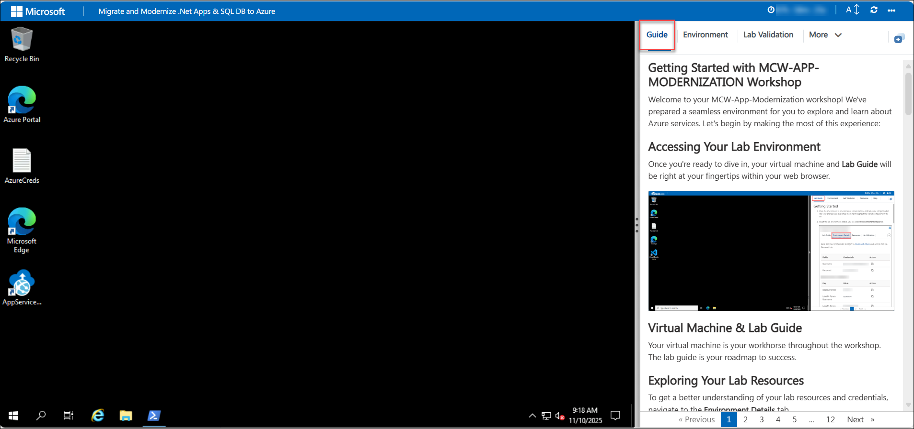
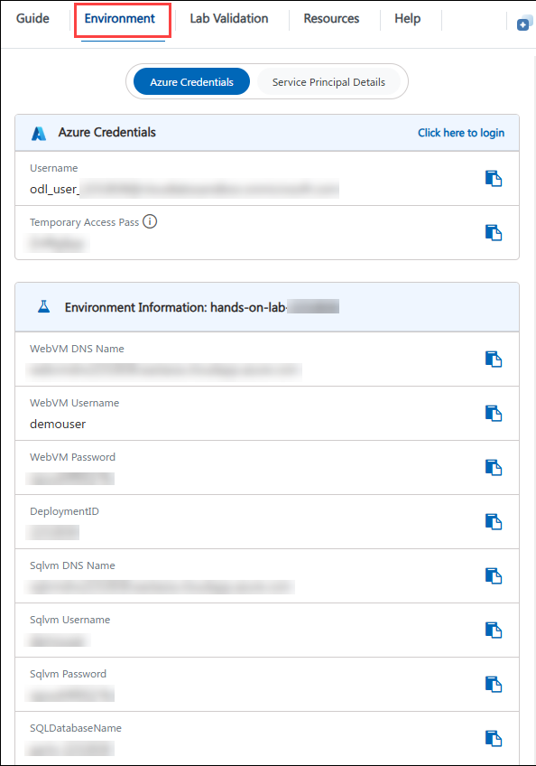
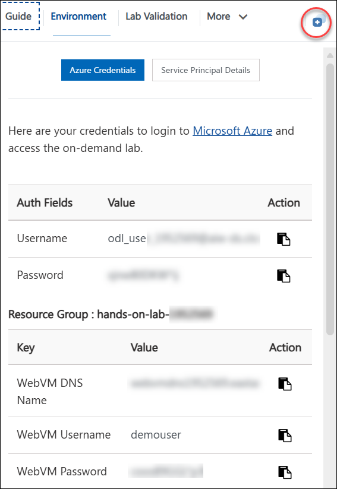
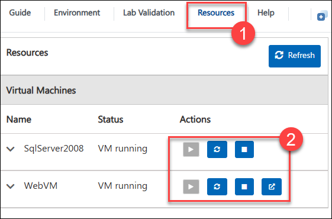
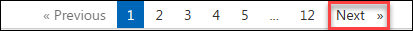

## **Getting Started with APP MODERNIZATION Workshop**
 
Welcome to your App Modernization workshop! We've prepared a ready-to-use environment for you to explore and learn about Azure services. Let's begin by getting familiar with it:

 
## **Accessing Your Lab Environment**
 
Your virtual machine and **Lab Guide** are both available directly in your web browser.
 

## **Virtual Machine & Lab Guide**
 
Your virtual machine is where you will do the hands-on work throughout the workshop, and the lab guide is your step-by-step roadmap.
 
## **Exploring Your Lab Resources**
 
To review the resources and credentials provisioned for you, navigate to the **Environment Details** tab.
 

 
## **Utilizing the Split Window Feature**
 
For convenience, you can open the lab guide in a separate window by selecting the **Split Window** icon in the bottom-right corner.

 
## **Managing Your Virtual Machine**
 
You can start, stop, or restart your virtual machine at any time from the **Resources** tab.
 

 
## **Let's Get Started with Azure Portal**
 
1. On your virtual machine, click the Azure portal shortcut as shown below:
 
        

1. You'll see the **Sign into Microsoft Azure** tab. Here, enter your credentials:
 
   - **Email/Username:** <inject key="AzureAdUserEmail"></inject>
 
        
 
1. Next, provide your password:
 
   - **Temporary Access Password:** <inject key="AzureAdUserPassword"></inject>
 
        

1. If the **Action Required** pop-up appears, click **Ask Later**.

           
 
1. If prompted to stay signed in, click **No**.

    
 
1. If a **Welcome to Microsoft Azure** pop-up window appears, click **Maybe Later** to skip the tour.
    
1. Now, click on **Next** from the lower right corner to move to the next page.

   

You're all set to begin the workshop. If you run into any issues along the way, contact us at cloudlabs-support@spektrasystems.com.
