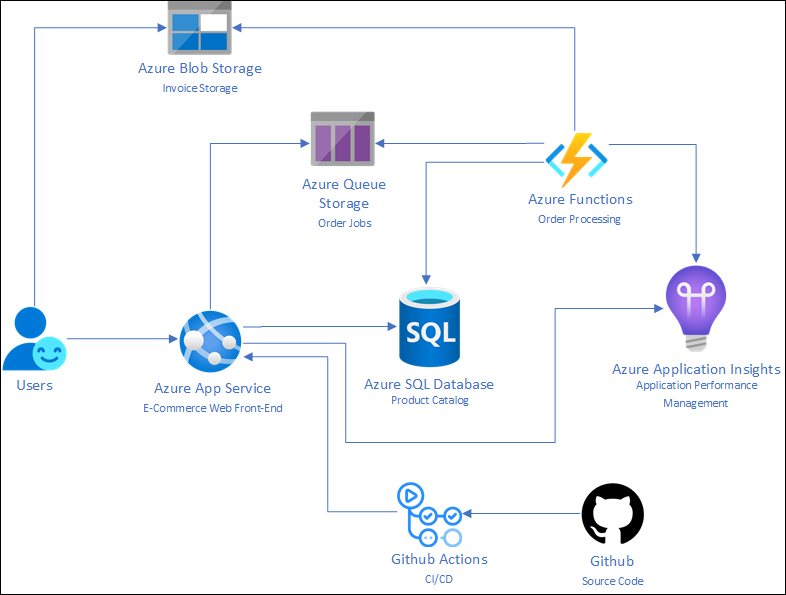

# Solution Architecture

Below is a high-level architecture diagram of the solution you implement in this hands-on lab. Review it carefully so that you understand how the individual components fit together as you build them.

> **Note:** The solution provided is only one of many possible, viable approaches.

The solution begins with setting up Azure Migrate as the central assessment and migration hub for Parts Unlimited's e-commerce website. Using the App Service Migration Assistant tool from Azure Migrate, Parts Unlimited confirms that their website is fully compatible with Azure App Service. As a next step, they use the App Service Migration Assistant to provision an Azure App Service plan and deploy their application to Azure. Following the success of moving the web application, Parts Unlimited uses a Data Migration Assistant (DMA) assessment to determine that they can migrate to a fully managed SQL Database service in Azure. The assessment reveals no compatibility issues or unsupported features that would prevent them from using Azure SQL Database.

Next, Parts Unlimited sets up a private GitHub repository and pushes their codebase to GitHub. They add a deployment slot to provide a staging environment where new functionality can be tested before it is released to production. For CI/CD, they use GitHub Actions and workflows.

Finally, Parts Unlimited decides to decouple its order processing system and move to an event-driven serverless compute platform. Following a [web-queue-worker architecture](https://docs.microsoft.com/en-us/azure/architecture/guide/architecture-styles/web-queue-worker), they build an Azure Function and use an Azure Storage queue to process orders and create invoices asynchronously. When new orders come in, the web front end adds jobs to the queue, and Azure Functions consumes them. The Function App scales independently based on the number of jobs in the queue, helping Parts Unlimited elastically handle a variable number of orders.
